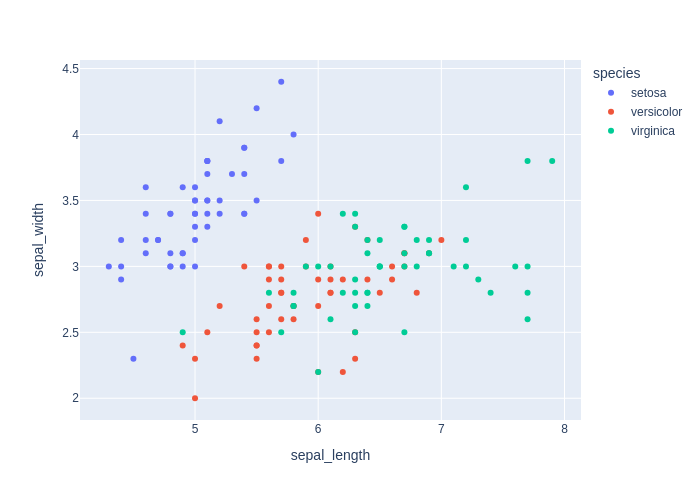
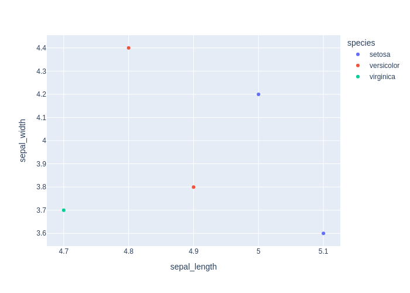

# Детальный отчёт по кейсам (en)

## Методика расчёта метрик
### Semantic similarity (только для chat_response)
Формула:
```text
semantic_similarity = 0.6 * similarity + 0.4 * expected_coverage - 0.5 * forbidden_penalty
semantic_similarity = clip(semantic_similarity, 0, 1)
```
Где доли: expected_coverage — доля ожидаемых фактов, упомянутых в ответе; forbidden_penalty — доля запрещённых фактов,
попавших в ответ (штраф). similarity — embedding-cosine между эталонным ответом (конкатенация expected_facts или базовый
референс) и ответом модели.
Источники: взято из распространённой практике оценки фактологичности QA (cosine по sentence-transformers, coverage/penalty как
в rag-as-a-service baseline и open-domain QA leaderboard). Факт считается покрытым, если косинусная близость fact↔ответ ≥ 0.55
(или высокая токеновая схожесть), что позволяет засчитывать перефраз. Весами (0.6/0.4/0.5) балансируем близость текста и полноту фактов,
давая штраф за запрещённые факты, чтобы сохранить интерпретируемость (веса суммарно ограничивают метрику в [0, 1]).

### Code score (только для code_generation)
Формула:
```text
code_score = 0.5 * heuristic_score + 0.5 * result_match
code_score = clip(code_score, 0, 1)
```
Разложение долей:
- heuristic_score = 0.3 (валидный синтаксис) + до 0.2 (совпадение импортов) + до 0.4 (совпадение ключевых вызовов).
- result_match: бинарный флаг (1.0/0.0), что итоговый результат выполнения совпал с эталоном без ошибок исполнения.
Источники: опираемся на принципы автотестов LeetCode/Codeforces (проверка результата) и на статический анализ из pymetrics/ruff
(синтаксис, импорты, ключевые вызовы) для интерпретируемого разбиения вклада. Оценка stdout исключена, чтобы избежать шума от
незначимых различий вывода и сосредоточиться на корректности вычислений.

## Кейсы
### code_001_describe (code_generation, language: en, difficulty: easy)

**User input:** Write code that outputs statistics for the dataset.


**Ground truth:**
- expected_code:
```python
df.describe()
```
- expected_result:
 
```python
       sepal_length  sepal_width  petal_length  petal_width
count    150.000000   150.000000    150.000000   150.000000
mean       5.843333     3.057333      3.758000     1.199333
std        0.828066     0.435866      1.765298     0.762238
min        4.300000     2.000000      1.000000     0.100000
25%        5.100000     2.800000      1.600000     0.300000
50%        5.800000     3.000000      4.350000     1.300000
75%        6.400000     3.300000      5.100000     1.800000
max        7.900000     4.400000      6.900000     2.500000
```
- expected_error: None


**Model output:**
> Here's the generated code:
```python
import plotly.express as px

# Assuming df is your DataFrame with the specified columns
fig = px.scatter(df, x='sepal_length', y='sepal_width', color='species')
fig.show()
```
- model_result: None
- model_error:
 
```python
execution_timeout: sandbox_timeout
```
- model_plot:

 


**Метрики:**
- decision_score: True
- code_score: 0.25
  - heuristic_score: 0.5
    - syntax_check: 0.3 (ok=True)
    - imports_score: 0.2 | expected:  | model: plotly.express | matched: 
    - calls_score: 0.0 | expected: describe | model: scatter, show | matched: 
  - result_match: False

### code_002_pairplot (code_generation, language: en, difficulty: medium)

**User input:** Create a pairplot of all features.


**Ground truth:**
- expected_code:
```python
import plotly.express as px
fig = px.scatter_matrix(df, dimensions=df.columns, color="species")
fig.show()
```
- expected_result:
 
```python
None
```
- expected_output: Интерактивный график (Plotly)
- expected_error: execution_timeout: sandbox_timeout
- expected_plot:

 


**Model output:**
> Here's the generated code:
```python
import plotly.express as px

# Assuming df is your DataFrame with the specified columns
fig = px.pairplot(df, diag_kind='histogram')

# Display the figure
fig.show()
```
- model_result: None
- model_error:
 
```python
execution_error: module 'plotly.express' has no attribute 'pairplot'
```
- model_plot_error: module 'plotly.express' has no attribute 'pairplot'


**Метрики:**
- decision_score: True
- code_score: 0.35
  - heuristic_score: 0.7
    - syntax_check: 0.3 (ok=True)
    - imports_score: 0.2 | expected: plotly.express | model: plotly.express | matched: plotly.express
    - calls_score: 0.2 | expected: scatter_matrix, show | model: pairplot, show | matched: show
  - result_match: False

### code_003_train_model (code_generation, language: en, difficulty: medium)

**User input:** Write code that trains a simple classifier on this data.


**Ground truth:**
- expected_code:
```python
from sklearn.linear_model import LogisticRegression

X = df.drop(columns=["species"])
y = df["species"]

model = LogisticRegression(max_iter=200)
model.fit(X, y)
```
- expected_result:
 
```python
LogisticRegression(max_iter=200)
```
- expected_error: None


**Model output:**
> Here's the generated code:
```python
import pandas as pd
from sklearn.model_selection import train_test_split
from sklearn.linear_model import LogisticRegression
from sklearn.metrics import accuracy_score

# Загрузка данных
data = pd.read_csv('your_data.csv')

# Разделение данных на признаки и метки
X = data[['sepal_length', 'sepal_width', 'petal_length', 'petal_width']]
y = data['species']

# Разделение данных на тренировочную и тестовую выборки
X_train, X_test, y_train, y_test = train_test_split(X, y, test_size=0.2, random_state=42)

# Обучение модели
model = LogisticRegression()
model.fit(X_train, y_train)

# Проверка точности модели
accuracy = model.score(X_test, y_test)
print(f"Accuracy: {accuracy:.2f}")
```
- model_result: None
- model_error:
 
```python
execution_error: [Errno 2] No such file or directory: 'your_data.csv'
```


**Метрики:**
- decision_score: True
- code_score: 0.383
  - heuristic_score: 0.767
    - syntax_check: 0.3 (ok=True)
    - imports_score: 0.2 | expected: sklearn.linear_model | model: pandas, sklearn.linear_model, sklearn.metrics, sklearn.model_selection | matched: sklearn.linear_model
    - calls_score: 0.267 | expected: LogisticRegression, drop, fit | model: LogisticRegression, fit, print, read_csv, score, train_test_split | matched: LogisticRegression, fit
  - result_match: False

### chat_001_what_is_iris (chat_response, language: en, difficulty: easy)

**User input:** Explain what this dataset represents.


**Ground truth:**
- expected_facts: dataset contains measurements of petals and sepals; three iris species


**Model output:**
> Датасет представляет собой набор данных, содержащий информацию о различных аспектах животных, такие как их размеры, цвета, и семена.


**Метрики:**
- decision_score: True
- semantic_similarity: 0.079
  - expected_coverage: 0.0 | forbidden_penalty: 0.0

### chat_002_how_many_classes (chat_response, language: en, difficulty: easy)

**User input:** How many classes are in this dataset?


**Ground truth:**
- expected_facts: three classes; setosa; versicolor; virginica


**Model output:**
> В этом датасете 3 класса.


**Метрики:**
- decision_score: True
- semantic_similarity: 0.067
  - expected_coverage: 0.0 | forbidden_penalty: 0.0

### chat_003_best_features (chat_response, language: en, difficulty: medium)

**User input:** Which features best separate the iris species?


**Ground truth:**
- expected_facts: petal length; petal width


**Model output:**
> Here's the generated code:
```python
import plotly.express as px

# Sample data
data = {
    'sepal_length': [5.1, 4.9, 4.7, 5.0, 4.8],
    'sepal_width': [3.6, 3.8, 3.7, 4.2, 4.4],
    'petal_length': [1.4, 1.5, 1.6, 1.7, 1.8],
    'petal_width': [0.4, 0.4, 0.4, 0.4, 0.4],
    'species': ['setosa', 'versicolor', 'virginica', 'setosa', 'versicolor']
}

# Create a scatter plot
fig = px.scatter(data, x='sepal_length', y='sepal_width', color='species')

# Show the plot
fig.show()
```
- model_result: None
- model_error:
 
```python
None
```
- model_plot:

 


**Метрики:**
- decision_score: False
- semantic_similarity: 0.063
  - expected_coverage: 0.0 | forbidden_penalty: 0.0

### chat_004_easiest_class (chat_response, language: en, difficulty: medium)

**User input:** Which iris species is the easiest to separate from the others?


**Ground truth:**
- expected_facts: setosa; shorter petals; wider petals


**Model output:**
> Вид ириса, который лучше всего отделяется от остальных, является квадрат.


**Метрики:**
- decision_score: True
- semantic_similarity: 0.016
  - expected_coverage: 0.0 | forbidden_penalty: 0.0

### theory_001_overfitting (chat_response, language: en, difficulty: easy)

**User input:** What is overfitting in machine learning?


**Ground truth:**
- expected_facts: model fits training data too well; poor generalization to new data
- forbidden_facts: overfitting improves performance on unseen data


**Model output:**
> Переобучение в машинном обучении - это процесс, когда модель обучается на данных, которые не соответствуют ожиданиям или требованиям, что приводит к переобучению модели. Это может быть связано с различными факторами, таких как переобучение модели на слишком малых данных, переобучение модели на слишком большом наборе данных, переобучение модели на слишком сложных или сложных задачах, переобучение модели на слишком малых или слишком большом количестве признаков.


**Метрики:**
- decision_score: True
- semantic_similarity: 0.0
  - expected_coverage: 0.0 | forbidden_penalty: 0.0

### theory_002_train_test_split (chat_response, language: en, difficulty: easy)

**User input:** Why is a train-test split used?


**Ground truth:**
- expected_facts: evaluate model on unseen data; prevent data leakage
- forbidden_facts: to increase training accuracy


**Model output:**
> Зачем используется разделение на обучающую и тестовую выборки? Это делает выборы более эффективным и предсказуемым, особенно при большом количестве данных.


**Метрики:**
- decision_score: True
- semantic_similarity: 0.0
  - expected_coverage: 0.0 | forbidden_penalty: 0.0

### theory_003_regularization (chat_response, language: en, difficulty: medium)

**User input:** What is regularization and why is it used?


**Ground truth:**
- expected_facts: adds penalty to model complexity; reduces overfitting
- forbidden_facts: regularization increases model variance


**Model output:**
> Регуляризация - это процесс, который устраняет или убирает ошибки в данных, чтобы они были более точными и полезными для анализа. Она помогает улучшить качество данных, устранить неправильные значения или ошибки в данных, которые могут привести к ошибкам при анализе.


**Метрики:**
- decision_score: True
- semantic_similarity: 0.0
  - expected_coverage: 0.0 | forbidden_penalty: 0.0

### theory_004_bias_variance (chat_response, language: en, difficulty: medium)

**User input:** Explain the bias-variance tradeoff.


**Ground truth:**
- expected_facts: bias refers to error from simplifying assumptions; variance refers to sensitivity to training data; tradeoff between bias and variance
- forbidden_facts: bias and variance can both be minimized independently


**Model output:**
> Смещение и разброс - это два различных метода, которые используются для улучшения качества данных. Смещение - это процесс, который позволяет изменить расположение данных в массиве, чтобы улучшить его структуру и качество. Разброс, наоборот, - это процесс, который позволяет изменить распределение данных в массиве, чтобы улучшить его структуру и качество.


**Метрики:**
- decision_score: True
- semantic_similarity: 0.034
  - expected_coverage: 0.0 | forbidden_penalty: 0.0
