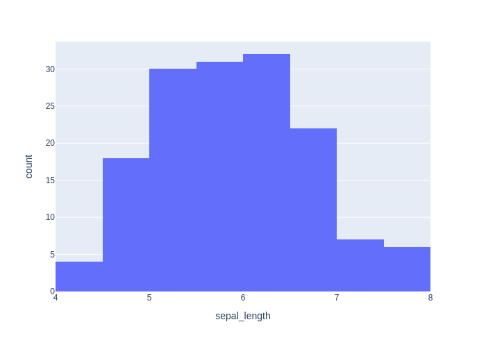

# Детальный отчёт по кейсам (ru)

## Методика расчёта метрик
### Semantic similarity (только для chat_response)
Формула:
```text
semantic_similarity = 0.6 * similarity + 0.4 * expected_coverage - 0.5 * forbidden_penalty
```
Где доли:
 - expected_coverage — доля ожидаемых фактов, упомянутых в ответе;
 - forbidden_penalty — доля запрещённых фактов,
попавших в ответ (штраф).
 - similarity — embedding-cosine между эталонным ответом (конкатенация expected_facts или базовый
референс) и ответом модели.


Факт считается покрытым, если косинусная близость fact↔ответ ≥ 0.55
(или высокая токеновая схожесть), что позволяет засчитывать перефраз. Весами (0.6/0.4/0.5) балансируем близость текста и полноту фактов,
давая штраф за запрещённые факты, чтобы сохранить интерпретируемость (веса суммарно ограничивают метрику в [0, 1]).

### Code score (только для code_generation)
- heuristic_score = 0.3 (валидный синтаксис) + до 0.2 (совпадение импортов) + до 0.4 (совпадение ключевых вызовов).
- result_match: бинарный флаг (1.0/0.0), что итоговый результат выполнения совпал с эталоном без ошибок исполнения.

## Кейсы
### code_001_describe (code_generation, language: ru, difficulty: easy)

**User input:** Напиши код, который выводит статистику по датасету.


**Ground truth:**
- expected_code:
```python
df.describe()
```
- expected_result:

```python
       sepal_length  sepal_width  petal_length  petal_width
count    150.000000   150.000000    150.000000   150.000000
mean       5.843333     3.057333      3.758000     1.199333
std        0.828066     0.435866      1.765298     0.762238
min        4.300000     2.000000      1.000000     0.100000
25%        5.100000     2.800000      1.600000     0.300000
50%        5.800000     3.000000      4.350000     1.300000
75%        6.400000     3.300000      5.100000     1.800000
max        7.900000     4.400000      6.900000     2.500000
```
- expected_error:

```python
None
```


**Model output:**
> Here's the generated code:
```python
stats = df.describe(include='all')
stats
```
- model_result:

```python
        sepal_length  sepal_width  petal_length  petal_width species
count     150.000000   150.000000    150.000000   150.000000     150
unique           NaN          NaN           NaN          NaN       3
top              NaN          NaN           NaN          NaN  setosa
freq             NaN          NaN           NaN          NaN      50
mean        5.843333     3.057333      3.758000     1.199333     NaN
std         0.828066     0.435866      1.765298     0.762238     NaN
min         4.300000     2.000000      1.000000     0.100000     NaN
25%         5.100000     2.800000      1.600000     0.300000     NaN
50%         5.800000     3.000000      4.350000     1.300000     NaN
75%         6.400000     3.300000      5.100000     1.800000     NaN
max         7.900000     4.400000      6.900000     2.500000     NaN
```
- model_error:

```python
None
```


**Метрики:**
- decision_score: True
  - heuristic_score: 1.0
    - syntax_check: 0.333 (ok=True)
    - imports_score: 0.222 | expected:  | model:  | matched:
    - calls_score: 0.444 | expected: describe | model: describe | matched: describe

### code_002_pairplot (code_generation, language: ru, difficulty: medium)

**User input:** Построй pairplot всех признаков.


**Ground truth:**
- expected_code:
```python
import plotly.express as px
fig = px.scatter_matrix(df, dimensions=df.columns, color="species")
fig.show()
```
- expected_result:

```python
None
```
- expected_output: Интерактивный график (Plotly)
- expected_error:

```python
execution_timeout: sandbox_timeout
```
- expected_plot:

 


**Model output:**
> Here's the generated code:
```python
import plotly.express as px
fig = px.scatter_matrix(df, dimensions=["sepal_length", "sepal_width", "petal_length", "petal_width"], color="species")
fig
```
- model_result:

```python
Figure({
    'data': [{'dimensions': [{'axis': {'matches': True},
                              'label': 'sepal_length',
                              'values': {'bdata': ('ZmZmZmZmFECamZmZmZkTQM3MzMzMzB' ... 'ZmZhJAMzMzMzMzFUAAAAAAAAAUQA=='),
                                         'dtype': 'f8'}},
                             {'axis': {'matches': True},
                              'label': 'sepal_width',
                              'values': {'bdata': ('AAAAAAAADEAAAAAAAAAIQJqZmZmZmQ' ... 'mZmQlAmpmZmZmZDUBmZmZmZmYKQA=='),
                                         'dtype': 'f8'}},
                             {'axis': {'matches': True},
                              'label': 'petal_length',
                              'values': {'bdata': ('ZmZmZmZm9j9mZmZmZmb2P83MzMzMzP' ... 'ZmZvY/AAAAAAAA+D9mZmZmZmb2Pw=='),
                                         'dtype': 'f8'}},
                             {'axis': {'matches': True},
                              'label': 'petal_width',
                              'values': {'bdata': ('mpmZmZmZyT+amZmZmZnJP5qZmZmZmc' ... 'mZmck/mpmZmZmZyT+amZmZmZnJPw=='),
                                         'dtype': 'f8'}}],
              'hovertemplate': ('species=setosa<br>%{xaxis.titl' ... 'itle.text}=%{y}<extra></extra>'),
              'legendgroup': 'setosa',
              'marker': {'color': '#636efa', 'symbol': 'circle'},
              'name': 'setosa',
              'showlegend': True,
              'type': 'splom'},
             {'dimensions': [{'axis': {'matches': True},
                              'label': 'sepal_length',
                              'values': {'bdata': ('AAAAAAAAHECamZmZmZkZQJqZmZmZmR' ... 'zMzBhAZmZmZmZmFEDNzMzMzMwWQA=='),
                                         'dtype': 'f8'}},
                             {'axis': {'matches': True},
                              'label': 'sepal_width',
                              'values': {'bdata': ('mpmZmZmZCUCamZmZmZkJQM3MzMzMzA' ... 'MzMwdAAAAAAAAABEBmZmZmZmYGQA=='),
                                         'dtype': 'f8'}},
                             {'axis': {'matches': True},
                              'label': 'petal_length',
                              'values': {'bdata': ('zczMzMzMEkAAAAAAAAASQJqZmZmZmR' ... 'MzMxFAAAAAAAAACEBmZmZmZmYQQA=='),
                                         'dtype': 'f8'}},
                             {'axis': {'matches': True},
                              'label': 'petal_width',
                              'values': {'bdata': ('ZmZmZmZm9j8AAAAAAAD4PwAAAAAAAP' ... 'zMzPQ/mpmZmZmZ8T/NzMzMzMz0Pw=='),
                                         'dtype': 'f8'}}],
              'hovertemplate': ('species=versicolor<br>%{xaxis.' ... 'itle.text}=%{y}<extra></extra>'),
              'legendgroup': 'versicolor',
              'marker': {'color': '#EF553B', 'symbol': 'circle'},
              'name': 'versicolor',
              'showlegend': True,
              'type': 'splom'},
             {'dimensions': [{'axis': {'matches': True},
                              'label': 'sepal_length',
                              'values': {'bdata': ('MzMzMzMzGUAzMzMzMzMXQGZmZmZmZh' ... 'AAABpAzczMzMzMGECamZmZmZkXQA=='),
                                         'dtype': 'f8'}},
                             {'axis': {'matches': True},
                              'label': 'sepal_width',
                              'values': {'bdata': ('ZmZmZmZmCkCamZmZmZkFQAAAAAAAAA' ... 'AAAAhAMzMzMzMzC0AAAAAAAAAIQA=='),
                                         'dtype': 'f8'}},
                             {'axis': {'matches': True},
                              'label': 'petal_length',
                              'values': {'bdata': ('AAAAAAAAGEBmZmZmZmYUQJqZmZmZmR' ... 'zMzBRAmpmZmZmZFUBmZmZmZmYUQA=='),
                                         'dtype': 'f8'}},
                             {'axis': {'matches': True},
                              'label': 'petal_width',
                              'values': {'bdata': ('AAAAAAAABEBmZmZmZmb+P83MzMzMzA' ... 'AAAABAZmZmZmZmAkDNzMzMzMz8Pw=='),
                                         'dtype': 'f8'}}],
              'hovertemplate': ('species=virginica<br>%{xaxis.t' ... 'itle.text}=%{y}<extra></extra>'),
              'legendgroup': 'virginica',
              'marker': {'color': '#00cc96', 'symbol': 'circle'},
              'name': 'virginica',
              'showlegend': True,
              'type': 'splom'}],
    'layout': {'dragmode': 'select',
               'legend': {'title': {'text': 'species'}, 'tracegroupgap': 0},
               'margin': {'t': 60},
               'template': '...'}
})
```
- model_error:

```python
None
```
- model_plot:

 


**Метрики:**
- decision_score: True
  - heuristic_score: 1.0
    - syntax_check: 0.333 (ok=True)
    - imports_score: 0.222 | expected: plotly.express | model: plotly.express | matched: plotly.express
    - calls_score: 0.444 | expected: scatter_matrix, show | model: scatter_matrix, show | matched: scatter_matrix, show

### code_003_train_model (code_generation, language: ru, difficulty: medium)

**User input:** Напиши код, который обучает простой классификатор на этих данных.


**Ground truth:**
- expected_code:
```python
from sklearn.linear_model import LogisticRegression

X = df.drop(columns=["species"])
y = df["species"]

model = LogisticRegression(max_iter=200)
model.fit(X, y)
```
- possible_code_objects: RandomForestClassifier, DecisionTreeClassifier, SVC, KNeighborsClassifier, GaussianNB
- expected_result:

```python
LogisticRegression(max_iter=200)
```
- expected_error:

```python
None
```


**Model output:**
> Here's the generated code:
```python
import pandas as pd
from sklearn.model_selection import train_test_split
from sklearn.preprocessing import LabelEncoder
from sklearn.linear_model import LogisticRegression
from sklearn.metrics import accuracy_score
X = df[['sepal_length', 'sepal_width', 'petal_length', 'petal_width']]
y = df['species']
le = LabelEncoder()
y_enc = le.fit_transform(y)
X_train, X_test, y_train, y_test = train_test_split(X, y_enc, test_size=0.2, random_state=42, stratify=y_enc)
model = LogisticRegression(max_iter=200)
model.fit(X_train, y_train)
y_pred = model.predict(X_test)
acc = accuracy_score(y_test, y_pred)
acc
```
- model_result:

```python
0.9666666666666667
```
- model_error:

```python
None
```


**Метрики:**
- decision_score: True
  - heuristic_score: 0.852
    - syntax_check: 0.333 (ok=True)
    - imports_score: 0.222 | expected: sklearn.linear_model | model: pandas, sklearn.linear_model, sklearn.metrics, sklearn.model_selection, sklearn.preprocessing | matched: sklearn.linear_model
    - calls_score: 0.296 | expected: LogisticRegression, drop, fit | model: LabelEncoder, LogisticRegression, accuracy_score, fit, fit_transform, predict, train_test_split | matched: LogisticRegression, fit

### code_004_show_all_plots (code_generation, language: ru, difficulty: hard)

**User input:** Отобрази все графики.


**Ground truth:**
- expected_code:
```python
import plotly.express as px
import plotly.graph_objects as go

# df already exists and represents the iris dataset

# Select numeric columns
num_cols = df.select_dtypes(include=["number"]).columns.tolist()

# Try to infer target column
candidate_targets = ["species", "target", "label", "class"]
target_col = next((c for c in candidate_targets if c in df.columns), None)

if not num_cols:
    raise ValueError("No numeric columns found in df to build plots.")

# 1) Histograms for all numeric features
fig_hist = px.histogram(
    df,
    x=num_cols,
    color=target_col if target_col else None,
    barmode="overlay",
    title="Distributions (Histograms)"
)
fig_hist.show()

# 2) Box plots by class (if target exists)
if target_col:
    for col in num_cols:
        fig_box = px.box(
            df,
            x=target_col,
            y=col,
            title=f"Boxplot: {col} by {target_col}"
        )
        fig_box.show()

# 3) Scatter plots for common Iris feature pairs
scatter_pairs = [
    ("sepal_length", "sepal_width"),
    ("petal_length", "petal_width")
]

for x, y in scatter_pairs:
    if x in df.columns and y in df.columns:
        fig_scatter = px.scatter(
            df,
            x=x,
            y=y,
            color=target_col if target_col else None,
            title=f"Scatter: {x} vs {y}"
        )
        fig_scatter.show()

# 4) Scatter matrix (pairwise relationships)
fig_matrix = px.scatter_matrix(
    df,
    dimensions=num_cols,
    color=target_col if target_col else None,
    title="Scatter Matrix"
)
fig_matrix.show()

# 5) Correlation heatmap
corr = df[num_cols].corr(numeric_only=True)

fig_heatmap = px.imshow(
    corr,
    text_auto=True,
    title="Correlation Heatmap"
)
fig_heatmap.show()

```
- possible_code_objects: df, px, go
- expected_result:

```python
None
```
- expected_output: Интерактивный график (Plotly)
- expected_error:

```python
execution_timeout: sandbox_timeout
```
- expected_plot:

 


**Model output:**
> Here's the generated code:
```python
import plotly.express as px
fig_scatter_matrix = px.scatter_matrix(df, dimensions=['sepal_length', 'sepal_width', 'petal_length', 'petal_width'], color='species')
fig_scatter_matrix.show()
fig_hist_sepal_length = px.histogram(df, x='sepal_length', color='species', nbins=30, barmode='overlay')
fig_hist_sepal_length.show()
fig_hist_sepal_width = px.histogram(df, x='sepal_width', color='species', nbins=30, barmode='overlay')
fig_hist_sepal_width.show()
fig_hist_petal_length = px.histogram(df, x='petal_length', color='species', nbins=30, barmode='overlay')
fig_hist_petal_length.show()
fig_hist_petal_width = px.histogram(df, x='petal_width', color='species', nbins=30, barmode='overlay')
fig_hist_petal_width.show()
fig_box_sepal_length = px.box(df, y='sepal_length', color='species')
fig_box_sepal_length.show()
fig_box_sepal_width = px.box(df, y='sepal_width', color='species')
fig_box_sepal_width.show()
fig_box_petal_length = px.box(df, y='petal_length', color='species')
fig_box_petal_length.show()
fig_box_petal_width = px.box(df, y='petal_width', color='species')
fig_box_petal_width.show()
fig_scatter_sepal = px.scatter(df, x='sepal_length', y='sepal_width', color='species')
fig_scatter_sepal.show()
fig_scatter_petal = px.scatter(df, x='petal_length', y='petal_width', color='species')
fig_scatter_petal.show()
fig_3d = px.scatter_3d(df, x='sepal_length', y='sepal_width', z='petal_length', color='species')
fig_3d.show()
```
- model_result:

```python
None
```
- model_error:

```python
execution_timeout: sandbox_timeout
```
- model_plot:

 


**Метрики:**
- decision_score: True
  - heuristic_score: 0.646
    - syntax_check: 0.333 (ok=True)
    - imports_score: 0.111 | expected: plotly.express, plotly.graph_objects | model: plotly.express | matched: plotly.express
    - calls_score: 0.202 | expected: ValueError, box, corr, histogram, imshow, next, scatter, scatter_matrix, select_dtypes, show, tolist | model: box, histogram, scatter, scatter_3d, scatter_matrix, show | matched: box, histogram, scatter, scatter_matrix, show

### code_005_histogram (code_generation, language: ru, difficulty: hard)

**User input:** Отобрази график Histogram


**Ground truth:**
- expected_code:
```python
import plotly.express as px

# df already exists and represents the iris dataset

num_cols = df.select_dtypes(include=["number"]).columns.tolist()

if not num_cols:
    raise ValueError("В df не найдено числовых колонок для построения histogram.")

# Строим histogram по всем числовым признакам
fig = px.histogram(
    df,
    x=num_cols,
    barmode="overlay",
    title="Histogram"
)

fig.show()

```
- possible_code_objects: df, px
- expected_result:

```python
None
```
- expected_output: Интерактивный график (Plotly)
- expected_error:

```python
execution_timeout: sandbox_timeout
```
- expected_plot:

 


**Model output:**
> Here's the generated code:
```python
import plotly.express as px
fig = px.histogram(df, x='sepal_length')
fig
```
- model_result:

```python
Figure({
    'data': [{'bingroup': 'x',
              'hovertemplate': 'sepal_length=%{x}<br>count=%{y}<extra></extra>',
              'legendgroup': '',
              'marker': {'color': '#636efa', 'pattern': {'shape': ''}},
              'name': '',
              'orientation': 'v',
              'showlegend': False,
              'type': 'histogram',
              'x': {'bdata': ('ZmZmZmZmFECamZmZmZkTQM3MzMzMzB' ... 'AAAAAAGkDNzMzMzMwYQJqZmZmZmRdA'),
                    'dtype': 'f8'},
              'xaxis': 'x',
              'yaxis': 'y'}],
    'layout': {'barmode': 'relative',
               'legend': {'tracegroupgap': 0},
               'margin': {'t': 60},
               'template': '...',
               'xaxis': {'anchor': 'y', 'domain': [0.0, 1.0], 'title': {'text': 'sepal_length'}},
               'yaxis': {'anchor': 'x', 'domain': [0.0, 1.0], 'title': {'text': 'count'}}}
})
```
- model_error:

```python
None
```
- model_plot:

 


**Метрики:**
- decision_score: True
  - heuristic_score: 0.733
    - syntax_check: 0.333 (ok=True)
    - imports_score: 0.222 | expected: plotly.express | model: plotly.express | matched: plotly.express
    - calls_score: 0.178 | expected: ValueError, histogram, select_dtypes, show, tolist | model: histogram, show | matched: histogram, show

### chat_001_what_is_iris (chat_response, language: ru, difficulty: easy)

**User input:** Поясни, что представляет собой датасет.


**Ground truth:**
- expected_facts: датасет содержит измерения лепестков и чашелистиков; три вида ириса
- forbidden_facts: животные


**Model output:**
> **Датасет** – это таблица, в которой собраны измерения разных цветов ириса.    Каждая строка представляет один образец растения, а столбцы описывают его свойства:  - **sepal_length** – длина лепестка в сантиметрах (число с плавающей точкой)   - **sepal_width** – ширина лепестка (число с плавающей точкой)   - **petal_length** – длина чашелистика (число с плавающей точкой)   - **petal_width** – ширина чашелистика (число с плавающей точкой)   - **species** – вид ириса (категория), например *setosa*, *versicolor* или *virginica*    Таким образом, датасет позволяет сравнивать физические характеристики разных видов ирисов.


**Метрики:**
- decision_score: True
- semantic_similarity: 0.19
  - expected_coverage: 0.0 | forbidden_penalty: 0.0

### chat_002_how_many_classes (chat_response, language: ru, difficulty: easy)

**User input:** Сколько классов в этом датасете?


**Ground truth:**
- expected_facts: три класса


**Model output:**
> The dataset contains **three** distinct classes in the **species** column.


**Метрики:**
- decision_score: True
- semantic_similarity: 0.026
  - expected_coverage: 0.0 | forbidden_penalty: 0.0

### chat_003_best_features (chat_response, language: ru, difficulty: medium)

**User input:** Какие признаки лучше всего разделяют виды ирисов?


**Ground truth:**
- expected_facts: длина лепестка; ширина лепестка


**Model output:**
> **Краткий ответ**   Для разделения трёх видов ирисов (setosa, versicolor, virginica) самые информативные признаки – **длина лепестка** и **ширина лепестка**.  **Почему они лучше всего работают**  - **Длина лепестка**: у *setosa* она обычно самая маленькая (около 1–1,5 см), у *versicolor* – средняя (≈ 4–5 см), у *virginica* – самая большая (≈ 5–6,5 см).   - **Ширина лепестка**: у *setosa* почти всегда узкая (≈ 0,2 см), у *versicolor* – шире (≈ 1,3 см), у *virginica* – ещё шире (≈ 2,0 см).    Эти два признака почти полностью отделяют виды друг от друга, тогда как **длина чашелистика** и **ширина чашелистика** сильно перекрываются между классами и дают меньше различий.  **Итого**   - Лучшие разделяющие признаки: **petal_length** и **petal_width**.   - Менее полезные: **sepal_length** и **sepal_width**.


**Метрики:**
- decision_score: True
- semantic_similarity: 0.125
  - expected_coverage: 0.0 | forbidden_penalty: 0.0

### chat_004_easiest_class (chat_response, language: ru, difficulty: medium)

**User input:** Какой вид ириса лучше всего отделяется от остальных?


**Ground truth:**
- expected_facts: setosa; короче лепестки; шире лепестки


**Model output:**
> Here's the generated code:
```python
import pandas as pd
import numpy as np
centroids = df.groupby('species')[['sepal_length', 'sepal_width', 'petal_length', 'petal_width']].mean()
species = centroids.index.tolist()
dist_matrix = pd.DataFrame(
    np.linalg.norm(centroids.values[:, None, :] - centroids.values[None, :, :], axis=2),
    index=species,
    columns=species
)
min_dist = dist_matrix.replace(0, np.nan).min()
best_species = min_dist.idxmax()
best_species
```
- model_result:

```python
None
```
- model_error:

```python
None
```


**Метрики:**
- decision_score: False
- semantic_similarity: 0.051
  - expected_coverage: 0.0 | forbidden_penalty: 0.0

### theory_001_overfitting (chat_response, language: ru, difficulty: easy)

**User input:** Что такое переобучение в машинном обучении?


**Ground truth:**
- expected_facts: модель слишком хорошо подстраивается под обучающую выборку; плохо обобщает на новые данные
- forbidden_facts: переобучение улучшает качество на новых данных


**Model output:**
> **Переобучение** – это когда модель слишком хорошо запоминает детали обучающих данных и плохо работает на новых, неизвестных примерах.  - На этапе обучения модель подгоняется под каждый шум и случайность в тренировочном наборе.   - В результате её предсказания на новых данных становятся неточными.   - Это похоже на ученика, который выучил ответы на контрольные вопросы, но не понимает материал.  Чтобы избежать переобучения, обычно используют:  - **Разделение данных** на тренировочный, проверочный и тестовый наборы.   - **Регуляризацию**, которая ограничивает сложность модели.   - **Кросс‑валидацию** для более надёжной оценки качества.   - **Уменьшение количества признаков** или параметров модели.    Таким образом, цель – создать модель, которая хорошо обобщает, а не просто запоминает обучающие примеры.


**Метрики:**
- decision_score: True
- semantic_similarity: 0.213
  - expected_coverage: 0.0 | forbidden_penalty: 0.0

### theory_002_train_test_split (chat_response, language: ru, difficulty: easy)

**User input:** Зачем используется разделение на обучающую и тестовую выборки?


**Ground truth:**
- expected_facts: оценка качества модели на невидимых данных; предотвращение утечки данных
- forbidden_facts: для увеличения точности на обучающей выборке


**Model output:**
> **Разделение на обучающую и тестовую выборки** делается, чтобы:  - **Обучить** модель на одной части данных, где она видит ответы и может подобрать параметры.   - **Оценить** её качество на другой части, которую модель никогда не видела. Это показывает, как она будет работать с новыми, реальными данными.   - **Предотвратить переобучение** – когда модель запоминает детали обучающего набора, а на новых примерах падает.   - **Сравнивать** разные модели или настройки, имея одинаковый набор для честного теста.    Таким образом, разделение помогает получить надёжную оценку и гарантировать, что модель будет полезна в реальном применении.


**Метрики:**
- decision_score: True
- semantic_similarity: 0.156
  - expected_coverage: 0.0 | forbidden_penalty: 0.0

### theory_003_regularization (chat_response, language: ru, difficulty: medium)

**User input:** Что такое регуляризация и зачем она нужна?


**Ground truth:**
- expected_facts: добавляет штраф за сложность модели; уменьшает переобучение
- forbidden_facts: регуляризация увеличивает разброс модели


**Model output:**
> **Регуляризация** – это метод, который помогает сделать модель машинного обучения более надёжной.  - Когда модель слишком точно подгоняется под учебные данные, она может запоминать шум и случайные детали. Это называется **переподгонкой**. - Регуляризация добавляет в процесс обучения небольшие ограничения или штрафы. Это заставляет модель искать более простые и обобщённые зависимости. - В результате модель лучше работает на новых, ранее не виденных данных.  Таким образом, регуляризация нужна, чтобы **предотвратить переобучение** и улучшить способность модели обобщать.


**Метрики:**
- decision_score: True
- semantic_similarity: 0.164
  - expected_coverage: 0.0 | forbidden_penalty: 0.0

### theory_004_bias_variance (chat_response, language: ru, difficulty: medium)

**User input:** Объясни компромисс между смещением и разбросом.


**Ground truth:**
- expected_facts: смещение связано с упрощающими предположениями модели; разброс связан с чувствительностью к обучающим данным; существует компромисс между смещением и разбросом
- forbidden_facts: смещение и разброс можно минимизировать независимо


**Model output:**
> **Компромисс между смещением и разбросом**  Смещение (bias) и разброс (variance) – два главных источника ошибок модели.  - **Смещение** показывает, насколько в среднем предсказания модели отклоняются от истинного значения. Высокое смещение возникает, когда модель слишком простая и не улавливает закономерности в данных.   - **Разброс** измеряет, насколько сильно предсказания модели меняются при разных обучающих наборах. Высокий разброс появляется у слишком сложных моделей, которые «переподгоняют» шум в обучающих данных.  **Что происходит, когда мы меняем сложность модели?**  - Делая модель **проще**, мы уменьшаем разброс, но увеличиваем смещение.   - Делая модель **сложнее**, мы снижаем смещение, но разброс растёт.  **Идеальная точка** – это место, где суммарная ошибка (смещение + разброс) минимальна. На практике мы ищем баланс, подбирая модель, которая достаточно гибкая, чтобы захватить основные паттерны, но не настолько гибкая, чтобы реагировать на случайный шум.  **Как находить компромисс?**  - Делать **кросс‑валидацию** – проверять модель на разных подвыборках данных.   - Применять **регуляризацию** – добавлять штраф за слишком большие коэффициенты, что уменьшает разброс.   - Выбирать модель с **подходящей сложностью** (например, дерево ограниченной глубины вместо полностью разросшегося).  Помните, что полностью избавиться от обоих типов ошибок невозможно; цель – найти лучший баланс для конкретной задачи.


**Метрики:**
- decision_score: True
- semantic_similarity: 0.282
  - expected_coverage: 0.0 | forbidden_penalty: 0.0

### chat_005_what_is_in_data (chat_response, language: ru, difficulty: easy)

**User input:** Что в данных


**Ground truth:**
- expected_facts: Данные представляют собой датасет Iris; В данных содержатся числовые признаки, описывающие размеры чашелистиков и лепестков; В данных есть категориальный признак с видом ириса; Каждая строка соответствует одному цветку
- forbidden_facts: Упоминание конкретных статистик или числовых значений; Утверждения о качестве модели или результатах обучения; Предположения о последующей обработке данных


**Model output:**
> **В наборе данных есть пять столбцов:**  - **sepal_length** – длина чашелистика, измеряется в сантиметрах, тип *float*   - **sepal_width** – ширина чашелистика, измеряется в сантиметрах, тип *float*   - **petal_length** – длина лепестка, измеряется в сантиметрах, тип *float*   - **petal_width** – ширина лепестка, измеряется в сантиметрах, тип *float*   - **species** – вид ириса, категориальная переменная, тип *category*    Эти данные обычно используют для классификации видов ириса.


**Метрики:**
- decision_score: True
- semantic_similarity: 0.209
  - expected_coverage: 0.0 | forbidden_penalty: 0.0
