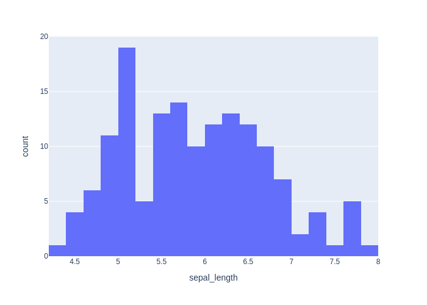

# Детальный отчёт по кейсам (en)

## Evaluation Results

- **Code generation accuracy: 88.9%** (16 / 18)

- **Chat response accuracy: 92.3%** (24 / 26)

- 1 из 2 ошибок обусловлена ошибками классификации `decision`, а не качеством ответа

- **Overall decision accuracy: 0.964**

## Кейсы
### code_001_describe_en (code_generation, language: en, difficulty: easy)

**User input:** Write code that outputs statistics for the dataset.


**Ground truth:**
- expected_code:
```python
df.describe()
```
- expected_result:

```python
       sepal_length  sepal_width  petal_length  petal_width
count    150.000000   150.000000    150.000000   150.000000
mean       5.843333     3.057333      3.758000     1.199333
std        0.828066     0.435866      1.765298     0.762238
min        4.300000     2.000000      1.000000     0.100000
25%        5.100000     2.800000      1.600000     0.300000
50%        5.800000     3.000000      4.350000     1.300000
75%        6.400000     3.300000      5.100000     1.800000
max        7.900000     4.400000      6.900000     2.500000
```
- expected_error:

```python
None
```


**Model output:**
> Here's the generated code:
```python
df.describe(include='all')
```
- model_result:

```python
        sepal_length  sepal_width  petal_length  petal_width species
count     150.000000   150.000000    150.000000   150.000000     150
unique           NaN          NaN           NaN          NaN       3
top              NaN          NaN           NaN          NaN  setosa
freq             NaN          NaN           NaN          NaN      50
mean        5.843333     3.057333      3.758000     1.199333     NaN
std         0.828066     0.435866      1.765298     0.762238     NaN
min         4.300000     2.000000      1.000000     0.100000     NaN
25%         5.100000     2.800000      1.600000     0.300000     NaN
50%         5.800000     3.000000      4.350000     1.300000     NaN
75%         6.400000     3.300000      5.100000     1.800000     NaN
max         7.900000     4.400000      6.900000     2.500000     NaN
```
- model_error:

```python
None
```
- decision_score: True

### code_002_pairplot_en (code_generation, language: en, difficulty: medium)

**User input:** Create a pairplot for all features.


**Ground truth:**
- expected_code:
```python
import plotly.express as px
fig = px.scatter_matrix(df, dimensions=df.columns, color="species")
fig.show()
```
- expected_result:

```python
None
```
- expected_output: Интерактивный график (Plotly)
- expected_error:

```python
execution_timeout: sandbox_timeout
```
- expected_plot:

 


**Model output:**
> Here's the generated code:
```python
import plotly.express as px
fig = px.scatter_matrix(df, dimensions=['sepal_length', 'sepal_width', 'petal_length', 'petal_width'], color='species')
fig.show()
```
- model_result:

```python
None
```
- model_error:

```python
execution_timeout: sandbox_timeout
```
- model_plot:

 
- decision_score: True

### code_003_train_model_en (code_generation, language: en, difficulty: medium)

**User input:** Write code that trains a simple classifier on this data.


**Ground truth:**
- expected_code:
```python
from sklearn.linear_model import LogisticRegression

X = df.drop(columns=["species"])
y = df["species"]

model = LogisticRegression(max_iter=200)
model.fit(X, y)
```
- possible_code_objects: RandomForestClassifier, DecisionTreeClassifier, SVC, KNeighborsClassifier, GaussianNB
- expected_result:

```python
LogisticRegression(max_iter=200)
```
- expected_error:

```python
None
```


**Model output:**
> Here's the generated code:
```python
from sklearn.model_selection import train_test_split
from sklearn.linear_model import LogisticRegression
from sklearn.metrics import accuracy_score

X = df[['sepal_length', 'sepal_width', 'petal_length', 'petal_width']]
y = df['species']

X_train, X_test, y_train, y_test = train_test_split(X, y, test_size=0.2, random_state=42)

model = LogisticRegression(max_iter=200)
model.fit(X_train, y_train)

y_pred = model.predict(X_test)
accuracy_score(y_test, y_pred)
```
- model_result:

```python
1.0
```
- model_error:

```python
None
```
- decision_score: True

### code_004_missing_check_en (code_generation, language: en, difficulty: easy)

**User input:** Check if there are missing values in the dataset.


**Ground truth:**
- expected_code:
```python
df.isnull().sum()
```
- expected_result:

```python
sepal_length    0
sepal_width     0
petal_length    0
petal_width     0
species         0
dtype: int64
```
- expected_error:

```python
None
```


**Model output:**
> Here's the generated code:
```python
df.isnull().sum()
```
- model_result:

```python
sepal_length    0
sepal_width     0
petal_length    0
petal_width     0
species         0
dtype: int64
```
- model_error:

```python
None
```
- decision_score: True

### code_005_fill_missing_en (code_generation, language: en, difficulty: easy)

**User input:** Fill missing values with the mean value of column.


**Ground truth:**
- expected_code:
```python
df.fillna(df.mean(numeric_only=True), inplace=True)
```
- expected_result:

```python
None
```
- expected_output: Графический вывод
- expected_error:

```python
None
```


**Model output:**
> Here's the generated code:
```python
df.fillna(df.mean(numeric_only=True), inplace=True)
```
- model_result:

```python
None
```
- model_error:

```python
None
```
- decision_score: True

### code_006_boxplot_en (code_generation, language: en, difficulty: medium)

**User input:** Create boxplots for all numeric features.


**Ground truth:**
- expected_code:
```python
import plotly.express as px

fig = px.box(df, y=df.select_dtypes(include="number").columns)
fig.show()
```
- expected_result:

```python
None
```
- expected_output: Интерактивный график (Plotly)
- expected_error:

```python
execution_timeout: sandbox_timeout
```
- expected_plot:

 


**Model output:**
> Here's the generated code:
```python
import plotly.express as px

fig = px.box(df, x='species', y='sepal_length', title='Boxplot of Sepal Length by Species')
fig.show()

fig = px.box(df, x='species', y='sepal_width', title='Boxplot of Sepal Width by Species')
fig.show()

fig = px.box(df, x='species', y='petal_length', title='Boxplot of Petal Length by Species')
fig.show()

fig = px.box(df, x='species', y='petal_width', title='Boxplot of Petal Width by Species')
fig.show()
```
- model_result:

```python
None
```
- model_error:

```python
execution_timeout: sandbox_timeout
```
- model_plot:

 
- decision_score: True

### code_007_standardize_en (code_generation, language: en, difficulty: medium)

**User input:** Standardize all feature columns.


**Ground truth:**
- expected_code:
```python
from sklearn.preprocessing import StandardScaler

scaler = StandardScaler()
X_scaled = scaler.fit_transform(df.drop(columns=["species"]))
```
- expected_result:

```python
None
```
- expected_output: Графический вывод
- expected_error:

```python
None
```


**Model output:**
> Here's the generated code:
```python
from sklearn.preprocessing import StandardScaler
scaler = StandardScaler()
df[['sepal_length', 'sepal_width', 'petal_length', 'petal_width']] = scaler.fit_transform(df[['sepal_length', 'sepal_width', 'petal_length', 'petal_width']])
```
- model_result:

```python
None
```
- model_error:

```python
None
```
- decision_score: True

### code_008_normalize_en (code_generation, language: en, difficulty: medium)

**User input:** Normalize the features in range 0 to 1.


**Ground truth:**
- expected_code:
```python
from sklearn.preprocessing import MinMaxScaler

scaler = MinMaxScaler()
X_normalized = scaler.fit_transform(df.drop(columns=["species"]))
```
- expected_result:

```python
None
```
- expected_output: Графический вывод
- expected_error:

```python
None
```


**Model output:**
> Here's the generated code:
```python
from sklearn.preprocessing import MinMaxScaler

scaler = MinMaxScaler()
df[['sepal_length', 'sepal_width', 'petal_length', 'petal_width']] = scaler.fit_transform(df[['sepal_length', 'sepal_width', 'petal_length', 'petal_width']])
```
- model_result:

```python
None
```
- model_error:

```python
None
```
- decision_score: True

### code_009_pca_en (code_generation, language: en, difficulty: medium)

**User input:** Reduce dimensionality to two components using PCA.


**Ground truth:**
- expected_code:
```python
from sklearn.decomposition import PCA

pca = PCA(n_components=2)
X_pca = pca.fit_transform(df.drop(columns=["species"]))
```
- expected_result:

```python
None
```
- expected_output: Графический вывод
- expected_error:

```python
None
```


**Model output:**
> Here's the generated code:
```python
from sklearn.decomposition import PCA
import pandas as pd

pca = PCA(n_components=2)
df_pca = pd.DataFrame(pca.fit_transform(df[['sepal_length', 'sepal_width', 'petal_length', 'petal_width']]), columns=['PC1', 'PC2'])
df_pca['species'] = df['species']
```
- model_result:

```python
None
```
- model_error:

```python
None
```
- decision_score: True

### code_010_pca_plot_en (code_generation, language: en, difficulty: hard)

**User input:** Make scatter plot of first two PCA components colored by species.


**Ground truth:**
- expected_code:
```python
import plotly.express as px
from sklearn.decomposition import PCA

pca = PCA(n_components=2)
X_pca = pca.fit_transform(df.drop(columns=["species"]))

df_pca = pd.DataFrame(X_pca, columns=["PC1", "PC2"])
df_pca["species"] = df["species"]

fig = px.scatter(df_pca, x="PC1", y="PC2", color="species")
fig.show()
```
- expected_result:

```python
None
```
- expected_output: Интерактивный график (Plotly)
- expected_error:

```python
execution_timeout: sandbox_timeout
```
- expected_plot:

 


**Model output:**
> Here's the generated code:
```python
import pandas as pd
from sklearn.decomposition import PCA
import plotly.express as px

pca = PCA(n_components=2)
principal_components = pca.fit_transform(df[['sepal_length', 'sepal_width', 'petal_length', 'petal_width']])
df_pca = pd.DataFrame(data=principal_components, columns=['PC1', 'PC2'])
df_pca['species'] = df['species']

px.scatter(df_pca, x='PC1', y='PC2', color='species', title='Scatter Plot of First Two PCA Components Colored by Species')
```
- model_result:

```python
Figure({
    'data': [{'hovertemplate': 'species=setosa<br>PC1=%{x}<br>PC2=%{y}<extra></extra>',
              'legendgroup': 'setosa',
              'marker': {'color': '#636efa', 'symbol': 'circle'},
              'mode': 'markers',
              'name': 'setosa',
              'orientation': 'v',
              'showlegend': True,
              'type': 'scatter',
              'x': {'bdata': ('TCgv2xZ5BcBwHb3qj7YFwCt/ZBanHA' ... 'A3twbAs49zVz1YBMACnPMXe6AFwA=='),
                    'dtype': 'f8'},
              'xaxis': 'x',
              'y': {'bdata': ('EP0gJgFx1D9gqoDk+afGvwBETuqzjc' ... 'dSLc2/4OGs4oaK4j+ATOo1oJK7Pw=='),
                    'dtype': 'f8'},
              'yaxis': 'y'},
             {'hovertemplate': 'species=versicolor<br>PC1=%{x}<br>PC2=%{y}<extra></extra>',
              'legendgroup': 'versicolor',
              'marker': {'color': '#EF553B', 'symbol': 'circle'},
              'mode': 'markers',
              'name': 'versicolor',
              'orientation': 'v',
              'showlegend': True,
              'type': 'scatter',
              'x': {'bdata': ('EFGrYaWO9D94pcUw8tbtP/SOhkXIbf' ... '/7j+Q/CHkYF80B7b9w9VVt1CLTPw=='),
                    'dtype': 'f8'},
              'xaxis': 'x',
              'y': {'bdata': ('sGilptXs5T8ggGMNlF/UP9DwisXrIu' ... 'n1KZI/cH1It+ox6L/AaxZ3V1TWvw=='),
                    'dtype': 'f8'},
              'yaxis': 'y'},
             {'hovertemplate': 'species=virginica<br>PC1=%{x}<br>PC2=%{y}<extra></extra>',
              'legendgroup': 'virginica',
              'marker': {'color': '#00cc96', 'symbol': 'circle'},
              'mode': 'markers',
              'name': 'virginica',
              'orientation': 'v',
              'showlegend': True,
              'type': 'scatter',
              'x': {'bdata': ('JFEO+eE/BEBEG+lfzqT2P7hux9Xz7g' ... 'PCOvw//MYKwUFq/j+wRhWtNj72Pw=='),
                    'dtype': 'f8'},
              'xaxis': 'x',
              'y': {'bdata': ('ACyJGcUrhL+Qu9T3tmXivwBDAF2CAt' ... 'kYMLQ/AMWbc1TbvT+wqiHnHRfSvw=='),
                    'dtype': 'f8'},
              'yaxis': 'y'}],
    'layout': {'legend': {'title': {'text': 'species'}, 'tracegroupgap': 0},
               'template': '...',
               'title': {'text': 'Scatter Plot of First Two PCA Components Colored by Species'},
               'xaxis': {'anchor': 'y', 'domain': [0.0, 1.0], 'title': {'text': 'PC1'}},
               'yaxis': {'anchor': 'x', 'domain': [0.0, 1.0], 'title': {'text': 'PC2'}}}
})
```
- model_error:

```python
None
```
- model_plot:

 
- decision_score: True

### code_011_kmeans_en (code_generation, language: en, difficulty: medium)

**User input:** Make three clusters using KMeans.


**Ground truth:**
- expected_code:
```python
from sklearn.cluster import KMeans

kmeans = KMeans(n_clusters=3, random_state=42)
clusters = kmeans.fit_predict(df.drop(columns=["species"]))
```
- expected_result:

```python
None
```
- expected_output: Графический вывод
- expected_error:

```python
None
```


**Model output:**
> Here's the generated code:
```python
from sklearn.cluster import KMeans
import pandas as pd

kmeans = KMeans(n_clusters=3, random_state=42)
df['cluster'] = kmeans.fit_predict(df[['sepal_length', 'sepal_width', 'petal_length', 'petal_width']])
```
- model_result:

```python
None
```
- model_error:

```python
None
```
- decision_score: True

### code_012_cluster_plot_en (code_generation, language: en, difficulty: medium)

**User input:** Make scatter plot of KMeans clusters using the first two features.


**Ground truth:**
- expected_code:
```python
import plotly.express as px
from sklearn.cluster import KMeans

X = df.drop("species", axis=1)
kmeans = KMeans(n_clusters=3, random_state=42)
clusters = kmeans.fit_predict(X)

fig = px.scatter(
    df,
    x=df.columns[0],
    y=df.columns[1],
    color=clusters.astype(str)
)
fig
```
- expected_result:

```python
None
```
- expected_output: Интерактивный график (Plotly)
- expected_error:

```python
execution_error: name 'clusters' is not defined
```
- expected_plot_error: name 'clusters' is not defined


**Model output:**
> Here's the generated code:
```python
from sklearn.cluster import KMeans
import plotly.express as px

kmeans = KMeans(n_clusters=3, random_state=42)
df['cluster'] = kmeans.fit_predict(df[['sepal_length', 'sepal_width']])

px.scatter(df, x='sepal_length', y='sepal_width', color='cluster', symbol='species', title='KMeans Clusters using First Two Features')
```
- model_result:

```python
Figure({
    'data': [{'hovertemplate': ('species=setosa<br>sepal_length' ... '%{marker.color}<extra></extra>'),
              'legendgroup': 'setosa',
              'marker': {'color': {'bdata': ('AgAAAAIAAAACAAAAAgAAAAIAAAACAA' ... 'AAAgAAAAIAAAACAAAAAgAAAAIAAAA='),
                                   'dtype': 'i4'},
                         'coloraxis': 'coloraxis',
                         'symbol': 'circle'},
              'mode': 'markers',
              'name': 'setosa',
              'orientation': 'v',
              'showlegend': True,
              'type': 'scatter',
              'x': {'bdata': ('ZmZmZmZmFECamZmZmZkTQM3MzMzMzB' ... 'ZmZhJAMzMzMzMzFUAAAAAAAAAUQA=='),
                    'dtype': 'f8'},
              'xaxis': 'x',
              'y': {'bdata': ('AAAAAAAADEAAAAAAAAAIQJqZmZmZmQ' ... 'mZmQlAmpmZmZmZDUBmZmZmZmYKQA=='),
                    'dtype': 'f8'},
              'yaxis': 'y'},
             {'hovertemplate': ('species=versicolor<br>sepal_le' ... '%{marker.color}<extra></extra>'),
              'legendgroup': 'versicolor',
              'marker': {'color': {'bdata': ('AAAAAAAAAAAAAAAAAQAAAAAAAAABAA' ... 'AAAQAAAAEAAAABAAAAAQAAAAEAAAA='),
                                   'dtype': 'i4'},
                         'coloraxis': 'coloraxis',
                         'symbol': 'diamond'},
              'mode': 'markers',
              'name': 'versicolor',
              'orientation': 'v',
              'showlegend': True,
              'type': 'scatter',
              'x': {'bdata': ('AAAAAAAAHECamZmZmZkZQJqZmZmZmR' ... 'zMzBhAZmZmZmZmFEDNzMzMzMwWQA=='),
                    'dtype': 'f8'},
              'xaxis': 'x',
              'y': {'bdata': ('mpmZmZmZCUCamZmZmZkJQM3MzMzMzA' ... 'MzMwdAAAAAAAAABEBmZmZmZmYGQA=='),
                    'dtype': 'f8'},
              'yaxis': 'y'},
             {'hovertemplate': ('species=virginica<br>sepal_len' ... '%{marker.color}<extra></extra>'),
              'legendgroup': 'virginica',
              'marker': {'color': {'bdata': ('AAAAAAEAAAAAAAAAAAAAAAAAAAAAAA' ... 'AAAAAAAAEAAAAAAAAAAAAAAAEAAAA='),
                                   'dtype': 'i4'},
                         'coloraxis': 'coloraxis',
                         'symbol': 'square'},
              'mode': 'markers',
              'name': 'virginica',
              'orientation': 'v',
              'showlegend': True,
              'type': 'scatter',
              'x': {'bdata': ('MzMzMzMzGUAzMzMzMzMXQGZmZmZmZh' ... 'AAABpAzczMzMzMGECamZmZmZkXQA=='),
                    'dtype': 'f8'},
              'xaxis': 'x',
              'y': {'bdata': ('ZmZmZmZmCkCamZmZmZkFQAAAAAAAAA' ... 'AAAAhAMzMzMzMzC0AAAAAAAAAIQA=='),
                    'dtype': 'f8'},
              'yaxis': 'y'}],
    'layout': {'coloraxis': {'colorbar': {'title': {'text': 'cluster'}},
                             'colorscale': [[0.0, '#0d0887'], [0.1111111111111111,
                                            '#46039f'], [0.2222222222222222,
                                            '#7201a8'], [0.3333333333333333,
                                            '#9c179e'], [0.4444444444444444,
                                            '#bd3786'], [0.5555555555555556,
                                            '#d8576b'], [0.6666666666666666,
                                            '#ed7953'], [0.7777777777777778,
                                            '#fb9f3a'], [0.8888888888888888,
                                            '#fdca26'], [1.0, '#f0f921']]},
               'legend': {'title': {'text': 'species'}, 'tracegroupgap': 0},
               'template': '...',
               'title': {'text': 'KMeans Clusters using First Two Features'},
               'xaxis': {'anchor': 'y', 'domain': [0.0, 1.0], 'title': {'text': 'sepal_length'}},
               'yaxis': {'anchor': 'x', 'domain': [0.0, 1.0], 'title': {'text': 'sepal_width'}}}
})
```
- model_error:

```python
None
```
- model_plot:

 
- decision_score: True

### code_013_train_test_split_en (code_generation, language: en, difficulty: easy)

**User input:** Split the dataset into train and test sets.


**Ground truth:**
- expected_code:
```python
from sklearn.model_selection import train_test_split

X = df.drop(columns=["species"])
y = df["species"]

X_train, X_test, y_train, y_test = train_test_split(X, y, test_size=0.2, random_state=42)
```
- expected_result:

```python
None
```
- expected_output: Графический вывод
- expected_error:

```python
None
```


**Model output:**
> Here's the generated code:
```python
from sklearn.model_selection import train_test_split

X = df.drop('species', axis=1)
y = df['species']

X_train, X_test, y_train, y_test = train_test_split(X, y, test_size=0.2, random_state=42, stratify=y)
```
- model_result:

```python
None
```
- model_error:

```python
None
```
- decision_score: True

### code_014_show_all_plots_en (code_generation, language: en, difficulty: hard)

**User input:** Show all plots.


**Ground truth:**
- expected_code:
```python
import plotly.express as px
import plotly.graph_objects as go

# df already exists and represents the iris dataset

# Select numeric columns
num_cols = df.select_dtypes(include=["number"]).columns.tolist()

# Try to infer target column
candidate_targets = ["species", "target", "label", "class"]
target_col = next((c for c in candidate_targets if c in df.columns), None)

if not num_cols:
    raise ValueError("No numeric columns found in df to build plots.")

# 1) Histograms for all numeric features
fig_hist = px.histogram(
    df,
    x=num_cols,
    color=target_col if target_col else None,
    barmode="overlay",
    title="Distributions (Histograms)"
)
fig_hist.show()

# 2) Box plots by class (if target exists)
if target_col:
    for col in num_cols:
        fig_box = px.box(
            df,
            x=target_col,
            y=col,
            title=f"Boxplot: {col} by {target_col}"
        )
        fig_box.show()

# 3) Scatter plots for common Iris feature pairs
scatter_pairs = [
    ("sepal_length", "sepal_width"),
    ("petal_length", "petal_width")
]

for x, y in scatter_pairs:
    if x in df.columns and y in df.columns:
        fig_scatter = px.scatter(
            df,
            x=x,
            y=y,
            color=target_col if target_col else None,
            title=f"Scatter: {x} vs {y}"
        )
        fig_scatter.show()

# 4) Scatter matrix (pairwise relationships)
fig_matrix = px.scatter_matrix(
    df,
    dimensions=num_cols,
    color=target_col if target_col else None,
    title="Scatter Matrix"
)
fig_matrix.show()

# 5) Correlation heatmap
corr = df[num_cols].corr(numeric_only=True)

fig_heatmap = px.imshow(
    corr,
    text_auto=True,
    title="Correlation Heatmap"
)
fig_heatmap.show()

```
- possible_code_objects: df, pd, np, px
- expected_result:

```python
None
```
- expected_output: Интерактивный график (Plotly)
- expected_error:

```python
execution_timeout: sandbox_timeout
```
- expected_plot:

 


**Model output:**
> Here's the generated code:
```python
import plotly.express as px

fig1 = px.scatter(df, x='sepal_length', y='sepal_width', color='species', title='Sepal Length vs Sepal Width')
fig2 = px.scatter(df, x='petal_length', y='petal_width', color='species', title='Petal Length vs Petal Width')
fig3 = px.box(df, x='species', y='sepal_length', title='Sepal Length by Species')
fig4 = px.box(df, x='species', y='sepal_width', title='Sepal Width by Species')
fig5 = px.box(df, x='species', y='petal_length', title='Petal Length by Species')
fig6 = px.box(df, x='species', y='petal_width', title='Petal Width by Species')

fig1.show()
fig2.show()
fig3.show()
fig4.show()
fig5.show()
fig6.show()
```
- model_result:

```python
None
```
- model_error:

```python
execution_timeout: sandbox_timeout
```
- model_plot:

 
- decision_score: True

### code_015_histogram_en (code_generation, language: en, difficulty: hard)

**User input:** Show a histogram.


**Ground truth:**
- expected_code:
```python
import plotly.express as px

# df already exists and represents the iris dataset

num_cols = df.select_dtypes(include=["number"]).columns.tolist()

if not num_cols:
    raise ValueError("В df не найдено числовых колонок для построения histogram.")

# Строим histogram по всем числовым признакам
fig = px.histogram(
    df,
    x=num_cols,
    barmode="overlay",
    title="Histogram"
)

fig.show()

```
- possible_code_objects: df, px
- expected_result:

```python
None
```
- expected_output: Интерактивный график (Plotly)
- expected_error:

```python
execution_timeout: sandbox_timeout
```
- expected_plot:

 


**Model output:**
> Here's the generated code:
```python
import plotly.express as px
px.histogram(df, x='sepal_length', nbins=20)
```
- model_result:

```python
Figure({
    'data': [{'bingroup': 'x',
              'hovertemplate': 'sepal_length=%{x}<br>count=%{y}<extra></extra>',
              'legendgroup': '',
              'marker': {'color': '#636efa', 'pattern': {'shape': ''}},
              'name': '',
              'nbinsx': 20,
              'orientation': 'v',
              'showlegend': False,
              'type': 'histogram',
              'x': {'bdata': ('ZmZmZmZmFECamZmZmZkTQM3MzMzMzB' ... 'AAAAAAGkDNzMzMzMwYQJqZmZmZmRdA'),
                    'dtype': 'f8'},
              'xaxis': 'x',
              'yaxis': 'y'}],
    'layout': {'barmode': 'relative',
               'legend': {'tracegroupgap': 0},
               'margin': {'t': 60},
               'template': '...',
               'xaxis': {'anchor': 'y', 'domain': [0.0, 1.0], 'title': {'text': 'sepal_length'}},
               'yaxis': {'anchor': 'x', 'domain': [0.0, 1.0], 'title': {'text': 'count'}}}
})
```
- model_error:

```python
None
```
- model_plot:

 
- decision_score: True

### code_016_index_to_value_en (code_generation, language: en, difficulty: hard)

**User input:** Display the Index to Values plot


**Ground truth:**
- expected_code:
```python
import plotly.express as px

df_reset = df.reset_index().rename(columns={"index": "index"})
fig = px.scatter(
    df_reset,
    x="index",
    y=["sepal_length", "sepal_width", "petal_length", "petal_width"],
)
fig
```
- possible_code_objects: df, px
- expected_result:

```python
Figure({
    'data': [{'hovertemplate': 'variable=sepal_length<br>index=%{x}<br>value=%{y}<extra></extra>',
              'legendgroup': 'sepal_length',
              'marker': {'color': '#636efa', 'symbol': 'circle'},
              'mode': 'markers',
              'name': 'sepal_length',
              'orientation': 'v',
              'showlegend': True,
              'type': 'scatter',
              'x': {'bdata': ('AAABAAIAAwAEAAUABgAHAAgACQAKAA' ... 'CLAIwAjQCOAI8AkACRAJIAkwCUAJUA'),
                    'dtype': 'i2'},
              'xaxis': 'x',
              'y': {'bdata': ('ZmZmZmZmFECamZmZmZkTQM3MzMzMzB' ... 'AAAAAAGkDNzMzMzMwYQJqZmZmZmRdA'),
                    'dtype': 'f8'},
              'yaxis': 'y'},
             {'hovertemplate': 'variable=sepal_width<br>index=%{x}<br>value=%{y}<extra></extra>',
              'legendgroup': 'sepal_width',
              'marker': {'color': '#EF553B', 'symbol': 'circle'},
              'mode': 'markers',
              'name': 'sepal_width',
              'orientation': 'v',
              'showlegend': True,
              'type': 'scatter',
              'x': {'bdata': ('AAABAAIAAwAEAAUABgAHAAgACQAKAA' ... 'CLAIwAjQCOAI8AkACRAJIAkwCUAJUA'),
                    'dtype': 'i2'},
              'xaxis': 'x',
              'y': {'bdata': ('AAAAAAAADEAAAAAAAAAIQJqZmZmZmQ' ... 'AAAAAACEAzMzMzMzMLQAAAAAAAAAhA'),
                    'dtype': 'f8'},
              'yaxis': 'y'},
             {'hovertemplate': 'variable=petal_length<br>index=%{x}<br>value=%{y}<extra></extra>',
              'legendgroup': 'petal_length',
              'marker': {'color': '#00cc96', 'symbol': 'circle'},
              'mode': 'markers',
              'name': 'petal_length',
              'orientation': 'v',
              'showlegend': True,
              'type': 'scatter',
              'x': {'bdata': ('AAABAAIAAwAEAAUABgAHAAgACQAKAA' ... 'CLAIwAjQCOAI8AkACRAJIAkwCUAJUA'),
                    'dtype': 'i2'},
              'xaxis': 'x',
              'y': {'bdata': ('ZmZmZmZm9j9mZmZmZmb2P83MzMzMzP' ... 'zMzMzMFECamZmZmZkVQGZmZmZmZhRA'),
                    'dtype': 'f8'},
              'yaxis': 'y'},
             {'hovertemplate': 'variable=petal_width<br>index=%{x}<br>value=%{y}<extra></extra>',
              'legendgroup': 'petal_width',
              'marker': {'color': '#ab63fa', 'symbol': 'circle'},
              'mode': 'markers',
              'name': 'petal_width',
              'orientation': 'v',
              'showlegend': True,
              'type': 'scatter',
              'x': {'bdata': ('AAABAAIAAwAEAAUABgAHAAgACQAKAA' ... 'CLAIwAjQCOAI8AkACRAJIAkwCUAJUA'),
                    'dtype': 'i2'},
              'xaxis': 'x',
              'y': {'bdata': ('mpmZmZmZyT+amZmZmZnJP5qZmZmZmc' ... 'AAAAAAAEBmZmZmZmYCQM3MzMzMzPw/'),
                    'dtype': 'f8'},
              'yaxis': 'y'}],
    'layout': {'legend': {'title': {'text': 'variable'}, 'tracegroupgap': 0},
               'margin': {'t': 60},
               'template': '...',
               'xaxis': {'anchor': 'y', 'domain': [0.0, 1.0], 'title': {'text': 'index'}},
               'yaxis': {'anchor': 'x', 'domain': [0.0, 1.0], 'title': {'text': 'value'}}}
})
```
- expected_error:

```python
None
```
- expected_plot:

 


**Model output:**
> Here's the generated code:
```python
df.index.to_series().plot(kind='line')
```
- model_result:

```python
Axes(0.125,0.11;0.775x0.77)
```
- model_error:

```python
None
```
- decision_score: True

### code_017_corr_matrix_en (code_generation, language: en, difficulty: hard)

**User input:** Display the correlation matrix plot


**Ground truth:**
- expected_code:
```python
import plotly.express as px

corr = df[["sepal_length", "sepal_width", "petal_length", "petal_width"]].corr()
fig = px.imshow(corr, text_auto=True)
fig
```
- possible_code_objects: df, px
- expected_result:

```python
Figure({
    'data': [{'coloraxis': 'coloraxis',
              'hovertemplate': 'x: %{x}<br>y: %{y}<br>color: %{z}<extra></extra>',
              'name': '0',
              'texttemplate': '%{z}',
              'type': 'heatmap',
              'x': array(['sepal_length', 'sepal_width', 'petal_length', 'petal_width'],
                         dtype=object),
              'xaxis': 'x',
              'y': array(['sepal_length', 'sepal_width', 'petal_length', 'petal_width'],
                         dtype=object),
              'yaxis': 'y',
              'z': {'bdata': ('AAAAAAAA8D9HWdmpDRm+v9Mdsyxo5e' ... '12m27Xv7hdSirLz+4/AAAAAAAA8D8='),
                    'dtype': 'f8',
                    'shape': '4, 4'}}],
    'layout': {'coloraxis': {'colorscale': [[0.0, '#0d0887'], [0.1111111111111111,
                                            '#46039f'], [0.2222222222222222,
                                            '#7201a8'], [0.3333333333333333,
                                            '#9c179e'], [0.4444444444444444,
                                            '#bd3786'], [0.5555555555555556,
                                            '#d8576b'], [0.6666666666666666,
                                            '#ed7953'], [0.7777777777777778,
                                            '#fb9f3a'], [0.8888888888888888,
                                            '#fdca26'], [1.0, '#f0f921']]},
               'margin': {'t': 60},
               'template': '...',
               'xaxis': {'anchor': 'y', 'constrain': 'domain', 'domain': [0.0, 1.0], 'scaleanchor': 'y'},
               'yaxis': {'anchor': 'x', 'autorange': 'reversed', 'constrain': 'domain', 'domain': [0.0, 1.0]}}
})
```
- expected_error:

```python
None
```
- expected_plot:

 


**Model output:**
> Here's the generated code:
```python
import plotly.express as px
import numpy as np

corr_matrix = df.select_dtypes(include=[np.number]).corr()
fig = px.imshow(corr_matrix, text_auto=True, aspect="auto", color_continuous_scale="RdBu_r")
fig.show()
```
- model_result:

```python
None
```
- model_error:

```python
execution_timeout: sandbox_timeout
```
- model_plot:

 
- decision_score: True

### code_018_radar_en (code_generation, language: en, difficulty: hard)

**User input:** Display the Radar chart


**Ground truth:**
- expected_code:
```python
import plotly.express as px

cols = ["sepal_length", "sepal_width", "petal_length", "petal_width"]
df_mean = df.groupby("species", observed=True)[cols].mean().reset_index()
df_long = df_mean.melt(id_vars="species", var_name="variable", value_name="value")
fig = px.line_polar(df_long, r="value", theta="variable", color="species", line_close=True)
fig
```
- possible_code_objects: df, px
- expected_result:

```python
None
```
- expected_output: Интерактивный график (Plotly)
- expected_error:

```python
execution_error: Value of 'r' is not the name of a column in 'data_frame'. Expected one of ['species', 'sepal_length', 'sepal_width', 'petal_length', 'petal_width'] but received: value
```
- expected_plot_error: Value of 'r' is not the name of a column in 'data_frame'. Expected one of ['species', 'sepal_length', 'sepal_width', 'petal_length', 'petal_width'] but received: value


**Model output:**
> Here's the generated code:
```python
import plotly.express as px

fig = px.line_polar(df, r=['sepal_length', 'sepal_width', 'petal_length', 'petal_width'], theta=['sepal_length', 'sepal_width', 'petal_length', 'petal_width'], color='species', line_close=True)
fig.show()
```
- model_result:

```python
None
```
- model_error:

```python
execution_error: All arguments should have the same length. The length of column argument `df[color]` is 150, whereas the length of previously-processed arguments ['r', 'theta'] is 4
```
- model_plot_error: All arguments should have the same length. The length of column argument `df[color]` is 150, whereas the length of previously-processed arguments ['r', 'theta'] is 4
- decision_score: True

### chat_001_what_is_iris_en (chat_response, language: en, difficulty: easy)

**User input:** Explain what this dataset represents.


**Ground truth:**
- expected_facts: dataset contains measurements of petals and sepals; three iris species


**Model output:**
> This dataset contains measurements of flowers from three different species.  Each row represents one flower, and the columns include:  - **sepal_length**: The length of the sepal in centimeters. - **sepal_width**: The width of the sepal in centimeters. - **petal_length**: The length of the petal in centimeters. - **petal_width**: The width of the petal in centimeters. - **species**: The type of flower, such as setosa, versicolor, or virginica.  These measurements are used to study and classify the different species based on their physical features.
- decision_score: True

### chat_002_how_many_classes_en (chat_response, language: en, difficulty: easy)

**User input:** How many classes are in this dataset?


**Ground truth:**
- expected_facts: three classes; setosa; versicolor; virginica


**Model output:**
> The dataset has **three classes**.  These are the species of flowers: - **setosa** - **versicolor** - **virginica**
- decision_score: True

### chat_003_best_features_en (chat_response, language: en, difficulty: medium)

**User input:** Which features best separate the iris species?


**Ground truth:**
- expected_facts: petal length; petal width


**Model output:**
> Here's the generated code:
```python
df.groupby('species').mean()
```
- model_result:

```python
None
```
- model_error:

```python
None
```
- decision_score: False

### chat_004_easiest_class_en (chat_response, language: en, difficulty: medium)

**User input:** Which iris species is the easiest to separate from the others?


**Ground truth:**
- expected_facts: setosa; shorter petals; wider petals


**Model output:**
> The **setosa** species is the easiest to separate from the others.  It has clearly distinct measurements, especially in petal length and petal width.   For example: - **Setosa** petals are usually under 2 centimeters long. - The other two species, **versicolor** and **virginica**, have much longer petals.  This clear difference makes setosa stand out and easy to identify.
- decision_score: True

### theory_001_overfitting_en (chat_response, language: en, difficulty: easy)

**User input:** What is overfitting in machine learning?


**Ground truth:**
- expected_facts: model fits training data too well; poor generalization to new data
- forbidden_facts: overfitting improves performance on unseen data


**Model output:**
> **Overfitting** happens when a machine learning model learns the training data too well — including its noise and outliers — instead of finding the general patterns.  This means the model performs very well on the training data but poorly on new, unseen data.  For example, imagine a model memorizing every detail of a photo instead of learning what the photo is about. When shown a similar but slightly different photo, it might fail to recognize it.  Overfitting often occurs when a model is too complex for the amount of data available.  To prevent overfitting, you can: - Use more training data - Simplify the model - Use techniques like cross-validation or regularization  In short, a good model generalizes well — it works not just on known data, but on new data too.
- decision_score: True

### theory_002_train_test_split_en (chat_response, language: en, difficulty: easy)

**User input:** Why is a train-test split used?


**Ground truth:**
- expected_facts: evaluate model on unseen data; prevent data leakage
- forbidden_facts: to increase training accuracy


**Model output:**
> A **train-test split** is used to check how well a model will perform on new, unseen data.  Here’s why it’s important:  - We train the model on part of the data, called the **training set**. - Then, we test the model on a separate part, called the **test set**. - This helps us see if the model learns patterns well or just memorizes the training data.  If a model does well on training data but poorly on test data, it might be **overfitting**.  Using a train-test split gives a more honest estimate of real-world performance.
- decision_score: True

### theory_003_regularization_en (chat_response, language: en, difficulty: medium)

**User input:** What is regularization and why is it used?


**Ground truth:**
- expected_facts: adds penalty to model complexity; reduces overfitting
- forbidden_facts: regularization increases model variance


**Model output:**
> **Regularization** is a technique used in machine learning to prevent a model from becoming too complex.  It helps stop **overfitting**, which happens when a model learns the training data too well — including its noise and outliers — and then performs poorly on new, unseen data.  By adding a penalty to the size of the model’s coefficients, regularization keeps the model simple and more likely to generalize well.  Common types include: - **L1 regularization** (Lasso): can shrink some coefficients to zero, helping with feature selection. - **L2 regularization** (Ridge): reduces the size of coefficients but doesn’t set them to zero.  In short, regularization makes models more reliable when making predictions on new data.
- decision_score: True

### theory_004_bias_variance_en (chat_response, language: en, difficulty: medium)

**User input:** Explain the bias-variance tradeoff.


**Ground truth:**
- expected_facts: bias refers to error from simplifying assumptions; variance refers to sensitivity to training data; tradeoff between bias and variance
- forbidden_facts: bias and variance can both be minimized independently


**Model output:**
> The **bias-variance tradeoff** is a key concept in machine learning that helps us understand how well a model will perform on new data.  **Bias** is the error from incorrect assumptions in the learning algorithm. High bias means the model is too simple. It might not capture the true patterns in the data. This leads to underfitting.  **Variance** is the error from sensitivity to small fluctuations in the training data. High variance means the model is too complex. It learns the training data too well, including noise. This leads to overfitting.  A good model balances both: - Not too simple (low bias) - Not too sensitive to training data (low variance)  If you reduce bias, variance often increases, and vice versa.  So, the tradeoff means we must find a middle ground where the model generalizes well to new data.  Example: - A straight line fit to curved data has **high bias**. - A very wiggly curve that fits every point exactly has **high variance**.  The goal is to find a model that performs well on both training and new data.
- decision_score: True

### chat_005_feature_count_en (chat_response, language: en, difficulty: easy)

**User input:** How many features does this dataset have?


**Ground truth:**
- expected_facts: four features; sepal length; sepal width; petal length; petal width
- forbidden_facts: five features; only petal features


**Model output:**
> This dataset has **five** features.  They are: - **sepal_length** - **sepal_width** - **petal_length** - **petal_width** - **species**  Each feature represents a different measurement or category in the dataset.
- decision_score: True

### chat_006_samples_count_en (chat_response, language: en, difficulty: easy)

**User input:** How many samples are in this dataset?


**Ground truth:**
- expected_facts: 150 samples; 50 samples per class
- forbidden_facts: 100 samples; imbalanced classes


**Model output:**
> The dataset contains **150 samples**.
- decision_score: True

### chat_007_numeric_only_en (chat_response, language: en, difficulty: easy)

**User input:** Are all features in this dataset numeric?


**Ground truth:**
- expected_facts: all features are numeric; continuous measurements
- forbidden_facts: categorical features; text features


**Model output:**
> No, not all features are numeric.  The features **sepal_length**, **sepal_width**, **petal_length**, and **petal_width** are all numeric (float values).  However, the **species** feature is a **category**, which means it contains text labels, like "setosa", "versicolor", or "virginica".  So, only four features are numeric. One feature, **species**, is categorical.
- decision_score: True

### chat_008_need_scaling_en (chat_response, language: en, difficulty: medium)

**User input:** Is feature scaling important for this dataset?


**Ground truth:**
- expected_facts: important for distance-based models; helps algorithms like kNN or SVM
- forbidden_facts: scaling is never useful; scaling changes class labels


**Model output:**
> **Feature scaling** can be important for this dataset, especially if you're using machine learning models that are sensitive to the scale of input features.  For example: - **Distance-based models** like K-Nearest Neighbors or Support Vector Machines work better when all features are on a similar scale. - **Gradient descent-based models** like logistic regression or neural networks can converge faster with scaled features.  In this dataset, features like **sepal_length**, **sepal_width**, **petal_length**, and **petal_width** have different ranges and units. Without scaling, features with larger values might dominate the learning process.  So, if you're planning to use certain models, **scaling the features** is a good idea.  But for some models, like decision trees or random forests, scaling isn't necessary.  Always consider your model choice when deciding whether to scale.
- decision_score: True

### chat_009_linear_separable_en (chat_response, language: en, difficulty: medium)

**User input:** Is this dataset linearly separable?


**Ground truth:**
- expected_facts: setosa is linearly separable; other classes overlap
- forbidden_facts: all classes are perfectly separable; no class is separable


**Model output:**
> This dataset contains measurements of flower parts—sepal length, sepal width, petal length, and petal width—and the species of the flower.  The species column is a category, meaning it has distinct groups, like setosa, versicolor, and virginica.  To determine if the dataset is linearly separable, we would need to check if a straight line (or plane in higher dimensions) can separate the species using the measurements.  In practice, this dataset—commonly known as the Iris dataset—**is not fully linearly separable**. While some species, like setosa, can be separated easily from the others, the other two species, versicolor and virginica, overlap in the feature space. No single straight line or plane can perfectly separate all three species.  So, **no**, this dataset is not linearly separable.
- decision_score: True

### chat_011_unsupervised_possible_en (chat_response, language: en, difficulty: medium)

**User input:** Can this dataset be used for unsupervised learning?


**Ground truth:**
- expected_facts: can be used for clustering; labels can be ignored
- forbidden_facts: unsupervised learning requires labels


**Model output:**
> Yes, this dataset can be used for **unsupervised learning**.  In unsupervised learning, we look for patterns in data without using known labels.  Here’s how this dataset can be used:  - You can group similar flowers together using **clustering**, like K-means. - You can reduce the number of features using **dimensionality reduction**, like PCA. - You can find hidden structures in the data, such as natural groupings based on petal and sepal measurements.  Even though the dataset has a *species* column, you can ignore it during unsupervised learning to discover patterns on your own.  Example:   **Clustering** might group flowers by size, even if you don’t know their species.  So yes — this dataset works well for unsupervised learning tasks.
- decision_score: True

### chat_012_pca_purpose_en (chat_response, language: en, difficulty: medium)

**User input:** Is PCA applicable to this dataset?


**Ground truth:**
- expected_facts: reduce dimensionality; enable visualization; capture most variance
- forbidden_facts: PCA improves class labels


**Model output:**
> **Yes**, PCA (Principal Component Analysis) is applicable to this dataset.  This dataset has numerical features: *sepal_length*, *sepal_width*, *petal_length*, and *petal_width*. These are all continuous measurements, which are ideal for PCA.  PCA works best when: - The data is numerical. - Features are on similar scales (or properly scaled). - There are correlations between features.  In this case, the features are all measurements in the same units (centimeters), so they are comparable. The species column is categorical and not used in PCA.  So, PCA can help reduce the number of dimensions while keeping most of the important information, especially if the features are correlated.  > Example: PCA might combine sepal and petal measurements into a few new components that explain most of the variation in the data.
- decision_score: True

### chat_013_outliers_en (chat_response, language: en, difficulty: medium)

**User input:** Are outliers a major concern in this dataset?


**Ground truth:**
- expected_facts: dataset is relatively clean; few or no strong outliers
- forbidden_facts: dataset is heavily corrupted by outliers


**Model output:**
> Outliers can be a concern in any dataset, especially when using models that are sensitive to extreme values.  In this dataset, we have measurements for **sepal length**, **sepal width**, **petal length**, and **petal width**, all of which are numerical. The **species** column is categorical.  To check for outliers, we would typically look at the distribution of each numerical feature. For example, a **petal length** value of 7 centimeters might be unusual if most values are around 1 to 2 centimeters.  However, without seeing the actual data, we can’t say for sure if outliers are a major issue.  **Key points:** - Outliers may affect results if you're doing certain types of analysis or modeling. - This dataset is from the well-known Iris dataset, which is generally clean and has few extreme outliers. - Still, it’s good practice to visually inspect the data using plots like boxplots or histograms.  If you'd like, I can suggest how to check for outliers using Python code.
- decision_score: True

### chat_014_real_world_limitations_en (chat_response, language: en, difficulty: hard)

**User input:** What are the limitations of this dataset?


**Ground truth:**
- expected_facts: small size; not representative of complex real-world data
- forbidden_facts: suitable for deep learning at scale


**Model output:**
> This dataset has a few key limitations:  - It contains only **four features**: sepal length, sepal width, petal length, and petal width. These are all physical measurements, so the data is limited to these specific characteristics.  - The **species** column is a category with only three types: setosa, versicolor, and virginica. This means the dataset can only be used to study or classify these three iris species.  - The dataset is **small**, with only 150 samples. This limits its use for training complex models or making generalizations to larger populations.  - It is a **well-known, simple dataset** often used for teaching. It may not represent real-world data complexity, such as noise, missing values, or variation beyond what's in this sample.  - There are **no missing values** or outliers in this dataset, which makes it too clean for real-world scenarios.  Because of these traits, the dataset is great for learning but not ideal for solving real-world problems.
- decision_score: True

### theory_006_classification_vs_regression_en (chat_response, language: en, difficulty: easy)

**User input:** What is the difference between classification and regression?


**Ground truth:**
- expected_facts: classification predicts discrete labels; regression predicts continuous values
- forbidden_facts: classification predicts numbers only; regression predicts categories


**Model output:**
> **Classification** and **regression** are two types of machine learning tasks.  In **classification**, the goal is to predict a **category** or **label**.   For example, deciding if a flower is *setosa*, *versicolor*, or *virginica*.  In **regression**, the goal is to predict a **number** or **continuous value**.   For example, predicting the exact length of a petal in centimeters.  So, the main difference is: - **Classification** predicts **which group**. - **Regression** predicts **how much**.  Both are used to make predictions based on data.
- decision_score: True

### theory_007_cross_validation_en (chat_response, language: en, difficulty: medium)

**User input:** What is cross-validation?


**Ground truth:**
- expected_facts: splits data into multiple folds; provides more reliable performance estimates; reduces dependence on a single train-test split
- forbidden_facts: cross-validation guarantees perfect performance


**Model output:**
> **Cross-validation** is a technique used to check how well a model will work on new, unseen data.  It helps us make sure the model is not just memorizing the training data, but actually learning patterns.  Here’s how it works in simple steps:  - The data is split into parts, often called **folds**. - The model is trained on some of the folds and tested on the remaining one. - This process is repeated so that each fold gets a turn being the test set. - The results from all the tests are combined to give a more reliable estimate of the model’s performance.  For example, in **5-fold cross-validation**, the data is split into 5 parts. The model is trained and tested 5 times, each time using a different part as the test set.  This method helps reduce the risk of getting misleading results from a single train-test split.  It’s especially useful when you have limited data.
- decision_score: True

### theory_008_feature_engineering_en (chat_response, language: en, difficulty: medium)

**User input:** What is feature engineering?


**Ground truth:**
- expected_facts: process of creating or transforming features; can improve model performance; requires domain knowledge
- forbidden_facts: feature engineering is only data cleaning


**Model output:**
> **Feature engineering** is the process of using raw data to create new features or modify existing ones to help machine learning models work better.  For example, in the iris dataset, you might combine **sepal_length** and **sepal_width** to create a new feature like "sepal area" by multiplying them.  This can help the model find patterns more easily.  Common techniques include: - Scaling values - Creating ratios (like petal_length divided by petal_width) - Binning continuous values into categories  Good feature engineering can make a big difference in how well a model performs.
- decision_score: True

### theory_009_data_leakage_en (chat_response, language: en, difficulty: medium)

**User input:** What is data leakage?


**Ground truth:**
- expected_facts: information from test data leaks into training; leads to overly optimistic evaluation; harms generalization
- forbidden_facts: data leakage improves real-world performance


**Model output:**
> **Data leakage** happens when information from outside the training dataset is used to create a model.  This can make the model seem more accurate than it really is.  For example, if a model uses future data or data that wouldn’t be available at prediction time, it’s leaking information.  In real-world use, the model should only use data it would have access to.  This can lead to poor performance when the model is used on new data.  Always keep the training and test data completely separate.  Avoid using data that includes outcomes or future details when training.
- decision_score: True

### theory_010_precision_recall_en (chat_response, language: en, difficulty: medium)

**User input:** Explain precision and recall.


**Ground truth:**
- expected_facts: precision measures correctness of positive predictions; recall measures coverage of actual positives; tradeoff between precision and recall
- forbidden_facts: precision and recall are always equal


**Model output:**
> **Precision** and **recall** are two important measures used to evaluate how well a model works, especially in classification tasks.  **Precision** tells us how many of the items the model predicted as positive are actually positive.   It answers: *Out of all the items the model said were positive, how many were correct?*  For example, if a model predicts 10 flowers are of a certain species, and 8 are actually that species, the precision is 8 out of 10, or 80%.  **Recall** tells us how many of the actual positive items the model correctly identified.   It answers: *Out of all the real positive items, how many did the model catch?*  For example, if there are 10 flowers of that species in total, and the model correctly identified 8, the recall is 8 out of 10, or 80%.  In short: - **Precision** = True positives / (True positives + False positives) - **Recall** = True positives / (True positives + False negatives)  A high precision means few wrong predictions.   A high recall means few missed predictions.  Both are important, and sometimes you need to balance them depending on the task.
- decision_score: True

### theory_011_accuracy_limitations_en (chat_response, language: en, difficulty: medium)

**User input:** Is accuracy a universal metric?


**Ground truth:**
- expected_facts: problematic with imbalanced datasets; does not reflect class-wise performance
- forbidden_facts: accuracy is always the best metric


**Model output:**
> **Accuracy** is not a universal metric.  It works well when all classes have similar numbers of samples.  But it can be misleading when classes are imbalanced.  For example, if 95% of the data is one class, a model might predict only that class and still have 95% accuracy — but it fails on the minority class.  Other metrics like **precision**, **recall**, and **F1-score** are often better for imbalanced data.  So, **accuracy** is useful in some cases, but not always the best choice.
- decision_score: True

### chat_012_what_is_in_data_en (chat_response, language: en, difficulty: easy)

**User input:** What is in the data?


**Ground truth:**
- expected_facts: The data represents the Iris dataset; The dataset contains numeric features describing sepal and petal measurements; There is a categorical feature indicating the iris species; Each row corresponds to a single flower
- forbidden_facts: Mentioning specific statistics or numeric values; Claims about model performance or training results; Assumptions about downstream data processing


**Model output:**
> The data contains information about flowers, specifically measurements of their petals and sepals, along with the species they belong to.  - **sepal_length**: The length of the sepal in centimeters. - **sepal_width**: The width of the sepal in centimeters. - **petal_length**: The length of the petal in centimeters. - **petal_width**: The width of the petal in centimeters. - **species**: The type of flower, such as setosa, versicolor, or virginica.  This dataset is commonly used to learn about classification in machine learning.
- decision_score: True
