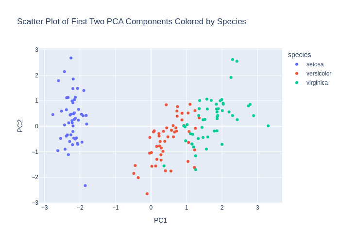
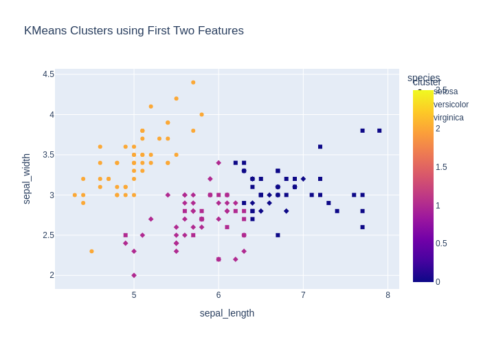

# Детальный отчёт по кейсам (en)

## Кейсы
### code_001_describe_en (code_generation, language: en, difficulty: easy)

**User input:** Write code that outputs statistics for the dataset.


**Ground truth:**
- expected_code:
```python
df.describe()
```
- expected_result:

```python
       sepal_length  sepal_width  petal_length  petal_width
count    150.000000   150.000000    150.000000   150.000000
mean       5.843333     3.057333      3.758000     1.199333
std        0.828066     0.435866      1.765298     0.762238
min        4.300000     2.000000      1.000000     0.100000
25%        5.100000     2.800000      1.600000     0.300000
50%        5.800000     3.000000      4.350000     1.300000
75%        6.400000     3.300000      5.100000     1.800000
max        7.900000     4.400000      6.900000     2.500000
```
- expected_error:

```python
None
```


**Model output:**
> Here's the generated code:
```python
df.describe(include='all')
```
- model_result:

```python
        sepal_length  sepal_width  petal_length  petal_width species
count     150.000000   150.000000    150.000000   150.000000     150
unique           NaN          NaN           NaN          NaN       3
top              NaN          NaN           NaN          NaN  setosa
freq             NaN          NaN           NaN          NaN      50
mean        5.843333     3.057333      3.758000     1.199333     NaN
std         0.828066     0.435866      1.765298     0.762238     NaN
min         4.300000     2.000000      1.000000     0.100000     NaN
25%         5.100000     2.800000      1.600000     0.300000     NaN
50%         5.800000     3.000000      4.350000     1.300000     NaN
75%         6.400000     3.300000      5.100000     1.800000     NaN
max         7.900000     4.400000      6.900000     2.500000     NaN
```
- model_error:

```python
None
```
- decision_score: True

### code_002_pairplot_en (code_generation, language: en, difficulty: medium)

**User input:** Create a pairplot for all features.


**Ground truth:**
- expected_code:
```python
import plotly.express as px
fig = px.scatter_matrix(df, dimensions=df.columns, color="species")
fig.show()
```
- expected_result:

```python
None
```
- expected_output: Интерактивный график (Plotly)
- expected_error:

```python
execution_timeout: sandbox_timeout
```
- expected_plot:

 


**Model output:**
> Here's the generated code:
```python
import plotly.express as px
fig = px.scatter_matrix(df, dimensions=['sepal_length', 'sepal_width', 'petal_length', 'petal_width'], color='species')
fig.show()
```
- model_result:

```python
None
```
- model_error:

```python
execution_timeout: sandbox_timeout
```
- model_plot:

 
- decision_score: True

### code_003_train_model_en (code_generation, language: en, difficulty: medium)

**User input:** Write code that trains a simple classifier on this data.


**Ground truth:**
- expected_code:
```python
from sklearn.linear_model import LogisticRegression

X = df.drop(columns=["species"])
y = df["species"]

model = LogisticRegression(max_iter=200)
model.fit(X, y)
```
- possible_code_objects: RandomForestClassifier, DecisionTreeClassifier, SVC, KNeighborsClassifier, GaussianNB
- expected_result:

```python
LogisticRegression(max_iter=200)
```
- expected_error:

```python
None
```


**Model output:**
> Here's the generated code:
```python
from sklearn.model_selection import train_test_split
from sklearn.linear_model import LogisticRegression
from sklearn.metrics import accuracy_score

X = df[['sepal_length', 'sepal_width', 'petal_length', 'petal_width']]
y = df['species']

X_train, X_test, y_train, y_test = train_test_split(X, y, test_size=0.2, random_state=42)

clf = LogisticRegression(max_iter=200)
clf.fit(X_train, y_train)

y_pred = clf.predict(X_test)
accuracy_score(y_test, y_pred)
```
- model_result:

```python
1.0
```
- model_error:

```python
None
```
- decision_score: True

### code_004_missing_check_en (code_generation, language: en, difficulty: easy)

**User input:** Check if there are missing values in the dataset.


**Ground truth:**
- expected_code:
```python
df.isnull().sum()
```
- expected_result:

```python
sepal_length    0
sepal_width     0
petal_length    0
petal_width     0
species         0
dtype: int64
```
- expected_error:

```python
None
```


**Model output:**
> Here's the generated code:
```python
df.isnull().sum()
```
- model_result:

```python
sepal_length    0
sepal_width     0
petal_length    0
petal_width     0
species         0
dtype: int64
```
- model_error:

```python
None
```
- decision_score: True

### code_005_fill_missing_en (code_generation, language: en, difficulty: easy)

**User input:** Fill missing values with the mean value of column.


**Ground truth:**
- expected_code:
```python
df.fillna(df.mean(numeric_only=True), inplace=True)
```
- expected_result:

```python
None
```
- expected_output: Графический вывод
- expected_error:

```python
None
```


**Model output:**
> Here's the generated code:
```python
df.fillna(df.mean(numeric_only=True), inplace=True)
```
- model_result:

```python
None
```
- model_error:

```python
None
```
- decision_score: True

### code_006_boxplot_en (code_generation, language: en, difficulty: medium)

**User input:** Create boxplots for all numeric features.


**Ground truth:**
- expected_code:
```python
import plotly.express as px

fig = px.box(df, y=df.select_dtypes(include="number").columns)
fig.show()
```
- expected_result:

```python
None
```
- expected_output: Интерактивный график (Plotly)
- expected_error:

```python
execution_timeout: sandbox_timeout
```
- expected_plot:

 


**Model output:**
> Here's the generated code:
```python
import plotly.express as px

fig = px.box(df, x='species', y='sepal_length', title='Boxplot of Sepal Length by Species')
fig.show()

fig = px.box(df, x='species', y='sepal_width', title='Boxplot of Sepal Width by Species')
fig.show()

fig = px.box(df, x='species', y='petal_length', title='Boxplot of Petal Length by Species')
fig.show()

fig = px.box(df, x='species', y='petal_width', title='Boxplot of Petal Width by Species')
fig.show()
```
- model_result:

```python
None
```
- model_error:

```python
execution_timeout: sandbox_timeout
```
- model_plot:

 
- decision_score: True

### code_007_standardize_en (code_generation, language: en, difficulty: medium)

**User input:** Standardize all feature columns.


**Ground truth:**
- expected_code:
```python
from sklearn.preprocessing import StandardScaler

scaler = StandardScaler()
X_scaled = scaler.fit_transform(df.drop(columns=["species"]))
```
- expected_result:

```python
None
```
- expected_output: Графический вывод
- expected_error:

```python
None
```


**Model output:**
> Here's the generated code:
```python
from sklearn.preprocessing import StandardScaler
scaler = StandardScaler()
df[['sepal_length', 'sepal_width', 'petal_length', 'petal_width']] = scaler.fit_transform(df[['sepal_length', 'sepal_width', 'petal_length', 'petal_width']])
```
- model_result:

```python
None
```
- model_error:

```python
None
```
- decision_score: True

### code_008_normalize_en (code_generation, language: en, difficulty: medium)

**User input:** Normalize the features in range 0 to 1.


**Ground truth:**
- expected_code:
```python
from sklearn.preprocessing import MinMaxScaler

scaler = MinMaxScaler()
X_normalized = scaler.fit_transform(df.drop(columns=["species"]))
```
- expected_result:

```python
None
```
- expected_output: Графический вывод
- expected_error:

```python
None
```


**Model output:**
> Here's the generated code:
```python
from sklearn.preprocessing import MinMaxScaler

scaler = MinMaxScaler()
df[['sepal_length', 'sepal_width', 'petal_length', 'petal_width']] = scaler.fit_transform(df[['sepal_length', 'sepal_width', 'petal_length', 'petal_width']])
```
- model_result:

```python
None
```
- model_error:

```python
None
```
- decision_score: True

### code_009_pca_en (code_generation, language: en, difficulty: medium)

**User input:** Reduce dimensionality to two components using PCA.


**Ground truth:**
- expected_code:
```python
from sklearn.decomposition import PCA

pca = PCA(n_components=2)
X_pca = pca.fit_transform(df.drop(columns=["species"]))
```
- expected_result:

```python
None
```
- expected_output: Графический вывод
- expected_error:

```python
None
```


**Model output:**
> Here's the generated code:
```python
from sklearn.decomposition import PCA
import pandas as pd

pca = PCA(n_components=2)
df_pca = pd.DataFrame(pca.fit_transform(df[['sepal_length', 'sepal_width', 'petal_length', 'petal_width']]), columns=['PC1', 'PC2'])
df_pca['species'] = df['species']
```
- model_result:

```python
None
```
- model_error:

```python
None
```
- decision_score: True

### code_010_pca_plot_en (code_generation, language: en, difficulty: hard)

**User input:** Make scatter plot of first two PCA components colored by species.


**Ground truth:**
- expected_code:
```python
import plotly.express as px
from sklearn.decomposition import PCA

pca = PCA(n_components=2)
X_pca = pca.fit_transform(df.drop(columns=["species"]))

df_pca = pd.DataFrame(X_pca, columns=["PC1", "PC2"])
df_pca["species"] = df["species"]

fig = px.scatter(df_pca, x="PC1", y="PC2", color="species")
fig.show()
```
- expected_result:

```python
None
```
- expected_output: Интерактивный график (Plotly)
- expected_error:

```python
execution_timeout: sandbox_timeout
```
- expected_plot:

 


**Model output:**
> Here's the generated code:
```python
import pandas as pd
from sklearn.decomposition import PCA
import plotly.express as px

# Standardize the features
features = ['sepal_length', 'sepal_width', 'petal_length', 'petal_width']
df_scaled = (df[features] - df[features].mean()) / df[features].std()

# Apply PCA
pca = PCA(n_components=2)
pca_components = pca.fit_transform(df_scaled)

# Create a DataFrame with PCA components and species
pca_df = pd.DataFrame(data=pca_components, columns=['PC1', 'PC2'])
pca_df['species'] = df['species']

# Create scatter plot
fig = px.scatter(pca_df, x='PC1', y='PC2', color='species', title='Scatter Plot of First Two PCA Components Colored by Species')
fig.show()
```
- model_result:

```python
None
```
- model_error:

```python
execution_timeout: sandbox_timeout
```
- model_plot:

 
- decision_score: True

### code_011_kmeans_en (code_generation, language: en, difficulty: medium)

**User input:** Make three clusters using KMeans.


**Ground truth:**
- expected_code:
```python
from sklearn.cluster import KMeans

kmeans = KMeans(n_clusters=3, random_state=42)
clusters = kmeans.fit_predict(df.drop(columns=["species"]))
```
- expected_result:

```python
None
```
- expected_output: Графический вывод
- expected_error:

```python
None
```


**Model output:**
> Here's the generated code:
```python
from sklearn.cluster import KMeans
import plotly.express as px
import pandas as pd

kmeans = KMeans(n_clusters=3, random_state=42)
df['cluster'] = kmeans.fit_predict(df[['sepal_length', 'sepal_width', 'petal_length', 'petal_width']])

px.scatter_3d(df, x='sepal_length', y='sepal_width', z='petal_length', color='cluster', symbol='species', title='KMeans Clustering (3 Clusters)')
```
- model_result:

```python
Figure({
    'data': [{'hovertemplate': ('species=setosa<br>sepal_length' ... '%{marker.color}<extra></extra>'),
              'legendgroup': 'setosa',
              'marker': {'color': {'bdata': ('AQAAAAEAAAABAAAAAQAAAAEAAAABAA' ... 'AAAQAAAAEAAAABAAAAAQAAAAEAAAA='),
                                   'dtype': 'i4'},
                         'coloraxis': 'coloraxis',
                         'symbol': 'circle'},
              'mode': 'markers',
              'name': 'setosa',
              'scene': 'scene',
              'showlegend': True,
              'type': 'scatter3d',
              'x': {'bdata': ('ZmZmZmZmFECamZmZmZkTQM3MzMzMzB' ... 'ZmZhJAMzMzMzMzFUAAAAAAAAAUQA=='),
                    'dtype': 'f8'},
              'y': {'bdata': ('AAAAAAAADEAAAAAAAAAIQJqZmZmZmQ' ... 'mZmQlAmpmZmZmZDUBmZmZmZmYKQA=='),
                    'dtype': 'f8'},
              'z': {'bdata': ('ZmZmZmZm9j9mZmZmZmb2P83MzMzMzP' ... 'ZmZvY/AAAAAAAA+D9mZmZmZmb2Pw=='),
                    'dtype': 'f8'}},
             {'hovertemplate': ('species=versicolor<br>sepal_le' ... '%{marker.color}<extra></extra>'),
              'legendgroup': 'versicolor',
              'marker': {'color': {'bdata': ('AAAAAAIAAAAAAAAAAgAAAAIAAAACAA' ... 'AAAgAAAAIAAAACAAAAAgAAAAIAAAA='),
                                   'dtype': 'i4'},
                         'coloraxis': 'coloraxis',
                         'symbol': 'diamond'},
              'mode': 'markers',
              'name': 'versicolor',
              'scene': 'scene',
              'showlegend': True,
              'type': 'scatter3d',
              'x': {'bdata': ('AAAAAAAAHECamZmZmZkZQJqZmZmZmR' ... 'zMzBhAZmZmZmZmFEDNzMzMzMwWQA=='),
                    'dtype': 'f8'},
              'y': {'bdata': ('mpmZmZmZCUCamZmZmZkJQM3MzMzMzA' ... 'MzMwdAAAAAAAAABEBmZmZmZmYGQA=='),
                    'dtype': 'f8'},
              'z': {'bdata': ('zczMzMzMEkAAAAAAAAASQJqZmZmZmR' ... 'MzMxFAAAAAAAAACEBmZmZmZmYQQA=='),
                    'dtype': 'f8'}},
             {'hovertemplate': ('species=virginica<br>sepal_len' ... '%{marker.color}<extra></extra>'),
              'legendgroup': 'virginica',
              'marker': {'color': {'bdata': ('AAAAAAIAAAAAAAAAAAAAAAAAAAAAAA' ... 'AAAAAAAAIAAAAAAAAAAAAAAAIAAAA='),
                                   'dtype': 'i4'},
                         'coloraxis': 'coloraxis',
                         'symbol': 'square'},
              'mode': 'markers',
              'name': 'virginica',
              'scene': 'scene',
              'showlegend': True,
              'type': 'scatter3d',
              'x': {'bdata': ('MzMzMzMzGUAzMzMzMzMXQGZmZmZmZh' ... 'AAABpAzczMzMzMGECamZmZmZkXQA=='),
                    'dtype': 'f8'},
              'y': {'bdata': ('ZmZmZmZmCkCamZmZmZkFQAAAAAAAAA' ... 'AAAAhAMzMzMzMzC0AAAAAAAAAIQA=='),
                    'dtype': 'f8'},
              'z': {'bdata': ('AAAAAAAAGEBmZmZmZmYUQJqZmZmZmR' ... 'zMzBRAmpmZmZmZFUBmZmZmZmYUQA=='),
                    'dtype': 'f8'}}],
    'layout': {'coloraxis': {'colorbar': {'title': {'text': 'cluster'}},
                             'colorscale': [[0.0, '#0d0887'], [0.1111111111111111,
                                            '#46039f'], [0.2222222222222222,
                                            '#7201a8'], [0.3333333333333333,
                                            '#9c179e'], [0.4444444444444444,
                                            '#bd3786'], [0.5555555555555556,
                                            '#d8576b'], [0.6666666666666666,
                                            '#ed7953'], [0.7777777777777778,
                                            '#fb9f3a'], [0.8888888888888888,
                                            '#fdca26'], [1.0, '#f0f921']]},
               'legend': {'title': {'text': 'species'}, 'tracegroupgap': 0},
               'scene': {'domain': {'x': [0.0, 1.0], 'y': [0.0, 1.0]},
                         'xaxis': {'title': {'text': 'sepal_length'}},
                         'yaxis': {'title': {'text': 'sepal_width'}},
                         'zaxis': {'title': {'text': 'petal_length'}}},
               'template': '...',
               'title': {'text': 'KMeans Clustering (3 Clusters)'}}
})
```
- model_error:

```python
None
```
- model_plot:

 
- decision_score: True

### code_012_cluster_plot_en (code_generation, language: en, difficulty: medium)

**User input:** Make scatter plot of KMeans clusters using the first two features.


**Ground truth:**
- expected_code:
```python
import plotly.express as px

X = df.drop(columns=["species"])

fig = px.scatter(X, x=X.columns[0], y=X.columns[1], color=clusters.astype(str))
fig.show()
```
- expected_result:

```python
None
```
- expected_output: Интерактивный график (Plotly)
- expected_error:

```python
execution_error: name 'clusters' is not defined
```
- expected_plot_error: name 'clusters' is not defined


**Model output:**
> Here's the generated code:
```python
import plotly.express as px
from sklearn.cluster import KMeans
import pandas as pd

kmeans = KMeans(n_clusters=3, random_state=42)
df['cluster'] = kmeans.fit_predict(df[['sepal_length', 'sepal_width']])

px.scatter(df, x='sepal_length', y='sepal_width', color='cluster', symbol='species', title='KMeans Clusters using First Two Features')
```
- model_result:

```python
Figure({
    'data': [{'hovertemplate': ('species=setosa<br>sepal_length' ... '%{marker.color}<extra></extra>'),
              'legendgroup': 'setosa',
              'marker': {'color': {'bdata': ('AgAAAAIAAAACAAAAAgAAAAIAAAACAA' ... 'AAAgAAAAIAAAACAAAAAgAAAAIAAAA='),
                                   'dtype': 'i4'},
                         'coloraxis': 'coloraxis',
                         'symbol': 'circle'},
              'mode': 'markers',
              'name': 'setosa',
              'orientation': 'v',
              'showlegend': True,
              'type': 'scatter',
              'x': {'bdata': ('ZmZmZmZmFECamZmZmZkTQM3MzMzMzB' ... 'ZmZhJAMzMzMzMzFUAAAAAAAAAUQA=='),
                    'dtype': 'f8'},
              'xaxis': 'x',
              'y': {'bdata': ('AAAAAAAADEAAAAAAAAAIQJqZmZmZmQ' ... 'mZmQlAmpmZmZmZDUBmZmZmZmYKQA=='),
                    'dtype': 'f8'},
              'yaxis': 'y'},
             {'hovertemplate': ('species=versicolor<br>sepal_le' ... '%{marker.color}<extra></extra>'),
              'legendgroup': 'versicolor',
              'marker': {'color': {'bdata': ('AAAAAAAAAAAAAAAAAQAAAAAAAAABAA' ... 'AAAQAAAAEAAAABAAAAAQAAAAEAAAA='),
                                   'dtype': 'i4'},
                         'coloraxis': 'coloraxis',
                         'symbol': 'diamond'},
              'mode': 'markers',
              'name': 'versicolor',
              'orientation': 'v',
              'showlegend': True,
              'type': 'scatter',
              'x': {'bdata': ('AAAAAAAAHECamZmZmZkZQJqZmZmZmR' ... 'zMzBhAZmZmZmZmFEDNzMzMzMwWQA=='),
                    'dtype': 'f8'},
              'xaxis': 'x',
              'y': {'bdata': ('mpmZmZmZCUCamZmZmZkJQM3MzMzMzA' ... 'MzMwdAAAAAAAAABEBmZmZmZmYGQA=='),
                    'dtype': 'f8'},
              'yaxis': 'y'},
             {'hovertemplate': ('species=virginica<br>sepal_len' ... '%{marker.color}<extra></extra>'),
              'legendgroup': 'virginica',
              'marker': {'color': {'bdata': ('AAAAAAEAAAAAAAAAAAAAAAAAAAAAAA' ... 'AAAAAAAAEAAAAAAAAAAAAAAAEAAAA='),
                                   'dtype': 'i4'},
                         'coloraxis': 'coloraxis',
                         'symbol': 'square'},
              'mode': 'markers',
              'name': 'virginica',
              'orientation': 'v',
              'showlegend': True,
              'type': 'scatter',
              'x': {'bdata': ('MzMzMzMzGUAzMzMzMzMXQGZmZmZmZh' ... 'AAABpAzczMzMzMGECamZmZmZkXQA=='),
                    'dtype': 'f8'},
              'xaxis': 'x',
              'y': {'bdata': ('ZmZmZmZmCkCamZmZmZkFQAAAAAAAAA' ... 'AAAAhAMzMzMzMzC0AAAAAAAAAIQA=='),
                    'dtype': 'f8'},
              'yaxis': 'y'}],
    'layout': {'coloraxis': {'colorbar': {'title': {'text': 'cluster'}},
                             'colorscale': [[0.0, '#0d0887'], [0.1111111111111111,
                                            '#46039f'], [0.2222222222222222,
                                            '#7201a8'], [0.3333333333333333,
                                            '#9c179e'], [0.4444444444444444,
                                            '#bd3786'], [0.5555555555555556,
                                            '#d8576b'], [0.6666666666666666,
                                            '#ed7953'], [0.7777777777777778,
                                            '#fb9f3a'], [0.8888888888888888,
                                            '#fdca26'], [1.0, '#f0f921']]},
               'legend': {'title': {'text': 'species'}, 'tracegroupgap': 0},
               'template': '...',
               'title': {'text': 'KMeans Clusters using First Two Features'},
               'xaxis': {'anchor': 'y', 'domain': [0.0, 1.0], 'title': {'text': 'sepal_length'}},
               'yaxis': {'anchor': 'x', 'domain': [0.0, 1.0], 'title': {'text': 'sepal_width'}}}
})
```
- model_error:

```python
None
```
- model_plot:

 
- decision_score: True

### code_013_train_test_split_en (code_generation, language: en, difficulty: easy)

**User input:** Split the dataset into train and test sets.


**Ground truth:**
- expected_code:
```python
from sklearn.model_selection import train_test_split

X = df.drop(columns=["species"])
y = df["species"]

X_train, X_test, y_train, y_test = train_test_split(X, y, test_size=0.2, random_state=42)
```
- expected_result:

```python
None
```
- expected_output: Графический вывод
- expected_error:

```python
None
```


**Model output:**
> Here's the generated code:
```python
from sklearn.model_selection import train_test_split

X = df.drop('species', axis=1)
y = df['species']
X_train, X_test, y_train, y_test = train_test_split(X, y, test_size=0.2, random_state=42, stratify=y)
```
- model_result:

```python
None
```
- model_error:

```python
None
```
- decision_score: True

### code_014_show_all_plots_en (code_generation, language: en, difficulty: hard)

**User input:** Show all plots.


**Ground truth:**
- expected_code:
```python
import plotly.express as px
import plotly.graph_objects as go

# df already exists and represents the iris dataset

# Select numeric columns
num_cols = df.select_dtypes(include=["number"]).columns.tolist()

# Try to infer target column
candidate_targets = ["species", "target", "label", "class"]
target_col = next((c for c in candidate_targets if c in df.columns), None)

if not num_cols:
    raise ValueError("No numeric columns found in df to build plots.")

# 1) Histograms for all numeric features
fig_hist = px.histogram(
    df,
    x=num_cols,
    color=target_col if target_col else None,
    barmode="overlay",
    title="Distributions (Histograms)"
)
fig_hist.show()

# 2) Box plots by class (if target exists)
if target_col:
    for col in num_cols:
        fig_box = px.box(
            df,
            x=target_col,
            y=col,
            title=f"Boxplot: {col} by {target_col}"
        )
        fig_box.show()

# 3) Scatter plots for common Iris feature pairs
scatter_pairs = [
    ("sepal_length", "sepal_width"),
    ("petal_length", "petal_width")
]

for x, y in scatter_pairs:
    if x in df.columns and y in df.columns:
        fig_scatter = px.scatter(
            df,
            x=x,
            y=y,
            color=target_col if target_col else None,
            title=f"Scatter: {x} vs {y}"
        )
        fig_scatter.show()

# 4) Scatter matrix (pairwise relationships)
fig_matrix = px.scatter_matrix(
    df,
    dimensions=num_cols,
    color=target_col if target_col else None,
    title="Scatter Matrix"
)
fig_matrix.show()

# 5) Correlation heatmap
corr = df[num_cols].corr(numeric_only=True)

fig_heatmap = px.imshow(
    corr,
    text_auto=True,
    title="Correlation Heatmap"
)
fig_heatmap.show()

```
- possible_code_objects: df, pd, np, px
- expected_result:

```python
None
```
- expected_output: Интерактивный график (Plotly)
- expected_error:

```python
execution_timeout: sandbox_timeout
```
- expected_plot:

 


**Model output:**
> Here's the generated code:
```python
import plotly.express as px

fig1 = px.scatter(df, x='sepal_length', y='sepal_width', color='species', title='Sepal Length vs Sepal Width')
fig2 = px.scatter(df, x='petal_length', y='petal_width', color='species', title='Petal Length vs Petal Width')
fig3 = px.box(df, x='species', y='sepal_length', title='Sepal Length by Species')
fig4 = px.box(df, x='species', y='sepal_width', title='Sepal Width by Species')
fig5 = px.box(df, x='species', y='petal_length', title='Petal Length by Species')
fig6 = px.box(df, x='species', y='petal_width', title='Petal Width by Species')

fig1.show()
fig2.show()
fig3.show()
fig4.show()
fig5.show()
fig6.show()
```
- model_result:

```python
None
```
- model_error:

```python
execution_timeout: sandbox_timeout
```
- model_plot:

 
- decision_score: True

### code_015_histogram_en (code_generation, language: en, difficulty: hard)

**User input:** Show a histogram.


**Ground truth:**
- expected_code:
```python
import plotly.express as px

# df already exists and represents the iris dataset

num_cols = df.select_dtypes(include=["number"]).columns.tolist()

if not num_cols:
    raise ValueError("В df не найдено числовых колонок для построения histogram.")

# Строим histogram по всем числовым признакам
fig = px.histogram(
    df,
    x=num_cols,
    barmode="overlay",
    title="Histogram"
)

fig.show()

```
- possible_code_objects: df, px
- expected_result:

```python
None
```
- expected_output: Интерактивный график (Plotly)
- expected_error:

```python
execution_timeout: sandbox_timeout
```
- expected_plot:

 


**Model output:**
> Here's the generated code:
```python
fig = px.histogram(df, x='sepal_length', nbins=20, title='Histogram of Sepal Length')
```
- model_result:

```python
None
```
- model_error:

```python
execution_error: name 'px' is not defined
```
- decision_score: True

### chat_001_what_is_iris_en (chat_response, language: en, difficulty: easy)

**User input:** Explain what this dataset represents.


**Ground truth:**
- expected_facts: dataset contains measurements of petals and sepals; three iris species


**Model output:**
> This dataset contains measurements of flowers from three different species.  Each row represents one flower, and each column shows a specific measurement:  - **sepal_length**: The length of the sepal in centimeters. - **sepal_width**: The width of the sepal in centimeters. - **petal_length**: The length of the petal in centimeters. - **petal_width**: The width of the petal in centimeters. - **species**: The type of flower, such as setosa, versicolor, or virginica.  These measurements help scientists and students identify and classify flowers based on their physical features.
- decision_score: True

### chat_002_how_many_classes_en (chat_response, language: en, difficulty: easy)

**User input:** How many classes are in this dataset?


**Ground truth:**
- expected_facts: three classes; setosa; versicolor; virginica


**Model output:**
> This dataset has **three classes**.  They are the species of flowers: - **setosa** - **versicolor** - **virginica**
- decision_score: True

### chat_003_best_features_en (chat_response, language: en, difficulty: medium)

**User input:** Which features best separate the iris species?


**Ground truth:**
- expected_facts: petal length; petal width


**Model output:**
> Here's the generated code:
```python
df.groupby('species').agg(['mean', 'std'])
```
- model_result:

```python
None
```
- model_error:

```python
None
```
- decision_score: False

### chat_004_easiest_class_en (chat_response, language: en, difficulty: medium)

**User input:** Which iris species is the easiest to separate from the others?


**Ground truth:**
- expected_facts: setosa; shorter petals; wider petals


**Model output:**
> The **setosa** species is the easiest to separate from the others.  It has clearly distinct measurements, especially in petal length and petal width.   For example: - Petal length is usually under 2 cm. - Petal width is usually under 0.8 cm.  These values are quite different from the other two species, versicolor and virginica, which overlap more in their measurements.
- decision_score: True

### theory_001_overfitting_en (chat_response, language: en, difficulty: easy)

**User input:** What is overfitting in machine learning?


**Ground truth:**
- expected_facts: model fits training data too well; poor generalization to new data
- forbidden_facts: overfitting improves performance on unseen data


**Model output:**
> **Overfitting** happens when a machine learning model learns the training data too well — so well that it starts memorizing the details and noise, instead of finding general patterns.  This means the model performs very well on the training data but poorly on new, unseen data.  For example, imagine a model trying to classify flowers. If it memorizes every flower in the training set, it might fail when seeing a slightly different flower.  **Key signs of overfitting:** - High accuracy on training data - Low accuracy on test or validation data  To avoid overfitting, we use techniques like: - Simplifying the model - Using more training data - Applying regularization - Using cross-validation  The goal is to build a model that generalizes well to new data.
- decision_score: True

### theory_002_train_test_split_en (chat_response, language: en, difficulty: easy)

**User input:** Why is a train-test split used?


**Ground truth:**
- expected_facts: evaluate model on unseen data; prevent data leakage
- forbidden_facts: to increase training accuracy


**Model output:**
> A **train-test split** is used to check how well a model will perform on new, unseen data.  Here’s why it’s important:  - We train the model on part of the data, called the **training set**. - Then we test the model on a separate part, called the **test set**. - This helps us see if the model learns patterns well or just memorizes the training data.  If a model works well on the test set, it’s likely to work well in real-world situations.  It’s like studying for a test using practice questions, then taking the real test to see how well you really understand the material.
- decision_score: True

### theory_003_regularization_en (chat_response, language: en, difficulty: medium)

**User input:** What is regularization and why is it used?


**Ground truth:**
- expected_facts: adds penalty to model complexity; reduces overfitting
- forbidden_facts: regularization increases model variance


**Model output:**
> **Regularization** is a technique used in machine learning to prevent a model from becoming too complex.  It works by adding a penalty to the size of the model's coefficients. This helps the model avoid overfitting, which happens when it learns the training data too well — including its noise and outliers — and performs poorly on new data.  Think of it like a rule that keeps the model simple and general.  Common types include: - **L1 regularization** (Lasso): Adds the absolute value of coefficients to the loss. - **L2 regularization** (Ridge): Adds the squared value of coefficients to the loss.  Regularization is used to improve a model's ability to make accurate predictions on unseen data.
- decision_score: True

### theory_004_bias_variance_en (chat_response, language: en, difficulty: medium)

**User input:** Explain the bias-variance tradeoff.


**Ground truth:**
- expected_facts: bias refers to error from simplifying assumptions; variance refers to sensitivity to training data; tradeoff between bias and variance
- forbidden_facts: bias and variance can both be minimized independently


**Model output:**
> The **bias-variance tradeoff** is a key concept in machine learning that helps us understand how well a model will perform on new data.  **Bias** is the error from incorrect assumptions in the learning algorithm. High bias means the model is too simple. It might miss important patterns in the data. This leads to **underfitting**.  **Variance** is the error from sensitivity to small fluctuations in the training data. High variance means the model is too complex. It learns the training data too well, including noise. This leads to **overfitting**.  A good model balances both: - Low bias: It captures the true relationship in the data. - Low variance: It performs consistently on new data.  If you reduce bias, variance often increases — and vice versa. The goal is to find the sweet spot where the model generalizes well.  Think of it like aiming at a target: - High bias: All shots are far from the center, but close to each other. - High variance: Shots are scattered all over, even if some hit the center. - Low bias and low variance: Shots are close to the center and close to each other.  This tradeoff helps guide model selection and tuning.
- decision_score: True

### chat_005_feature_count_en (chat_response, language: en, difficulty: easy)

**User input:** How many features does this dataset have?


**Ground truth:**
- expected_facts: four features; sepal length; sepal width; petal length; petal width
- forbidden_facts: five features; only petal features


**Model output:**
> This dataset has **five** features.  They are: - **sepal_length** - **sepal_width** - **petal_length** - **petal_width** - **species**  Each feature describes a different characteristic of the flowers in the dataset.
- decision_score: True

### chat_006_samples_count_en (chat_response, language: en, difficulty: easy)

**User input:** How many samples are in this dataset?


**Ground truth:**
- expected_facts: 150 samples; 50 samples per class
- forbidden_facts: 100 samples; imbalanced classes


**Model output:**
> The dataset contains **150 samples**.
- decision_score: True

### chat_007_numeric_only_en (chat_response, language: en, difficulty: easy)

**User input:** Are all features in this dataset numeric?


**Ground truth:**
- expected_facts: all features are numeric; continuous measurements
- forbidden_facts: categorical features; text features


**Model output:**
> No, not all features are numeric.  The features **sepal_length**, **sepal_width**, **petal_length**, and **petal_width** are all numeric (float type).  However, the **species** feature is a category, which means it contains text labels like "setosa", "versicolor", or "virginica".  So, only four features are numeric. The **species** feature is categorical.
- decision_score: True

### chat_008_need_scaling_en (chat_response, language: en, difficulty: medium)

**User input:** Is feature scaling important for this dataset?


**Ground truth:**
- expected_facts: important for distance-based models; helps algorithms like kNN or SVM
- forbidden_facts: scaling is never useful; scaling changes class labels


**Model output:**
> **Feature scaling** can be important for this dataset, especially if you're using machine learning models that are sensitive to the scale of input features.  For example: - **Distance-based models** like *k-Nearest Neighbors* or *Support Vector Machines* work better when all features are on a similar scale. - **Gradient descent-based models** like *Logistic Regression* or *Neural Networks* also converge faster when features are scaled.  In this dataset, features like *sepal_length*, *sepal_width*, *petal_length*, and *petal_width* have different ranges and units. Without scaling, features with larger values (like petal_length) might dominate the model's learning process.  So, yes — **scaling helps improve model performance and stability**.  If you're planning to use such models, consider using techniques like **StandardScaler** or **MinMaxScaler**.
- decision_score: True

### chat_009_linear_separable_en (chat_response, language: en, difficulty: medium)

**User input:** Is this dataset linearly separable?


**Ground truth:**
- expected_facts: setosa is linearly separable; other classes overlap
- forbidden_facts: all classes are perfectly separable; no class is separable


**Model output:**
> This dataset contains measurements of flower parts—**sepal length**, **sepal width**, **petal length**, and **petal width**—and the species of the flower.  Whether the data is **linearly separable** depends on how the species are distributed in the feature space.  In general, for this dataset, **species can be separated with good accuracy using linear methods**, especially when using **petal length** and **petal width**.  For example: - **Setosa** flowers are clearly separated from the other two species. - **Versicolor** and **Virginica** overlap more, but still show some separation.  So, while **perfect linear separation** across all three species is not possible, **two of the species can be separated linearly**.  If you want to check this yourself, plotting the data with **petal length** and **petal width** often shows clear clusters.  Note: Determining exact linear separability requires a formal analysis or model, which is best done with code.
- decision_score: True

### chat_011_unsupervised_possible_en (chat_response, language: en, difficulty: medium)

**User input:** Can this dataset be used for unsupervised learning?


**Ground truth:**
- expected_facts: can be used for clustering; labels can be ignored
- forbidden_facts: unsupervised learning requires labels


**Model output:**
> Yes, this dataset can be used for unsupervised learning.  In unsupervised learning, we look for patterns in data without using labels.  Here’s how this dataset can be used:  - **Clustering**: You can group similar flowers together based on their measurements. For example, using *k-means* to find natural groups of flowers. - **Dimensionality reduction**: You can use techniques like *PCA* to reduce the four features (sepal length, sepal width, petal length, petal width) into fewer dimensions while keeping the most important information. - **Anomaly detection**: You can find unusual flowers that don’t fit the typical patterns in the data.  Even though the dataset includes a *species* column, you can ignore it during unsupervised learning to discover hidden structures on your own.  So, yes — this dataset works well for unsupervised learning tasks.
- decision_score: True

### chat_012_pca_purpose_en (chat_response, language: en, difficulty: medium)

**User input:** Is PCA applicable to this dataset?


**Ground truth:**
- expected_facts: reduce dimensionality; enable visualization; capture most variance
- forbidden_facts: PCA improves class labels


**Model output:**
> Yes, **PCA** (Principal Component Analysis) is applicable to this dataset.  The dataset contains numerical features:   - **sepal_length**   - **sepal_width**   - **petal_length**   - **petal_width**  These are all continuous numeric values, which is exactly what PCA needs.  PCA works best when variables are on similar scales and have some correlation. In this case, the measurements are all in centimeters and likely show some relationships — for example, longer petals often go with longer sepals.  So, PCA can help reduce the number of features while keeping most of the important information.  > **Note**: It's a good idea to **standardize** the data before applying PCA, since the features may have different scales.  If you'd like, I can help you write code to apply PCA to this dataset.
- decision_score: True

### chat_013_outliers_en (chat_response, language: en, difficulty: medium)

**User input:** Are outliers a major concern in this dataset?


**Ground truth:**
- expected_facts: dataset is relatively clean; few or no strong outliers
- forbidden_facts: dataset is heavily corrupted by outliers


**Model output:**
> Outliers can be a concern in any dataset, but in this case, the data appears to be from the well-known **Iris dataset**, which is generally clean and well-behaved.  The features — **sepal_length**, **sepal_width**, **petal_length**, and **petal_width** — are all continuous measurements of flower parts, and they tend to cluster neatly by species.  Because the dataset is small and carefully collected, extreme values are rare. There might be a few points that stand out slightly, but they are not likely to be major outliers.  In short: **Outliers are not a major concern** for this dataset.  If you're doing detailed analysis, you can still check for outliers using tools like box plots or statistical methods. But for most purposes, the data is reliable and doesn’t require special handling for outliers.
- decision_score: True

### chat_014_real_world_limitations_en (chat_response, language: en, difficulty: hard)

**User input:** What are the limitations of this dataset?


**Ground truth:**
- expected_facts: small size; not representative of complex real-world data
- forbidden_facts: suitable for deep learning at scale


**Model output:**
> This dataset has a few key limitations:  - It contains only **four numerical features**: sepal length, sepal width, petal length, and petal width.   - The target variable, **species**, is a categorical label with only three classes.   - The dataset is small, with just **150 samples** total.   - It is a **well-known, preprocessed dataset** (Iris dataset), so it may not reflect real-world complexity or noise.   - It does not include missing values, which might make it less realistic for testing data cleaning techniques.   - The features are highly correlated, which can affect some machine learning models.  These limitations mean the dataset is best suited for learning and basic model testing, not for real-world deployment.
- decision_score: True

### theory_006_classification_vs_regression_en (chat_response, language: en, difficulty: easy)

**User input:** What is the difference between classification and regression?


**Ground truth:**
- expected_facts: classification predicts discrete labels; regression predicts continuous values
- forbidden_facts: classification predicts numbers only; regression predicts categories


**Model output:**
> **Classification** and **regression** are two types of machine learning tasks.  In **classification**, the goal is to predict a **category** or **label**.   For example, deciding if a flower is *setosa*, *versicolor*, or *virginica*.  In **regression**, the goal is to predict a **number** or **continuous value**.   For example, predicting the exact length of a petal in centimeters.  So, the main difference is: - **Classification** predicts **which group** something belongs to. - **Regression** predicts **how much** or **how many**.  Both are used to make predictions based on data.
- decision_score: True

### theory_007_cross_validation_en (chat_response, language: en, difficulty: medium)

**User input:** What is cross-validation?


**Ground truth:**
- expected_facts: splits data into multiple folds; provides more reliable performance estimates; reduces dependence on a single train-test split
- forbidden_facts: cross-validation guarantees perfect performance


**Model output:**
> **Cross-validation** is a method used to check how well a model will work on new, unseen data.  It helps make sure the model isn't just memorizing the training data, but actually learning patterns.  Here’s how it works in simple steps:  - The data is split into parts, often called *folds*. - The model is trained on some of the folds and tested on the remaining one. - This process is repeated so that each fold gets a turn being the test set. - The results from all the tests are combined to give a better idea of the model’s performance.  A common type is **k-fold cross-validation**, where the data is split into *k* parts.  For example, with 5-fold cross-validation: - The data is divided into 5 groups. - The model is trained and tested 5 times. - Each time, a different group is used for testing.  This gives a more reliable estimate of how the model will perform in real use.
- decision_score: True

### theory_008_feature_engineering_en (chat_response, language: en, difficulty: medium)

**User input:** What is feature engineering?


**Ground truth:**
- expected_facts: process of creating or transforming features; can improve model performance; requires domain knowledge
- forbidden_facts: feature engineering is only data cleaning


**Model output:**
> **Feature engineering** is the process of using your knowledge about the data to create new features or improve existing ones.  It helps machine learning models understand the data better.  For example, in the iris dataset, you might combine **petal_length** and **petal_width** to create a new feature like **petal_area**.  This new feature could help the model spot patterns more easily.  Feature engineering is about making the most useful inputs for your model.
- decision_score: True

### theory_009_data_leakage_en (chat_response, language: en, difficulty: medium)

**User input:** What is data leakage?


**Ground truth:**
- expected_facts: information from test data leaks into training; leads to overly optimistic evaluation; harms generalization
- forbidden_facts: data leakage improves real-world performance


**Model output:**
> **Data leakage** happens when information from outside the training dataset is used to create a model.  This can make the model seem more accurate than it really is.  For example, if you accidentally include future data or data that wouldn't be available at prediction time, that’s leakage.  It can lead to poor performance when the model is used in real situations.  Always make sure your model only uses data that will be available when making predictions.
- decision_score: True

### theory_010_precision_recall_en (chat_response, language: en, difficulty: medium)

**User input:** Explain precision and recall.


**Ground truth:**
- expected_facts: precision measures correctness of positive predictions; recall measures coverage of actual positives; tradeoff between precision and recall
- forbidden_facts: precision and recall are always equal


**Model output:**
> **Precision** and **recall** are two important measures used to evaluate how well a model works, especially in classification tasks.  - **Precision** tells us how many of the items the model predicted as positive are actually positive.     It answers: *Out of all the items the model said were positive, how many were correct?*     High precision means few false positives.  - **Recall** tells us how many of the actual positive items the model correctly identified.     It answers: *Out of all the real positive items, how many did the model catch?*     High recall means few false negatives.  For example, in a medical test: - **High precision** means if the test says someone has a disease, it's very likely true. - **High recall** means the test finds most people who actually have the disease.  They often trade off against each other.   Improving one can reduce the other.  A good model tries to balance both.
- decision_score: True

### theory_011_accuracy_limitations_en (chat_response, language: en, difficulty: medium)

**User input:** Is accuracy a universal metric?


**Ground truth:**
- expected_facts: problematic with imbalanced datasets; does not reflect class-wise performance
- forbidden_facts: accuracy is always the best metric


**Model output:**
> **Accuracy** is not a universal metric.  It works well when all classes are balanced — meaning each class has about the same number of samples.  But in cases where classes are imbalanced — for example, one species of iris appears much more often than others — accuracy can be misleading.  For instance, if 90% of the data is one species, a model that always predicts that species would have 90% accuracy, even if it fails on the other species.  So, accuracy is useful in some cases, but not always the best choice.  Other metrics like **precision**, **recall**, or **F1-score** are often better for imbalanced data.  Always consider the context and data distribution when choosing a metric.
- decision_score: True

### chat_012_what_is_in_data_en (chat_response, language: en, difficulty: easy)

**User input:** What is in the data?


**Ground truth:**
- expected_facts: The data represents the Iris dataset; The dataset contains numeric features describing sepal and petal measurements; There is a categorical feature indicating the iris species; Each row corresponds to a single flower
- forbidden_facts: Mentioning specific statistics or numeric values; Claims about model performance or training results; Assumptions about downstream data processing


**Model output:**
> The data contains measurements of flower parts and the species of the flowers.  - **sepal_length**: The length of the sepal in centimeters. - **sepal_width**: The width of the sepal in centimeters. - **petal_length**: The length of the petal in centimeters. - **petal_width**: The width of the petal in centimeters. - **species**: The type of flower, such as setosa, versicolor, or virginica.  Each row represents one flower with these five pieces of information.
- decision_score: True
