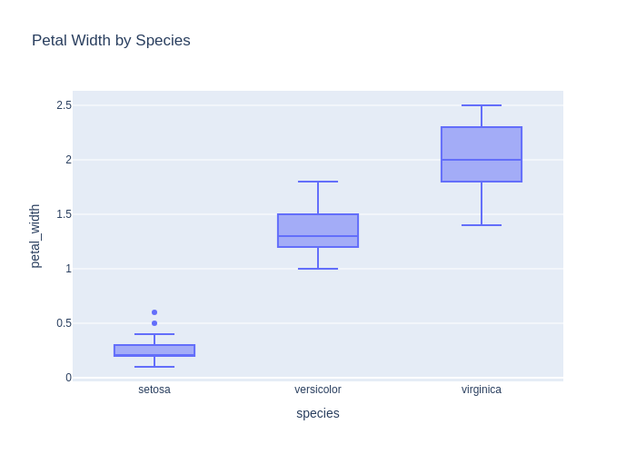

# Детальный отчёт по кейсам (en)

## Методика расчёта метрик
### Semantic similarity (только для chat_response)
Формула:
```text
semantic_similarity = 0.6 * similarity + 0.4 * expected_coverage - 0.5 * forbidden_penalty
```
Где доли:
 - expected_coverage — доля ожидаемых фактов, упомянутых в ответе;
 - forbidden_penalty — доля запрещённых фактов,
попавших в ответ (штраф).
 - similarity — embedding-cosine между эталонным ответом (конкатенация expected_facts или базовый
референс) и ответом модели.


Факт считается покрытым, если косинусная близость fact↔ответ ≥ 0.55
(или высокая токеновая схожесть), что позволяет засчитывать перефраз. Весами (0.6/0.4/0.5) балансируем близость текста и полноту фактов,
давая штраф за запрещённые факты, чтобы сохранить интерпретируемость (веса суммарно ограничивают метрику в [0, 1]).

### Code score (только для code_generation)
- heuristic_score = 0.3 (валидный синтаксис) + до 0.2 (совпадение импортов) + до 0.4 (совпадение ключевых вызовов).
- result_match: бинарный флаг (1.0/0.0), что итоговый результат выполнения совпал с эталоном без ошибок исполнения.

## Кейсы
### code_001_describe_en (code_generation, language: en, difficulty: easy)

**User input:** Write code that outputs statistics for the dataset.


**Ground truth:**
- expected_code:
```python
df.describe()
```
- expected_result:

```python
       sepal_length  sepal_width  petal_length  petal_width
count    150.000000   150.000000    150.000000   150.000000
mean       5.843333     3.057333      3.758000     1.199333
std        0.828066     0.435866      1.765298     0.762238
min        4.300000     2.000000      1.000000     0.100000
25%        5.100000     2.800000      1.600000     0.300000
50%        5.800000     3.000000      4.350000     1.300000
75%        6.400000     3.300000      5.100000     1.800000
max        7.900000     4.400000      6.900000     2.500000
```
- expected_error:

```python
None
```


**Model output:**
> Here's the generated code:
```python
df.describe(include='all')
```
- model_result:

```python
        sepal_length  sepal_width  petal_length  petal_width species
count     150.000000   150.000000    150.000000   150.000000     150
unique           NaN          NaN           NaN          NaN       3
top              NaN          NaN           NaN          NaN  setosa
freq             NaN          NaN           NaN          NaN      50
mean        5.843333     3.057333      3.758000     1.199333     NaN
std         0.828066     0.435866      1.765298     0.762238     NaN
min         4.300000     2.000000      1.000000     0.100000     NaN
25%         5.100000     2.800000      1.600000     0.300000     NaN
50%         5.800000     3.000000      4.350000     1.300000     NaN
75%         6.400000     3.300000      5.100000     1.800000     NaN
max         7.900000     4.400000      6.900000     2.500000     NaN
```
- model_error:

```python
None
```


**Метрики:**
- decision_score: True
  - heuristic_score: 1.0
    - syntax_check: 0.333 (ok=True)
    - imports_score: 0.222 | expected:  | model:  | matched:
    - calls_score: 0.444 | expected: describe | model: describe | matched: describe

### code_002_pairplot_en (code_generation, language: en, difficulty: medium)

**User input:** Create a pairplot for all features.


**Ground truth:**
- expected_code:
```python
import plotly.express as px
fig = px.scatter_matrix(df, dimensions=df.columns, color="species")
fig.show()
```
- expected_result:

```python
None
```
- expected_output: Интерактивный график (Plotly)
- expected_error:

```python
execution_timeout: sandbox_timeout
```
- expected_plot:

 


**Model output:**
> Here's the generated code:
```python
import plotly.express as px
fig = px.scatter_matrix(df, dimensions=['sepal_length', 'sepal_width', 'petal_length', 'petal_width'], color='species')
fig.show()
```
- model_result:

```python
None
```
- model_error:

```python
execution_timeout: sandbox_timeout
```
- model_plot:

 


**Метрики:**
- decision_score: True
  - heuristic_score: 1.0
    - syntax_check: 0.333 (ok=True)
    - imports_score: 0.222 | expected: plotly.express | model: plotly.express | matched: plotly.express
    - calls_score: 0.444 | expected: scatter_matrix, show | model: scatter_matrix, show | matched: scatter_matrix, show

### code_003_train_model_en (code_generation, language: en, difficulty: medium)

**User input:** Write code that trains a simple classifier on this data.


**Ground truth:**
- expected_code:
```python
from sklearn.linear_model import LogisticRegression

X = df.drop(columns=["species"])
y = df["species"]

model = LogisticRegression(max_iter=200)
model.fit(X, y)
```
- possible_code_objects: RandomForestClassifier, DecisionTreeClassifier, SVC, KNeighborsClassifier, GaussianNB
- expected_result:

```python
LogisticRegression(max_iter=200)
```
- expected_error:

```python
None
```


**Model output:**
> Here's the generated code:
```python
from sklearn.model_selection import train_test_split
from sklearn.linear_model import LogisticRegression
from sklearn.metrics import accuracy_score

X = df[['sepal_length', 'sepal_width', 'petal_length', 'petal_width']]
y = df['species']

X_train, X_test, y_train, y_test = train_test_split(X, y, test_size=0.2, random_state=42)

model = LogisticRegression(max_iter=200)
model.fit(X_train, y_train)

y_pred = model.predict(X_test)
accuracy_score(y_test, y_pred)
```
- model_result:

```python
1.0
```
- model_error:

```python
None
```


**Метрики:**
- decision_score: True
  - heuristic_score: 0.852
    - syntax_check: 0.333 (ok=True)
    - imports_score: 0.222 | expected: sklearn.linear_model | model: sklearn.linear_model, sklearn.metrics, sklearn.model_selection | matched: sklearn.linear_model
    - calls_score: 0.296 | expected: LogisticRegression, drop, fit | model: LogisticRegression, accuracy_score, fit, predict, train_test_split | matched: LogisticRegression, fit

### chat_001_what_is_iris_en (chat_response, language: en, difficulty: easy)

**User input:** Explain what this dataset represents.


**Ground truth:**
- expected_facts: dataset contains measurements of petals and sepals; three iris species


**Model output:**
> This dataset contains measurements of flower parts, specifically:  - **Sepal length**: The length of the sepal in centimeters. - **Sepal width**: The width of the sepal in centimeters. - **Petal length**: The length of the petal in centimeters. - **Petal width**: The width of the petal in centimeters. - **Species**: The type of flower, such as setosa, versicolor, or virginica.  These measurements are used to identify and classify different species of flowers, especially in the well-known **Iris dataset**. Each row represents one flower, and the data helps in understanding how the physical features differ between species.


**Метрики:**
- decision_score: True
- semantic_similarity: 0.66
  - expected_coverage: 0.5 | forbidden_penalty: 0.0
  - покрытые факты: dataset contains measurements of petals and sepals (score 0.751)

### chat_002_how_many_classes_en (chat_response, language: en, difficulty: easy)

**User input:** How many classes are in this dataset?


**Ground truth:**
- expected_facts: three classes; setosa; versicolor; virginica


**Model output:**
> The dataset has **three classes**.  These are the unique species in the `species` column.


**Метрики:**
- decision_score: True
- semantic_similarity: 0.276
  - expected_coverage: 0.0 | forbidden_penalty: 0.0

### chat_003_best_features_en (chat_response, language: en, difficulty: medium)

**User input:** Which features best separate the iris species?


**Ground truth:**
- expected_facts: petal length; petal width


**Model output:**
> Here's the generated code:
```python
import plotly.express as px
import pandas as pd

# Create a box plot for each feature grouped by species
fig = px.box(df, x='species', y='sepal_length', title='Sepal Length by Species')
fig.show()

fig = px.box(df, x='species', y='sepal_width', title='Sepal Width by Species')
fig.show()

fig = px.box(df, x='species', y='petal_length', title='Petal Length by Species')
fig.show()

fig = px.box(df, x='species', y='petal_width', title='Petal Width by Species')
fig.show()
```
- model_result:

```python
None
```
- model_error:

```python
None
```
- model_plot:

 


**Метрики:**
- decision_score: False
- semantic_similarity: 0.063
  - expected_coverage: 0.0 | forbidden_penalty: 0.0

### chat_004_easiest_class_en (chat_response, language: en, difficulty: medium)

**User input:** Which iris species is the easiest to separate from the others?


**Ground truth:**
- expected_facts: setosa; shorter petals; wider petals


**Model output:**
> The **setosa** species is the easiest to separate from the others.  It has distinctly smaller petal and sepal measurements compared to the other two species, versicolor and virginica.  For example: - **Setosa** has petal lengths usually under 2 cm. - **Versicolor** and **virginica** have longer petals, often over 3 cm.  This clear difference makes setosa stand out in the data.


**Метрики:**
- decision_score: True
- semantic_similarity: 0.415
  - expected_coverage: 0.0 | forbidden_penalty: 0.0

### theory_001_overfitting_en (chat_response, language: en, difficulty: easy)

**User input:** What is overfitting in machine learning?


**Ground truth:**
- expected_facts: model fits training data too well; poor generalization to new data
- forbidden_facts: overfitting improves performance on unseen data


**Model output:**
> **Overfitting** happens when a machine learning model learns the training data too well — so well that it starts memorizing the details and noise, instead of finding general patterns.  This means the model performs very well on the training data, but poorly on new, unseen data.  Think of it like studying only the exact questions from a practice test. You might get a perfect score on that test, but fail on a real exam with different questions.  In short: - The model is too complex. - It captures random fluctuations in the training data. - It doesn’t generalize to new data.  To avoid overfitting, we use techniques like: - Simplifying the model - Using more training data - Applying regularization - Checking performance on validation data  The goal is to find a balance — a model that learns the patterns, but doesn’t memorize the data.


**Метрики:**
- decision_score: True
- semantic_similarity: 0.0
  - expected_coverage: 0.0 | forbidden_penalty: 1.0
  - упомянутые запрещённые факты: overfitting improves performance on unseen data (score 0.586)

### theory_002_train_test_split_en (chat_response, language: en, difficulty: easy)

**User input:** Why is a train-test split used?


**Ground truth:**
- expected_facts: evaluate model on unseen data; prevent data leakage
- forbidden_facts: to increase training accuracy


**Model output:**
> A **train-test split** is used to check how well a machine learning model will perform on new, unseen data.  Here’s why it’s important:  - The model learns from the **training data**. - Then, it is tested on the **test data**, which it has never seen before. - This helps us see if the model can make good predictions on new examples. - Without a test split, we might think the model is doing well, but it could just be memorizing the training data.  In short, a train-test split helps us **avoid overfitting** and gives a more honest estimate of the model’s real-world performance.


**Метрики:**
- decision_score: True
- semantic_similarity: 0.08
  - expected_coverage: 0.0 | forbidden_penalty: 0.0

### theory_003_regularization_en (chat_response, language: en, difficulty: medium)

**User input:** What is regularization and why is it used?


**Ground truth:**
- expected_facts: adds penalty to model complexity; reduces overfitting
- forbidden_facts: regularization increases model variance


**Model output:**
> **Regularization** is a technique used in machine learning to prevent a model from overfitting the training data.  When a model is too complex, it may learn the training data too well — including noise and outliers. This makes it perform poorly on new, unseen data. Regularization helps by adding a penalty to the size of the coefficients in the model.  This penalty discourages the model from becoming too complex. As a result, the model generalizes better to new data.  Common types of regularization include: - **L1 regularization** (Lasso): Adds the absolute value of coefficients as a penalty. - **L2 regularization** (Ridge): Adds the squared value of coefficients as a penalty.  In short, regularization improves a model's ability to make accurate predictions on new data by keeping it simple and balanced.


**Метрики:**
- decision_score: True
- semantic_similarity: 0.0
  - expected_coverage: 0.0 | forbidden_penalty: 1.0
  - упомянутые запрещённые факты: regularization increases model variance (score 0.627)

### theory_004_bias_variance_en (chat_response, language: en, difficulty: medium)

**User input:** Explain the bias-variance tradeoff.


**Ground truth:**
- expected_facts: bias refers to error from simplifying assumptions; variance refers to sensitivity to training data; tradeoff between bias and variance
- forbidden_facts: bias and variance can both be minimized independently


**Model output:**
> The **bias-variance tradeoff** is a key concept in machine learning that helps us understand how well a model will perform on new data.  **Bias** is the error from incorrect assumptions in the learning algorithm. High bias means the model is too simple and doesn't capture the patterns in the data. It leads to underfitting.  **Variance** is the error from too much sensitivity to small fluctuations in the training data. High variance means the model is too complex and learns noise instead of the true pattern. It leads to overfitting.  A good model balances bias and variance: - Too much bias → model is too simple → poor performance on both training and test data. - Too much variance → model is too complex → performs well on training data but poorly on test data.  The goal is to find a sweet spot where the model is complex enough to learn the patterns, but not so complex that it memorizes the noise.  Think of it like aiming at a target: - High bias: all shots are far from the center, but close to each other. - High variance: shots are scattered widely, even if some hit the center. - Low bias and low variance: shots are tight and close to the center.  Balancing both leads to better generalization on new data.


**Метрики:**
- decision_score: True
- semantic_similarity: 0.561
  - expected_coverage: 0.333 | forbidden_penalty: 0.0
  - покрытые факты: tradeoff between bias and variance (score 0.661)
