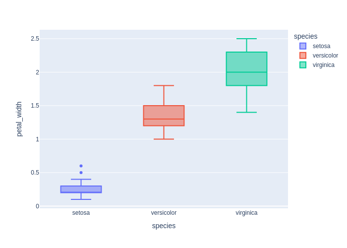
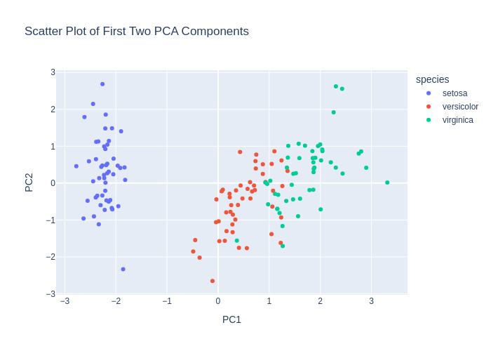
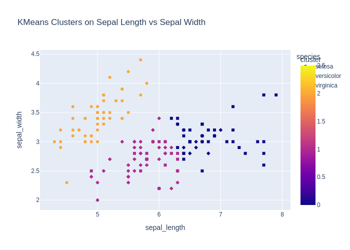
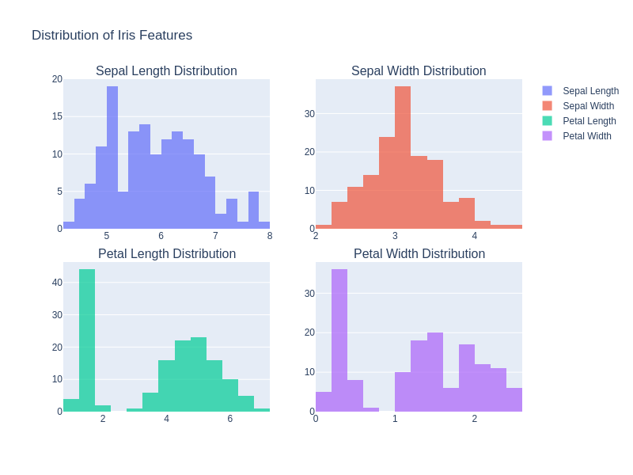
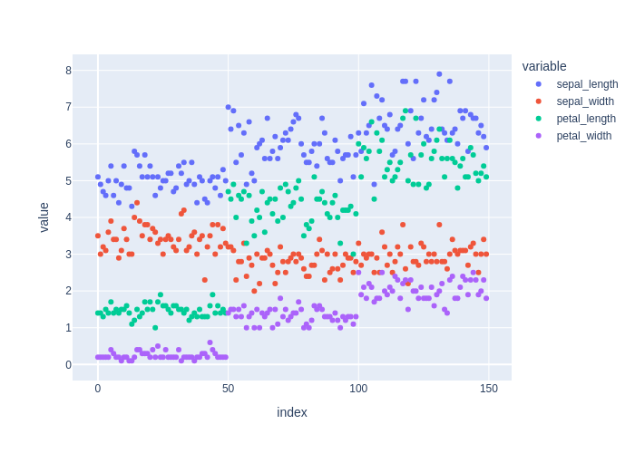
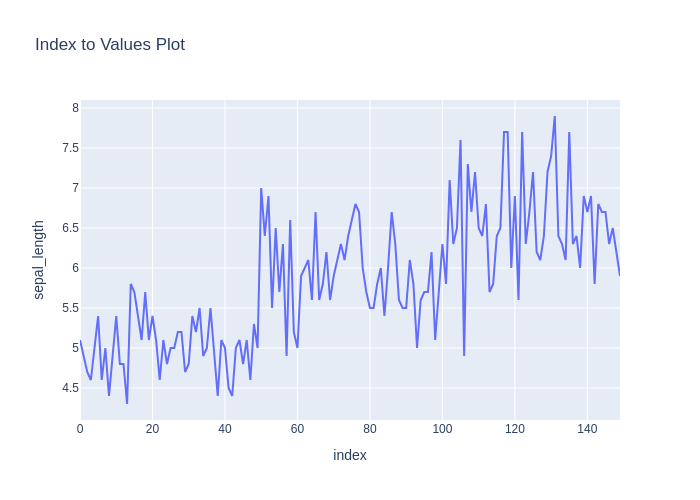
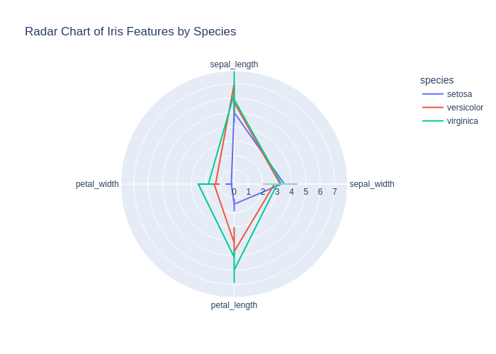

# Детальный отчёт по кейсам (ru)

## Evaluation Results

- **Code generation accuracy: 100%** (18 / 18)

- **Chat response accuracy: 88.5%** (23 / 26)

    - 2 из 3 ошибок обусловлены ошибками классификации `decision`, а не качеством ответа:

            "Какие признаки лучше всего разделяют виды ирисов?"
            "Какой вид ириса лучше всего отделяется от остальных?"

- **Overall decision accuracy: 0.964**

## Кейсы
### code_001_describe (code_generation, language: ru, difficulty: easy)

**User input:** Напиши код, который выводит статистику по датасету.


**Ground truth:**
- expected_code:
```python
df.describe()
```
- expected_result:

```python
       sepal_length  sepal_width  petal_length  petal_width
count    150.000000   150.000000    150.000000   150.000000
mean       5.843333     3.057333      3.758000     1.199333
std        0.828066     0.435866      1.765298     0.762238
min        4.300000     2.000000      1.000000     0.100000
25%        5.100000     2.800000      1.600000     0.300000
50%        5.800000     3.000000      4.350000     1.300000
75%        6.400000     3.300000      5.100000     1.800000
max        7.900000     4.400000      6.900000     2.500000
```
- expected_error:

```python
None
```


**Model output:**
> Here's the generated code:
```python
df.describe(include='all')
```
- model_result:

```python
        sepal_length  sepal_width  petal_length  petal_width species
count     150.000000   150.000000    150.000000   150.000000     150
unique           NaN          NaN           NaN          NaN       3
top              NaN          NaN           NaN          NaN  setosa
freq             NaN          NaN           NaN          NaN      50
mean        5.843333     3.057333      3.758000     1.199333     NaN
std         0.828066     0.435866      1.765298     0.762238     NaN
min         4.300000     2.000000      1.000000     0.100000     NaN
25%         5.100000     2.800000      1.600000     0.300000     NaN
50%         5.800000     3.000000      4.350000     1.300000     NaN
75%         6.400000     3.300000      5.100000     1.800000     NaN
max         7.900000     4.400000      6.900000     2.500000     NaN
```
- model_error:

```python
None
```
- decision_score: True

### code_002_pairplot (code_generation, language: ru, difficulty: medium)

**User input:** Построй pairplot всех признаков.


**Ground truth:**
- expected_code:
```python
import plotly.express as px
fig = px.scatter_matrix(df, dimensions=df.columns, color="species")
fig.show()
```
- expected_result:

```python
None
```
- expected_output: Интерактивный график (Plotly)
- expected_error:

```python
execution_timeout: sandbox_timeout
```
- expected_plot:

 


**Model output:**
> Here's the generated code:
```python
import plotly.express as px
fig = px.scatter_matrix(df, dimensions=['sepal_length', 'sepal_width', 'petal_length', 'petal_width'], color='species')
fig.show()
```
- model_result:

```python
None
```
- model_error:

```python
execution_timeout: sandbox_timeout
```
- model_plot:

 
- decision_score: True

### code_003_train_model (code_generation, language: ru, difficulty: medium)

**User input:** Напиши код, который обучает простой классификатор на этих данных.


**Ground truth:**
- expected_code:
```python
from sklearn.linear_model import LogisticRegression

X = df.drop(columns=["species"])
y = df["species"]

model = LogisticRegression(max_iter=200)
model.fit(X, y)
```
- possible_code_objects: RandomForestClassifier, DecisionTreeClassifier, SVC, KNeighborsClassifier, GaussianNB
- expected_result:

```python
LogisticRegression(max_iter=200)
```
- expected_error:

```python
None
```


**Model output:**
> Here's the generated code:
```python
from sklearn.model_selection import train_test_split
from sklearn.preprocessing import StandardScaler
from sklearn.linear_model import LogisticRegression
from sklearn.metrics import accuracy_score

X = df[['sepal_length', 'sepal_width', 'petal_length', 'petal_width']]
y = df['species']

X_train, X_test, y_train, y_test = train_test_split(X, y, test_size=0.2, random_state=42)

scaler = StandardScaler()
X_train_scaled = scaler.fit_transform(X_train)
X_test_scaled = scaler.transform(X_test)

classifier = LogisticRegression(max_iter=200)
classifier.fit(X_train_scaled, y_train)

y_pred = classifier.predict(X_test_scaled)
accuracy_score(y_test, y_pred)
```
- model_result:

```python
1.0
```
- model_error:

```python
None
```
- decision_score: True

### code_004_missing_check (code_generation, language: ru, difficulty: easy)

**User input:** Проверь, есть ли в датасете пропущенные значения.


**Ground truth:**
- expected_code:
```python
df.isnull().sum()
```
- expected_result:

```python
sepal_length    0
sepal_width     0
petal_length    0
petal_width     0
species         0
dtype: int64
```
- expected_error:

```python
None
```


**Model output:**
> Here's the generated code:
```python
df.isnull().sum()
```
- model_result:

```python
sepal_length    0
sepal_width     0
petal_length    0
petal_width     0
species         0
dtype: int64
```
- model_error:

```python
None
```
- decision_score: True

### code_005_fill_missing (code_generation, language: ru, difficulty: easy)

**User input:** Заполни пропущенные значения средним значением по столбцам.


**Ground truth:**
- expected_code:
```python
df.fillna(df.mean(numeric_only=True), inplace=True)
```
- expected_result:

```python
None
```
- expected_output: Графический вывод
- expected_error:

```python
None
```


**Model output:**
> Here's the generated code:
```python
df.fillna(df.mean(numeric_only=True), inplace=True)
```
- model_result:

```python
None
```
- model_error:

```python
None
```
- decision_score: True

### code_006_boxplot (code_generation, language: ru, difficulty: medium)

**User input:** Построй boxplot для всех числовых признаков.


**Ground truth:**
- expected_code:
```python
import plotly.express as px

fig = px.box(df, y=df.select_dtypes(include="number").columns)
fig.show()
```
- expected_result:

```python
None
```
- expected_output: Интерактивный график (Plotly)
- expected_error:

```python
execution_timeout: sandbox_timeout
```
- expected_plot:

 


**Model output:**
> Here's the generated code:
```python
import plotly.express as px
fig = px.box(df, x='species', y='sepal_length', title='Boxplot for sepal_length')
fig.show()
fig = px.box(df, x='species', y='sepal_width', title='Boxplot for sepal_width')
fig.show()
fig = px.box(df, x='species', y='petal_length', title='Boxplot for petal_length')
fig.show()
fig = px.box(df, x='species', y='petal_width', title='Boxplot for petal_width')
fig.show()
```
- model_result:

```python
None
```
- model_error:

```python
execution_timeout: sandbox_timeout
```
- model_plot:

 
- decision_score: True

### code_007_standardize (code_generation, language: ru, difficulty: medium)

**User input:** Стандартизируй все признаки датасета.


**Ground truth:**
- expected_code:
```python
from sklearn.preprocessing import StandardScaler

scaler = StandardScaler()
X_scaled = scaler.fit_transform(df.drop(columns=["species"]))
```
- expected_result:

```python
None
```
- expected_output: Графический вывод
- expected_error:

```python
None
```


**Model output:**
> Here's the generated code:
```python
from sklearn.preprocessing import StandardScaler
scaler = StandardScaler()
df[['sepal_length', 'sepal_width', 'petal_length', 'petal_width']] = scaler.fit_transform(df[['sepal_length', 'sepal_width', 'petal_length', 'petal_width']])
```
- model_result:

```python
None
```
- model_error:

```python
None
```
- decision_score: True

### code_008_normalize (code_generation, language: ru, difficulty: medium)

**User input:** Нормализуй признаки в диапазон от 0 до 1.


**Ground truth:**
- expected_code:
```python
from sklearn.preprocessing import MinMaxScaler

scaler = MinMaxScaler()
X_normalized = scaler.fit_transform(df.drop(columns=["species"]))
```
- expected_result:

```python
None
```
- expected_output: Графический вывод
- expected_error:

```python
None
```


**Model output:**
> Here's the generated code:
```python
from sklearn.preprocessing import MinMaxScaler

scaler = MinMaxScaler()
df[['sepal_length', 'sepal_width', 'petal_length', 'petal_width']] = scaler.fit_transform(df[['sepal_length', 'sepal_width', 'petal_length', 'petal_width']])
```
- model_result:

```python
None
```
- model_error:

```python
None
```
- decision_score: True

### code_009_pca (code_generation, language: ru, difficulty: medium)

**User input:** Снизь размерность датасета до двух компонент с помощью PCA.


**Ground truth:**
- expected_code:
```python
from sklearn.decomposition import PCA

pca = PCA(n_components=2)
X_pca = pca.fit_transform(df.drop(columns=["species"]))
```
- expected_result:

```python
None
```
- expected_output: Графический вывод
- expected_error:

```python
None
```


**Model output:**
> Here's the generated code:
```python
from sklearn.decomposition import PCA
import pandas as pd

pca = PCA(n_components=2)
df_pca = pd.DataFrame(pca.fit_transform(df.select_dtypes(include=[float])), columns=['PC1', 'PC2'])
df_pca['species'] = df['species']
```
- model_result:

```python
None
```
- model_error:

```python
None
```
- decision_score: True

### code_010_pca_plot (code_generation, language: ru, difficulty: medium)

**User input:** Построй scatter plot первых двух PCA-компонент с раскраской по видам.


**Ground truth:**
- expected_code:
```python
import plotly.express as px
from sklearn.decomposition import PCA

pca = PCA(n_components=2)
X_pca = pca.fit_transform(df.drop(columns=["species"]))

df_pca = pd.DataFrame(X_pca, columns=["PC1", "PC2"])
df_pca["species"] = df["species"]

fig = px.scatter(df_pca, x="PC1", y="PC2", color="species")
fig.show()
```
- expected_result:

```python
None
```
- expected_output: Интерактивный график (Plotly)
- expected_error:

```python
execution_timeout: sandbox_timeout
```
- expected_plot:

 


**Model output:**
> Here's the generated code:
```python
import pandas as pd
import plotly.express as px
from sklearn.decomposition import PCA
from sklearn.preprocessing import StandardScaler

# Standardize the features
scaler = StandardScaler()
df_scaled = scaler.fit_transform(df[['sepal_length', 'sepal_width', 'petal_length', 'petal_width']])

# Apply PCA
pca = PCA(n_components=2)
pca_components = pca.fit_transform(df_scaled)

# Create a DataFrame with PCA components
pca_df = pd.DataFrame(data=pca_components, columns=['PC1', 'PC2'])
pca_df['species'] = df['species'].values

# Plot scatter plot with colors by species
fig = px.scatter(pca_df, x='PC1', y='PC2', color='species', title='Scatter Plot of First Two PCA Components')
fig.show()
```
- model_result:

```python
None
```
- model_error:

```python
execution_timeout: sandbox_timeout
```
- model_plot:

 
- decision_score: True

### code_011_kmeans (code_generation, language: ru, difficulty: medium)

**User input:** Выполни кластеризацию KMeans на три кластера.


**Ground truth:**
- expected_code:
```python
from sklearn.cluster import KMeans

kmeans = KMeans(n_clusters=3, random_state=42)
clusters = kmeans.fit_predict(df.drop(columns=["species"]))
```
- expected_result:

```python
None
```
- expected_output: Графический вывод
- expected_error:

```python
None
```


**Model output:**
> Here's the generated code:
```python
from sklearn.cluster import KMeans
import pandas as pd

kmeans = KMeans(n_clusters=3, random_state=42)
df['cluster'] = kmeans.fit_predict(df[['sepal_length', 'sepal_width', 'petal_length', 'petal_width']])
```
- model_result:

```python
None
```
- model_error:

```python
None
```
- decision_score: True

### code_012_cluster_plot (code_generation, language: ru, difficulty: medium)

**User input:** Построй scatter plot кластеров KMeans по первым двум признакам.


**Ground truth:**
- expected_code:
```python
import plotly.express as px
from sklearn.cluster import KMeans

X = df.drop("species", axis=1)
kmeans = KMeans(n_clusters=3, random_state=42)
clusters = kmeans.fit_predict(X)

fig = px.scatter(
    df,
    x=df.columns[0],
    y=df.columns[1],
    color=clusters.astype(str)
)
fig
```
- expected_result:

```python
None
```
- expected_output: Интерактивный график (Plotly)
- expected_error:

```python
execution_error: name 'clusters' is not defined
```
- expected_plot_error: name 'clusters' is not defined


**Model output:**
> Here's the generated code:
```python
import plotly.express as px
from sklearn.cluster import KMeans
import pandas as pd

kmeans = KMeans(n_clusters=3, random_state=42)
df['cluster'] = kmeans.fit_predict(df[['sepal_length', 'sepal_width']])

fig = px.scatter(df, x='sepal_length', y='sepal_width', color='cluster', symbol='species', title='KMeans Clusters on Sepal Length vs Sepal Width')
fig.show()
```
- model_result:

```python
None
```
- model_error:

```python
execution_timeout: sandbox_timeout
```
- model_plot:

 
- decision_score: True

### code_013_train_test_split (code_generation, language: ru, difficulty: easy)

**User input:** Раздели датасет на обучающую и тестовую выборки.


**Ground truth:**
- expected_code:
```python
from sklearn.model_selection import train_test_split

X = df.drop(columns=["species"])
y = df["species"]

X_train, X_test, y_train, y_test = train_test_split(X, y, test_size=0.2, random_state=42)
```
- expected_result:

```python
None
```
- expected_output: Графический вывод
- expected_error:

```python
None
```


**Model output:**
> Here's the generated code:
```python
from sklearn.model_selection import train_test_split

X = df.drop('species', axis=1)
y = df['species']
X_train, X_test, y_train, y_test = train_test_split(X, y, test_size=0.2, random_state=42, stratify=y)
```
- model_result:

```python
None
```
- model_error:

```python
None
```
- decision_score: True

### code_014_show_all_plots (code_generation, language: ru, difficulty: hard)

**User input:** Отобрази все графики.


**Ground truth:**
- expected_code:
```python
import plotly.express as px
import plotly.graph_objects as go

# df already exists and represents the iris dataset

# Select numeric columns
num_cols = df.select_dtypes(include=["number"]).columns.tolist()

# Try to infer target column
candidate_targets = ["species", "target", "label", "class"]
target_col = next((c for c in candidate_targets if c in df.columns), None)

if not num_cols:
    raise ValueError("No numeric columns found in df to build plots.")

# 1) Histograms for all numeric features
fig_hist = px.histogram(
    df,
    x=num_cols,
    color=target_col if target_col else None,
    barmode="overlay",
    title="Distributions (Histograms)"
)
fig_hist.show()

# 2) Box plots by class (if target exists)
if target_col:
    for col in num_cols:
        fig_box = px.box(
            df,
            x=target_col,
            y=col,
            title=f"Boxplot: {col} by {target_col}"
        )
        fig_box.show()

# 3) Scatter plots for common Iris feature pairs
scatter_pairs = [
    ("sepal_length", "sepal_width"),
    ("petal_length", "petal_width")
]

for x, y in scatter_pairs:
    if x in df.columns and y in df.columns:
        fig_scatter = px.scatter(
            df,
            x=x,
            y=y,
            color=target_col if target_col else None,
            title=f"Scatter: {x} vs {y}"
        )
        fig_scatter.show()

# 4) Scatter matrix (pairwise relationships)
fig_matrix = px.scatter_matrix(
    df,
    dimensions=num_cols,
    color=target_col if target_col else None,
    title="Scatter Matrix"
)
fig_matrix.show()

# 5) Correlation heatmap
corr = df[num_cols].corr(numeric_only=True)

fig_heatmap = px.imshow(
    corr,
    text_auto=True,
    title="Correlation Heatmap"
)
fig_heatmap.show()

```
- possible_code_objects: df, px, go
- expected_result:

```python
None
```
- expected_output: Интерактивный график (Plotly)
- expected_error:

```python
execution_timeout: sandbox_timeout
```
- expected_plot:

 


**Model output:**
> Here's the generated code:
```python
import plotly.express as px
import plotly.graph_objects as go
from plotly.subplots import make_subplots

# Create a figure with subplots
fig = make_subplots(
    rows=2, cols=2,
    subplot_titles=('Sepal Length Distribution', 'Sepal Width Distribution',
                    'Petal Length Distribution', 'Petal Width Distribution'),
    vertical_spacing=0.1,
    horizontal_spacing=0.1
)

# Add histograms for each numerical column
fig.add_trace(
    go.Histogram(x=df['sepal_length'], nbinsx=20, name='Sepal Length', opacity=0.7),
    row=1, col=1
)
fig.add_trace(
    go.Histogram(x=df['sepal_width'], nbinsx=20, name='Sepal Width', opacity=0.7),
    row=1, col=2
)
fig.add_trace(
    go.Histogram(x=df['petal_length'], nbinsx=20, name='Petal Length', opacity=0.7),
    row=2, col=1
)
fig.add_trace(
    go.Histogram(x=df['petal_width'], nbinsx=20, name='Petal Width', opacity=0.7),
    row=2, col=2
)

# Update layout
fig.update_layout(
    title_text="Distribution of Iris Features",
    showlegend=True,
    height=600,
    width=800
)

# Show the figure
fig.show()

# Pairplot using Plotly Express
px.scatter_matrix(
    df,
    dimensions=['sepal_length', 'sepal_width', 'petal_length', 'petal_width'],
    color='species',
    title="Pairplot of Iris Features",
    labels={col: col.replace('_', ' ').title() for col in ['sepal_length', 'sepal_width', 'petal_length', 'petal_width']},
    opacity=0.7
).show()

# Box plots for each feature by species
fig_box = px.box(
    df,
    x='species',
    y='sepal_length',
    title="Sepal Length by Species",
    labels={'species': 'Species', 'sepal_length': 'Sepal Length (cm)'}
)
fig_box.show()

fig_box = px.box(
    df,
    x='species',
    y='sepal_width',
    title="Sepal Width by Species",
    labels={'species': 'Species', 'sepal_width': 'Sepal Width (cm)'}
)
fig_box.show()

fig_box = px.box(
    df,
    x='species',
    y='petal_length',
    title="Petal Length by Species",
    labels={'species': 'Species', 'petal_length': 'Petal Length (cm)'}
)
fig_box.show()

fig_box = px.box(
    df,
    x='species',
    y='petal_width',
    title="Petal Width by Species",
    labels={'species': 'Species', 'petal_width': 'Petal Width (cm)'}
)
fig_box.show()
```
- model_result:

```python
None
```
- model_error:

```python
execution_timeout: sandbox_timeout
```
- model_plot:

 
- decision_score: True

### code_015_histogram (code_generation, language: ru, difficulty: hard)

**User input:** Отобрази график Histogram


**Ground truth:**
- expected_code:
```python
import plotly.express as px

# df already exists and represents the iris dataset

num_cols = df.select_dtypes(include=["number"]).columns.tolist()

if not num_cols:
    raise ValueError("В df не найдено числовых колонок для построения histogram.")

# Строим histogram по всем числовым признакам
fig = px.histogram(
    df,
    x=num_cols,
    barmode="overlay",
    title="Histogram"
)

fig.show()

```
- possible_code_objects: df, px
- expected_result:

```python
None
```
- expected_output: Интерактивный график (Plotly)
- expected_error:

```python
execution_timeout: sandbox_timeout
```
- expected_plot:

 


**Model output:**
> Here's the generated code:
```python
import plotly.express as px

px.histogram(df, x='sepal_length', nbins=20, title='Histogram of Sepal Length')
```
- model_result:

```python
Figure({
    'data': [{'bingroup': 'x',
              'hovertemplate': 'sepal_length=%{x}<br>count=%{y}<extra></extra>',
              'legendgroup': '',
              'marker': {'color': '#636efa', 'pattern': {'shape': ''}},
              'name': '',
              'nbinsx': 20,
              'orientation': 'v',
              'showlegend': False,
              'type': 'histogram',
              'x': {'bdata': ('ZmZmZmZmFECamZmZmZkTQM3MzMzMzB' ... 'AAAAAAGkDNzMzMzMwYQJqZmZmZmRdA'),
                    'dtype': 'f8'},
              'xaxis': 'x',
              'yaxis': 'y'}],
    'layout': {'barmode': 'relative',
               'legend': {'tracegroupgap': 0},
               'template': '...',
               'title': {'text': 'Histogram of Sepal Length'},
               'xaxis': {'anchor': 'y', 'domain': [0.0, 1.0], 'title': {'text': 'sepal_length'}},
               'yaxis': {'anchor': 'x', 'domain': [0.0, 1.0], 'title': {'text': 'count'}}}
})
```
- model_error:

```python
None
```
- model_plot:

 
- decision_score: True

### code_016_index_to_value (code_generation, language: ru, difficulty: hard)

**User input:** Отобрази график Index To Values Plot


**Ground truth:**
- expected_code:
```python
import plotly.express as px

df_reset = df.reset_index().rename(columns={"index": "index"})
fig = px.scatter(
    df_reset,
    x="index",
    y=["sepal_length", "sepal_width", "petal_length", "petal_width"],
)
fig
```
- possible_code_objects: df, px
- expected_result:

```python
Figure({
    'data': [{'hovertemplate': 'variable=sepal_length<br>index=%{x}<br>value=%{y}<extra></extra>',
              'legendgroup': 'sepal_length',
              'marker': {'color': '#636efa', 'symbol': 'circle'},
              'mode': 'markers',
              'name': 'sepal_length',
              'orientation': 'v',
              'showlegend': True,
              'type': 'scatter',
              'x': {'bdata': ('AAABAAIAAwAEAAUABgAHAAgACQAKAA' ... 'CLAIwAjQCOAI8AkACRAJIAkwCUAJUA'),
                    'dtype': 'i2'},
              'xaxis': 'x',
              'y': {'bdata': ('ZmZmZmZmFECamZmZmZkTQM3MzMzMzB' ... 'AAAAAAGkDNzMzMzMwYQJqZmZmZmRdA'),
                    'dtype': 'f8'},
              'yaxis': 'y'},
             {'hovertemplate': 'variable=sepal_width<br>index=%{x}<br>value=%{y}<extra></extra>',
              'legendgroup': 'sepal_width',
              'marker': {'color': '#EF553B', 'symbol': 'circle'},
              'mode': 'markers',
              'name': 'sepal_width',
              'orientation': 'v',
              'showlegend': True,
              'type': 'scatter',
              'x': {'bdata': ('AAABAAIAAwAEAAUABgAHAAgACQAKAA' ... 'CLAIwAjQCOAI8AkACRAJIAkwCUAJUA'),
                    'dtype': 'i2'},
              'xaxis': 'x',
              'y': {'bdata': ('AAAAAAAADEAAAAAAAAAIQJqZmZmZmQ' ... 'AAAAAACEAzMzMzMzMLQAAAAAAAAAhA'),
                    'dtype': 'f8'},
              'yaxis': 'y'},
             {'hovertemplate': 'variable=petal_length<br>index=%{x}<br>value=%{y}<extra></extra>',
              'legendgroup': 'petal_length',
              'marker': {'color': '#00cc96', 'symbol': 'circle'},
              'mode': 'markers',
              'name': 'petal_length',
              'orientation': 'v',
              'showlegend': True,
              'type': 'scatter',
              'x': {'bdata': ('AAABAAIAAwAEAAUABgAHAAgACQAKAA' ... 'CLAIwAjQCOAI8AkACRAJIAkwCUAJUA'),
                    'dtype': 'i2'},
              'xaxis': 'x',
              'y': {'bdata': ('ZmZmZmZm9j9mZmZmZmb2P83MzMzMzP' ... 'zMzMzMFECamZmZmZkVQGZmZmZmZhRA'),
                    'dtype': 'f8'},
              'yaxis': 'y'},
             {'hovertemplate': 'variable=petal_width<br>index=%{x}<br>value=%{y}<extra></extra>',
              'legendgroup': 'petal_width',
              'marker': {'color': '#ab63fa', 'symbol': 'circle'},
              'mode': 'markers',
              'name': 'petal_width',
              'orientation': 'v',
              'showlegend': True,
              'type': 'scatter',
              'x': {'bdata': ('AAABAAIAAwAEAAUABgAHAAgACQAKAA' ... 'CLAIwAjQCOAI8AkACRAJIAkwCUAJUA'),
                    'dtype': 'i2'},
              'xaxis': 'x',
              'y': {'bdata': ('mpmZmZmZyT+amZmZmZnJP5qZmZmZmc' ... 'AAAAAAAEBmZmZmZmYCQM3MzMzMzPw/'),
                    'dtype': 'f8'},
              'yaxis': 'y'}],
    'layout': {'legend': {'title': {'text': 'variable'}, 'tracegroupgap': 0},
               'margin': {'t': 60},
               'template': '...',
               'xaxis': {'anchor': 'y', 'domain': [0.0, 1.0], 'title': {'text': 'index'}},
               'yaxis': {'anchor': 'x', 'domain': [0.0, 1.0], 'title': {'text': 'value'}}}
})
```
- expected_error:

```python
None
```
- expected_plot:

 


**Model output:**
> Here's the generated code:
```python
import plotly.express as px
fig = px.line(df, x=df.index, y=df.columns[0], title='Index to Values Plot')
fig.show()
```
- model_result:

```python
None
```
- model_error:

```python
execution_timeout: sandbox_timeout
```
- model_plot:

 
- decision_score: True

### code_017_corr_matrix (code_generation, language: ru, difficulty: hard)

**User input:** отобрази график correlation matrix


**Ground truth:**
- expected_code:
```python
import plotly.express as px

corr = df[["sepal_length", "sepal_width", "petal_length", "petal_width"]].corr()
fig = px.imshow(corr, text_auto=True)
fig
```
- possible_code_objects: df, px
- expected_result:

```python
Figure({
    'data': [{'coloraxis': 'coloraxis',
              'hovertemplate': 'x: %{x}<br>y: %{y}<br>color: %{z}<extra></extra>',
              'name': '0',
              'texttemplate': '%{z}',
              'type': 'heatmap',
              'x': array(['sepal_length', 'sepal_width', 'petal_length', 'petal_width'],
                         dtype=object),
              'xaxis': 'x',
              'y': array(['sepal_length', 'sepal_width', 'petal_length', 'petal_width'],
                         dtype=object),
              'yaxis': 'y',
              'z': {'bdata': ('AAAAAAAA8D9HWdmpDRm+v9Mdsyxo5e' ... '12m27Xv7hdSirLz+4/AAAAAAAA8D8='),
                    'dtype': 'f8',
                    'shape': '4, 4'}}],
    'layout': {'coloraxis': {'colorscale': [[0.0, '#0d0887'], [0.1111111111111111,
                                            '#46039f'], [0.2222222222222222,
                                            '#7201a8'], [0.3333333333333333,
                                            '#9c179e'], [0.4444444444444444,
                                            '#bd3786'], [0.5555555555555556,
                                            '#d8576b'], [0.6666666666666666,
                                            '#ed7953'], [0.7777777777777778,
                                            '#fb9f3a'], [0.8888888888888888,
                                            '#fdca26'], [1.0, '#f0f921']]},
               'margin': {'t': 60},
               'template': '...',
               'xaxis': {'anchor': 'y', 'constrain': 'domain', 'domain': [0.0, 1.0], 'scaleanchor': 'y'},
               'yaxis': {'anchor': 'x', 'autorange': 'reversed', 'constrain': 'domain', 'domain': [0.0, 1.0]}}
})
```
- expected_error:

```python
None
```
- expected_plot:

 


**Model output:**
> Here's the generated code:
```python
import plotly.express as px
import numpy as np

corr = df.select_dtypes(include=[np.number]).corr()
fig = px.imshow(corr, text_auto=True, aspect="auto", color_continuous_scale="RdBu_r")
fig.show()
```
- model_result:

```python
None
```
- model_error:

```python
execution_timeout: sandbox_timeout
```
- model_plot:

 
- decision_score: True

### code_018_radar (code_generation, language: ru, difficulty: hard)

**User input:** Отобрази график Radar


**Ground truth:**
- expected_code:
```python
import plotly.express as px

cols = ["sepal_length", "sepal_width", "petal_length", "petal_width"]
df_mean = df.groupby("species", observed=True)[cols].mean().reset_index()
df_long = df_mean.melt(id_vars="species", var_name="variable", value_name="value")
fig = px.line_polar(df_long, r="value", theta="variable", color="species", line_close=True)
fig
```
- possible_code_objects: df, px
- expected_result:

```python
None
```
- expected_output: Интерактивный график (Plotly)
- expected_error:

```python
execution_error: Value of 'r' is not the name of a column in 'data_frame'. Expected one of ['species', 'sepal_length', 'sepal_width', 'petal_length', 'petal_width'] but received: value
```
- expected_plot_error: Value of 'r' is not the name of a column in 'data_frame'. Expected one of ['species', 'sepal_length', 'sepal_width', 'petal_length', 'petal_width'] but received: value


**Model output:**
> Here's the generated code:
```python
import plotly.express as px
import pandas as pd

# Prepare data for radar chart
df_melted = df.melt(id_vars='species', value_vars=['sepal_length', 'sepal_width', 'petal_length', 'petal_width'],
                    var_name='feature', value_name='value')

# Create radar chart
fig = px.line_polar(df_melted, r='value', theta='feature', color='species', line_close=True,
                    title='Radar Chart of Iris Features by Species')
fig.show()
```
- model_result:

```python
None
```
- model_error:

```python
execution_timeout: sandbox_timeout
```
- model_plot:

 
- decision_score: True

### chat_001_what_is_iris (chat_response, language: ru, difficulty: easy)

**User input:** Поясни, что представляет собой датасет.


**Ground truth:**
- expected_facts: датасет содержит измерения лепестков и чашелистиков; три вида ириса
- forbidden_facts: животные


**Model output:**
> Этот датасет содержит данные о цветках ириса.   Каждая строка — это один цветок, а столбцы описывают его измерения и вид.  Вот что означает каждый столбец:  - **sepal_length** — длина чашелистика в сантиметрах   - **sepal_width** — ширина чашелистика в сантиметрах   - **petal_length** — длина лепестка в сантиметрах   - **petal_width** — ширина лепестка в сантиметрах   - **species** — вид ириса, например, setosa, versicolor или virginica  Данные используются для обучения моделей машинного обучения, чтобы научиться определять вид ириса по его размерам.
- decision_score: True

### chat_002_how_many_classes (chat_response, language: ru, difficulty: easy)

**User input:** Сколько классов в этом датасете?


**Ground truth:**
- expected_facts: три класса


**Model output:**
> В этом датасете **три класса**.  Они соответствуют видам ирисов, указанным в столбце **species**: - *setosa* - *versicolor* - *virginica*
- decision_score: True

### chat_003_best_features (chat_response, language: ru, difficulty: medium)

**User input:** Какие признаки лучше всего разделяют виды ирисов?


**Ground truth:**
- expected_facts: длина лепестка; ширина лепестка


**Model output:**
> Here's the generated code:
```python
df.groupby('species').agg(['mean', 'std'])
```
- model_result:

```python
None
```
- model_error:

```python
None
```
- decision_score: False

### chat_004_easiest_class (chat_response, language: ru, difficulty: medium)

**User input:** Какой вид ириса лучше всего отделяется от остальных?


**Ground truth:**
- expected_facts: setosa; короче лепестки; шире лепестки


**Model output:**
> Here's the generated code:
```python
import plotly.express as px

fig = px.scatter(df, x='petal_length', y='petal_width', color='species', title='Разделение видов ирисов по длине и ширине лепестков')
fig.show()
```
- model_result:

```python
None
```
- model_error:

```python
None
```
- model_plot:

 
- decision_score: False

### theory_001_overfitting (chat_response, language: ru, difficulty: easy)

**User input:** Что такое переобучение в машинном обучении?


**Ground truth:**
- expected_facts: модель слишком хорошо подстраивается под обучающую выборку; плохо обобщает на новые данные
- forbidden_facts: переобучение улучшает качество на новых данных


**Model output:**
> **Переобучение** — это когда модель машинного обучения слишком хорошо учится на тренировочных данных.  Вот что это значит:  - Модель запоминает не только общий паттерн, но и шум или случайные особенности в данных. - Она работает отлично на тренировочных данных, но плохо на новых, не виденных ранее данных. - Это как учиться на одной конкретной контрольной работе, а потом не справиться с другой, даже если она похожа.  Пример:   Если модель учится на изображениях кошек и собак, и запоминает, что все кошки на фото с зелёным фоном, она может ошибаться, если увидит кошку на другом фоне.  Чтобы избежать переобучения, используют методы, такие как: - Разделение данных на тренировочную и тестовую выборки. - Использование регуляризации. - Остановка обучения, когда качество на тестовых данных перестаёт улучшаться.
- decision_score: True

### theory_002_train_test_split (chat_response, language: ru, difficulty: easy)

**User input:** Зачем используется разделение на обучающую и тестовую выборки?


**Ground truth:**
- expected_facts: оценка качества модели на невидимых данных; предотвращение утечки данных
- forbidden_facts: для увеличения точности на обучающей выборке


**Model output:**
> Разделение на обучающую и тестовую выборки помогает проверить, насколько хорошо модель работает на новых, не виденных данных.  - **Обучающая выборка** используется для обучения модели.   - **Тестовая выборка** используется для оценки, насколько хорошо модель поняла данные.  Это важно, потому что если модель просто запоминает данные, она может плохо работать на новых примерах.   Разделение помогает избежать переобучения.  Пример: ``` Обучающая выборка: 80% данных Тестовая выборка: 20% данных ```
- decision_score: True

### theory_003_regularization (chat_response, language: ru, difficulty: medium)

**User input:** Что такое регуляризация и зачем она нужна?


**Ground truth:**
- expected_facts: добавляет штраф за сложность модели; уменьшает переобучение
- forbidden_facts: регуляризация увеличивает разброс модели


**Model output:**
> **Регуляризация** — это способ улучшить работу модели машинного обучения, чтобы она не слишком точно подстраивалась под обучающие данные.  Иногда модель "запоминает" шум или случайности в данных. Это называется **переобучением**. Регуляризация помогает избежать этого, делая модель проще.  Она добавляет небольшое ограничение на величину весов в модели. Это заставляет модель не полагаться слишком сильно на один признак.  **Для чего нужна?** - Чтобы модель лучше работала на новых, не виденных данных. - Чтобы избежать переобучения. - Чтобы сделать модель более надёжной и обобщающей.  Пример: Представь, что ты учишься на примерах. Если ты просто запоминаешь каждый пример, ты можешь не справиться с новым. Регуляризация — как совет: "Не запоминай всё, а понимай суть".
- decision_score: True

### theory_004_bias_variance (chat_response, language: ru, difficulty: medium)

**User input:** Объясни компромисс между смещением и разбросом.


**Ground truth:**
- expected_facts: смещение связано с упрощающими предположениями модели; разброс связан с чувствительностью к обучающим данным; существует компромисс между смещением и разбросом
- forbidden_facts: смещение и разброс можно минимизировать независимо


**Model output:**
> **Смещение** и **разброс** — это два важных понятия в статистике и машинном обучении.  - **Смещение** — это ошибка, возникающая, когда модель слишком простая, чтобы захватить сложные закономерности в данных.     Например, если мы пытаемся описать кривую с помощью прямой линии, модель будет иметь высокое смещение.  - **Разброс** — это когда модель слишком сложная и подстраивается под шум в данных, а не только под настоящие закономерности.     Это приводит к переобучению. Модель хорошо работает на обучающих данных, но плохо — на новых.  **Компромисс** между ними означает, что если мы уменьшаем смещение, разброс может увеличиться, и наоборот.  Например: - Простая модель: низкое смещение, но высокий разброс. - Сложная модель: низкий разброс, но высокое смещение.  Цель — найти баланс, чтобы модель хорошо работала как на известных, так и на новых данных.
- decision_score: True

### chat_005_feature_count (chat_response, language: ru, difficulty: easy)

**User input:** Сколько признаков содержит этот датасет?


**Ground truth:**
- expected_facts: четыре признака; длина чашелистика; ширина чашелистика; длина лепестка; ширина лепестка
- forbidden_facts: пять признаков; только признаки лепестков


**Model output:**
> Этот датасет содержит **5 признаков**.  - **sepal_length** — длина чашелистика   - **sepal_width** — ширина чашелистика   - **petal_length** — длина лепестка   - **petal_width** — ширина лепестка   - **species** — вид цветка    Каждый признак описывает определённую характеристику цветка.
- decision_score: True

### chat_006_samples_count (chat_response, language: ru, difficulty: easy)

**User input:** Сколько объектов содержится в этом датасете?


**Ground truth:**
- expected_facts: 150 объектов; 50 объектов на класс
- forbidden_facts: 100 объектов; несбалансированные классы


**Model output:**
> В этом датасете содержится **150 объектов**.
- decision_score: True

### chat_007_numeric_only (chat_response, language: ru, difficulty: easy)

**User input:** Все ли признаки в этом датасете являются числовыми?


**Ground truth:**
- expected_facts: все признаки числовые; непрерывные измерения
- forbidden_facts: категориальные признаки; текстовые признаки


**Model output:**
> Нет, не все признаки в этом датасете являются числовыми.  В датасете есть четыре признака с числовыми значениями: - **sepal_length** — длина чашелистика - **sepal_width** — ширина чашелистика - **petal_length** — длина лепестка - **petal_width** — ширина лепестка  Один признак — **species** — является категориальным. Это означает, что он содержит текстовые метки, например, названия видов цветов, такие как *setosa*, *versicolor*, *virginica*.  Таким образом, три признака — числовые, один — категориальный.
- decision_score: True

### chat_008_need_scaling (chat_response, language: ru, difficulty: medium)

**User input:** Важно ли масштабирование признаков для этого датасета?


**Ground truth:**
- expected_facts: важно для моделей, основанных на расстоянии; помогает алгоритмам вроде kNN или SVM
- forbidden_facts: масштабирование никогда не нужно; масштабирование меняет метки классов


**Model output:**
> **Масштабирование признаков** может быть важно, если вы используете алгоритмы, чувствительные к масштабу данных.  В вашем датасете есть следующие признаки: - **sepal_length** — длина чашелистика - **sepal_width** — ширина чашелистика - **petal_length** — длина лепестка - **petal_width** — ширина лепестка  Эти признаки измеряются в одинаковых единицах (сантиметры), и их значения близки по масштабу.  **Когда масштабирование важно:** - При использовании методов, основанных на расстояниях, например, **K-ближайших соседей (KNN)** или **метод опорных векторов (SVM)**. - При применении **градиентного спуска** или **регуляризации** (L1, L2).  **Когда масштабирование не обязательно:** - При работе с **деревьями решений** или **случайным лесом**, так как они не зависят от масштаба признаков. - При использовании **логистической регрессии** с регуляризацией — масштабирование помогает, но не критично.  **Вывод:**   Если вы используете алгоритмы, чувствительные к масштабу, **масштабирование полезно**.   Если используете деревья — **не обязательно**.  Пример:   ``` sepal_length: 5.1 petal_length: 1.4 ``` Значения близки, поэтому разница не слишком велика, но всё равно может повлиять на результаты при некоторых методах.
- decision_score: True

### chat_009_linear_separable (chat_response, language: ru, difficulty: medium)

**User input:** Является ли этот датасет линейно разделимым?


**Ground truth:**
- expected_facts: класс setosa линейно разделим; остальные классы перекрываются
- forbidden_facts: все классы идеально разделимы; ни один класс не разделим


**Model output:**
> Этот датасет **не является линейно разделимым**.  **Пояснение:**   Датасет содержит измерения цветков ириса — **длину и ширину чашелистиков** и **длину и ширину лепестков**, а также их **вид** (species).   Хотя некоторые виды ирисов могут частично разделяться на графике, **все три вида пересекаются** в пространстве признаков. Это означает, что **нельзя провести одну прямую линию (или плоскость)**, которая бы полностью разделила все три класса.  Например, на графике с двумя признаками (например, длина лепестка и ширина лепестка) виды **Iris-setosa** хорошо отделяется, но **Iris-versicolor** и **Iris-virginica** пересекаются.  👉 Поэтому **линейная модель не сможет правильно классифицировать все объекты**.  Если нужно, можно использовать более сложные модели, например, деревья решений или нейросети.
- decision_score: True

### chat_011_unsupervised_possible (chat_response, language: ru, difficulty: medium)

**User input:** Можно ли использовать этот датасет для обучения без учителя?


**Ground truth:**
- expected_facts: можно использовать для кластеризации; метки классов можно игнорировать
- forbidden_facts: обучение без учителя требует меток


**Model output:**
> **Да**, этот датасет можно использовать для обучения без учителя.  Вот почему:  - Датасет содержит **признаки** — длину и ширину чашелистиков и лепестков. - У него есть **метка класса** — вид цветка (`species`). - При обучении без учителя мы **не используем метки**. - Поэтому можно отобрать только числовые признаки: `sepal_length`, `sepal_width`, `petal_length`, `petal_width`.  Такие данные подходят для задач, как: - Кластеризация (например, найти группы похожих цветков). - Уменьшение размерности (например, PCA). - Обнаружение аномалий.  > Пример:   > ```text > sepal_length, sepal_width, petal_length, petal_width > 5.1, 3.5, 1.4, 0.2 > 4.9, 3.0, 1.4, 0.2 > ```  Если нужно — могу предложить, как использовать его для безучительного обучения.
- decision_score: True

### chat_012_pca_purpose (chat_response, language: ru, difficulty: medium)

**User input:** Применим ли метод PCA к этому датасету?


**Ground truth:**
- expected_facts: снижение размерности; возможность визуализации; сохранение большей части дисперсии
- forbidden_facts: PCA улучшает метки классов


**Model output:**
> **Да**, метод **PCA** (главные компоненты) можно применить к этому датасету.  Вот почему:  - Все признаки **sepal_length**, **sepal_width**, **petal_length**, **petal_width** — это **числовые значения** (типы `float`). - Метод PCA работает с числовыми данными, чтобы найти главные направления вариации. - Признак **species** — это категориальная переменная, но её можно **не включать в PCA**, так как PCA предназначен для числовых признаков.  > ✅ **Рекомендация**: Применяйте PCA только к числовым столбцам: `sepal_length`, `sepal_width`, `petal_length`, `petal_width`.  Если нужно, я могу помочь сформулировать код для этого.
- decision_score: True

### chat_013_outliers (chat_response, language: ru, difficulty: medium)

**User input:** Являются ли выбросы серьёзной проблемой в этом датасете?


**Ground truth:**
- expected_facts: датасет относительно чистый; мало или нет выраженных выбросов
- forbidden_facts: датасет сильно искажён выбросами


**Model output:**
> **Выбросы** могут быть серьёзной проблемой, если они искажают результаты анализа или обучения моделей.  В этом датасете есть четыре числовых признака: - **sepal_length** (длина чашелистика) - **sepal_width** (ширина чашелистика) - **petal_length** (длина лепестка) - **petal_width** (ширина лепестка)  Если в этих данных есть значения, которые сильно отклоняются от остальных, они могут повлиять на: - Средние значения - Модели машинного обучения - Визуализации, например, графики или диаграммы  Но в данном случае, данные — это **цветы Ириса**, и они известны своей чёткой структурой. Выбросы в таких данных редки, но всё же возможны — например, из-за ошибки измерения.  Чтобы проверить, есть ли выбросы, нужно: - Посмотреть на **диаграммы размаха (boxplots)** - Использовать **метод межквартильного размаха (IQR)**  Если вы хотите, я могу помочь сгенерировать **Python-код**, чтобы проверить выбросы.
- decision_score: True

### chat_014_real_world_limitations (chat_response, language: ru, difficulty: hard)

**User input:** Какие ограничения есть у этого датасета?


**Ground truth:**
- expected_facts: небольшой размер; не отражает сложные реальные данные
- forbidden_facts: подходит для масштабного глубокого обучения


**Model output:**
> Этот датасет имеет несколько ограничений:  - **Ограниченный размер**: Данные содержат всего 150 строк, что может быть мало для сложных моделей машинного обучения. - **Одна категория признака**: Признак *species* — это категориальный (категория), и он содержит только три вида цветов, что ограничивает разнообразие. - **Фиксированные измерения**: Все признаки — это измерения цветков (длина и ширина чашелистиков и лепестков), что делает датасет узкоспециализированным. - **Нет пропущенных значений**: Хотя это плюс, это может не отражать реальные данные, где часто бывают пропуски. - **Известный и простой датасет**: Так как он широко известен, он может быть слишком простым для сложных задач.  Этот датасет идеален для обучения, но не всегда подходит для реальных задач.
- decision_score: True

### theory_006_classification_vs_regression (chat_response, language: ru, difficulty: easy)

**User input:** В чём разница между классификацией и регрессией?


**Ground truth:**
- expected_facts: классификация предсказывает дискретные классы; регрессия предсказывает непрерывные значения
- forbidden_facts: классификация предсказывает только числа; регрессия предсказывает категории


**Model output:**
> **Классификация** и **регрессия** — это два типа задач в машинном обучении.  - **Классификация** — это когда модель предсказывает **категорию** или **метку**.     Например: определить, какой вид цветка — ирис сея, ирис виргинский или ирис разноцветный.  - **Регрессия** — это когда модель предсказывает **числовое значение**.     Например: предсказать длину лепестка ириса в сантиметрах.  **Ключевое отличие:**   - Классификация — **категории**.   - Регрессия — **числа**.  Пример из данных:   - Если модель говорит: "Это ирис сея", — это **классификация**.   - Если модель говорит: "Длина лепестка — 1.5 см", — это **регрессия**.
- decision_score: True

### theory_007_cross_validation (chat_response, language: ru, difficulty: medium)

**User input:** Что такое кросс-валидация?


**Ground truth:**
- expected_facts: разбиение данных на несколько фолдов; более надёжная оценка качества модели; уменьшает зависимость от одного train-test разбиения
- forbidden_facts: кросс-валидация гарантирует идеальное качество


**Model output:**
> **Кросс-валидация** — это способ проверить, насколько хорошо модель работает на новых данных.  Вместо того чтобы просто проверять модель на одной части данных, кросс-валидация делит данные на несколько частей.  Например, при **кросс-валидации с 5 блоками** (5-fold cross-validation):  - Данные разбиваются на 5 частей. - Модель обучается на 4 частях и проверяется на 1 части. - Этот процесс повторяется 5 раз, каждый раз с другой частью в качестве проверки. - В итоге получаем 5 оценок точности, которые усредняются.  Это помогает получить более надёжную оценку качества модели.  Пример: ``` Данные: [A, B, C, D, E] Шаг 1: Обучение на [B, C, D, E], проверка на [A] Шаг 2: Обучение на [A, C, D, E], проверка на [B] ... И так далее. ```
- decision_score: True

### theory_008_feature_engineering (chat_response, language: ru, difficulty: medium)

**User input:** Что такое feature engineering?


**Ground truth:**
- expected_facts: процесс создания или преобразования признаков; может улучшить качество модели; требует знания предметной области
- forbidden_facts: feature engineering — это только очистка данных


**Model output:**
> **Feature engineering** — это процесс создания новых признаков или преобразования существующих для улучшения работы модели машинного обучения.  Например, из данных о цветах можно создать новый признак:   **"отношение длины лепестка к ширине"**.   Это может помочь модели лучше понять различия между видами.  Другие примеры: - Сложение двух признаков - Логарифмирование значений - Кодирование категорий (например, виды цветов)  Цель — помочь модели находить более точные закономерности в данных.
- decision_score: True

### theory_009_data_leakage (chat_response, language: ru, difficulty: medium)

**User input:** Что такое утечка данных?


**Ground truth:**
- expected_facts: информация из тестовой выборки попадает в обучение; приводит к завышенной оценке качества; ухудшает обобщающую способность
- forbidden_facts: утечка данных улучшает качество в реальных условиях


**Model output:**
> **Утечка данных** — это когда личная или важная информация попадает к людям, которые не должны её видеть.  Например: - Кто-то украли данные с компьютера. - Данные случайно отправили не тому человеку. - Сайт не защитил информацию, и её увидели злоумышленники.  Такие данные могут включать: - Имена - Номера телефонов - Адреса - Пароли - Номера кредитных карт  Утечка может нанести вред людям и компаниям. Поэтому важно защищать данные с помощью паролей, шифрования и других мер безопасности.
- decision_score: True

### theory_010_precision_recall (chat_response, language: ru, difficulty: medium)

**User input:** Поясни, что такое precision и recall.


**Ground truth:**
- expected_facts: precision показывает точность положительных предсказаний; recall показывает полноту выявления положительных объектов; существует компромисс между precision и recall
- forbidden_facts: precision и recall всегда равны


**Model output:**
> **Precision** и **recall** — это метрики, которые используются для оценки качества модели в задачах классификации.  - **Precision** (точность) показывает, насколько надёжны положительные предсказания модели.     Другими словами, из всех объектов, которые модель назвала "положительными", сколько действительно были положительными.     Пример: Если модель говорит, что 10 цветков — это ирисы сорта "setosa", а на самом деле только 8 из них — setosa, то precision = 8 / 10 = 0.8.  - **Recall** (полнота) показывает, насколько хорошо модель находит все положительные объекты.     То есть, из всех настоящих положительных объектов, сколько модель смогла правильно обнаружить.     Пример: Если в данных 12 цветков setosa, а модель нашла только 8, то recall = 8 / 12 ≈ 0.67.  Коротко: - **Precision** — "Если модель говорит, что это так, то это действительно так?" - **Recall** — "Модель нашла все случаи, которые были такими?"  Обе метрики важны, и часто используют **F1-оценку**, которая объединяет precision и recall.
- decision_score: True

### theory_011_accuracy_limitations (chat_response, language: ru, difficulty: medium)

**User input:** Является ли accuracy универсальной метрикой?


**Ground truth:**
- expected_facts: проблематична при несбалансированных данных; не отражает качество по отдельным классам
- forbidden_facts: accuracy всегда лучшая метрика


**Model output:**
> **Accuracy** — это метрика, которая показывает, какой процент предсказаний был сделан правильно.  Однако **accuracy не является универсальной метрикой**.  Вот почему:  - Она может вводить в заблуждение, если данные несбалансированные. - Например, если 95% объектов относятся к одному классу, модель, просто предсказывающая этот класс, будет иметь accuracy 95%, даже если ничего не понимает.  **Лучше использовать accuracy вместе с другими метриками**, такими как: - **Precision** — точность предсказаний - **Recall** — полнота - **F1-score** — гармоническое среднее precision и recall  **Вывод:**   Accuracy полезна, но не подходит для всех случаев.   Её стоит использовать с осторожностью, особенно на несбалансированных данных.
- decision_score: True

### chat_012_what_is_in_data (chat_response, language: ru, difficulty: easy)

**User input:** Что в данных


**Ground truth:**
- expected_facts: Данные представляют собой датасет Iris; В данных содержатся числовые признаки, описывающие размеры чашелистиков и лепестков; В данных есть категориальный признак с видом ириса; Каждая строка соответствует одному цветку
- forbidden_facts: Упоминание конкретных статистик или числовых значений; Утверждения о качестве модели или результатах обучения; Предположения о последующей обработке данных


**Model output:**
> В данных есть следующие столбцы:  - **sepal_length** — длина чашелистика (в сантиметрах)   - **sepal_width** — ширина чашелистика (в сантиметрах)   - **petal_length** — длина лепестка (в сантиметрах)   - **petal_width** — ширина лепестка (в сантиметрах)   - **species** — вид цветка (категориальный признак, например, setosa, versicolor, virginica)  Это классический набор данных, часто используемый для обучения и тестирования моделей машинного обучения.
- decision_score: True
