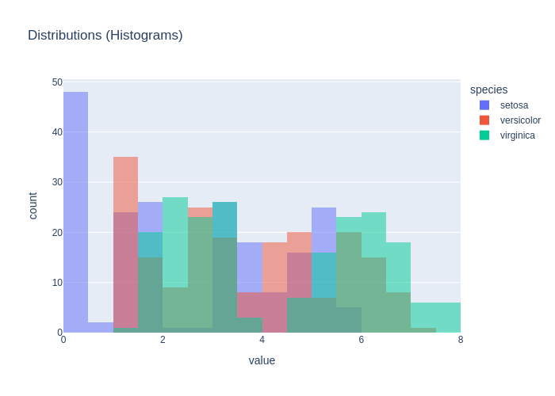
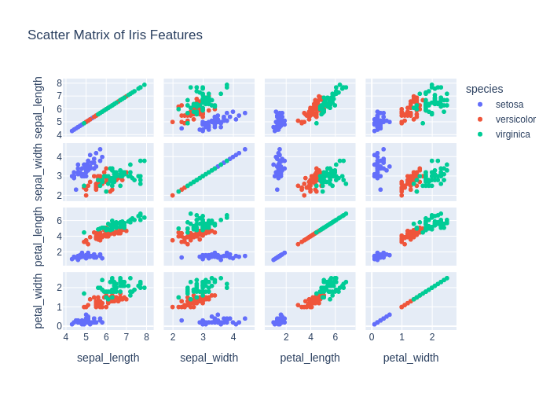
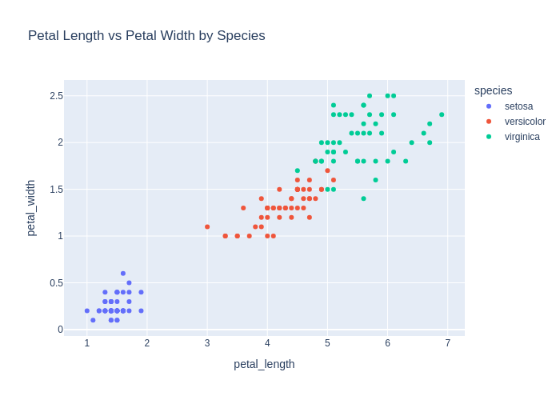

# Детальный отчёт по кейсам (ru)

## Методика расчёта метрик
### Semantic similarity (только для chat_response)
Формула:
```text
semantic_similarity = 0.6 * similarity + 0.4 * expected_coverage - 0.5 * forbidden_penalty
```
Где доли:
 - expected_coverage — доля ожидаемых фактов, упомянутых в ответе;
 - forbidden_penalty — доля запрещённых фактов,
попавших в ответ (штраф).
 - similarity — embedding-cosine между эталонным ответом (конкатенация expected_facts или базовый
референс) и ответом модели.


Факт считается покрытым, если косинусная близость fact↔ответ ≥ 0.55
(или высокая токеновая схожесть), что позволяет засчитывать перефраз. Весами (0.6/0.4/0.5) балансируем близость текста и полноту фактов,
давая штраф за запрещённые факты, чтобы сохранить интерпретируемость (веса суммарно ограничивают метрику в [0, 1]).

### Code score (только для code_generation)
- heuristic_score = 0.3 (валидный синтаксис) + до 0.2 (совпадение импортов) + до 0.4 (совпадение ключевых вызовов).
- result_match: бинарный флаг (1.0/0.0), что итоговый результат выполнения совпал с эталоном без ошибок исполнения.

## Кейсы
### code_001_describe (code_generation, language: ru, difficulty: easy)

**User input:** Напиши код, который выводит статистику по датасету.


**Ground truth:**
- expected_code:
```python
df.describe()
```
- expected_result:

```python
       sepal_length  sepal_width  petal_length  petal_width
count    150.000000   150.000000    150.000000   150.000000
mean       5.843333     3.057333      3.758000     1.199333
std        0.828066     0.435866      1.765298     0.762238
min        4.300000     2.000000      1.000000     0.100000
25%        5.100000     2.800000      1.600000     0.300000
50%        5.800000     3.000000      4.350000     1.300000
75%        6.400000     3.300000      5.100000     1.800000
max        7.900000     4.400000      6.900000     2.500000
```
- expected_error:

```python
None
```


**Model output:**
> Here's the generated code:
```python
df.describe(include='all')
```
- model_result:

```python
        sepal_length  sepal_width  petal_length  petal_width species
count     150.000000   150.000000    150.000000   150.000000     150
unique           NaN          NaN           NaN          NaN       3
top              NaN          NaN           NaN          NaN  setosa
freq             NaN          NaN           NaN          NaN      50
mean        5.843333     3.057333      3.758000     1.199333     NaN
std         0.828066     0.435866      1.765298     0.762238     NaN
min         4.300000     2.000000      1.000000     0.100000     NaN
25%         5.100000     2.800000      1.600000     0.300000     NaN
50%         5.800000     3.000000      4.350000     1.300000     NaN
75%         6.400000     3.300000      5.100000     1.800000     NaN
max         7.900000     4.400000      6.900000     2.500000     NaN
```
- model_error:

```python
None
```


**Метрики:**
- decision_score: True
  - heuristic_score: 1.0
    - syntax_check: 0.333 (ok=True)
    - imports_score: 0.222 | expected:  | model:  | matched:
    - calls_score: 0.444 | expected: describe | model: describe | matched: describe

### code_002_pairplot (code_generation, language: ru, difficulty: medium)

**User input:** Построй pairplot всех признаков.


**Ground truth:**
- expected_code:
```python
import plotly.express as px
fig = px.scatter_matrix(df, dimensions=df.columns, color="species")
fig.show()
```
- expected_result:

```python
None
```
- expected_output: Интерактивный график (Plotly)
- expected_error:

```python
execution_timeout: sandbox_timeout
```
- expected_plot:

 


**Model output:**
> Here's the generated code:
```python
import plotly.express as px
fig = px.scatter_matrix(df, dimensions=['sepal_length', 'sepal_width', 'petal_length', 'petal_width'], color='species')
fig.update_traces(diagonal_visible=False)
fig.show()
```
- model_result:

```python
None
```
- model_error:

```python
execution_timeout: sandbox_timeout
```
- model_plot:

 


**Метрики:**
- decision_score: True
  - heuristic_score: 1.0
    - syntax_check: 0.333 (ok=True)
    - imports_score: 0.222 | expected: plotly.express | model: plotly.express | matched: plotly.express
    - calls_score: 0.444 | expected: scatter_matrix, show | model: scatter_matrix, show, update_traces | matched: scatter_matrix, show

### code_003_train_model (code_generation, language: ru, difficulty: medium)

**User input:** Напиши код, который обучает простой классификатор на этих данных.


**Ground truth:**
- expected_code:
```python
from sklearn.linear_model import LogisticRegression

X = df.drop(columns=["species"])
y = df["species"]

model = LogisticRegression(max_iter=200)
model.fit(X, y)
```
- possible_code_objects: RandomForestClassifier, DecisionTreeClassifier, SVC, KNeighborsClassifier, GaussianNB
- expected_result:

```python
LogisticRegression(max_iter=200)
```
- expected_error:

```python
None
```


**Model output:**
> Here's the generated code:
```python
from sklearn.model_selection import train_test_split
from sklearn.linear_model import LogisticRegression
from sklearn.metrics import accuracy_score

X = df[['sepal_length', 'sepal_width', 'petal_length', 'petal_width']]
y = df['species']

X_train, X_test, y_train, y_test = train_test_split(X, y, test_size=0.2, random_state=42)

model = LogisticRegression(max_iter=200)
model.fit(X_train, y_train)

y_pred = model.predict(X_test)
accuracy_score(y_test, y_pred)
```
- model_result:

```python
1.0
```
- model_error:

```python
None
```


**Метрики:**
- decision_score: True
  - heuristic_score: 0.852
    - syntax_check: 0.333 (ok=True)
    - imports_score: 0.222 | expected: sklearn.linear_model | model: sklearn.linear_model, sklearn.metrics, sklearn.model_selection | matched: sklearn.linear_model
    - calls_score: 0.296 | expected: LogisticRegression, drop, fit | model: LogisticRegression, accuracy_score, fit, predict, train_test_split | matched: LogisticRegression, fit

### code_004_show_all_plots (code_generation, language: ru, difficulty: hard)

**User input:** Отобрази все графики.


**Ground truth:**
- expected_code:
```python
import plotly.express as px
import plotly.graph_objects as go

# df already exists and represents the iris dataset

# Select numeric columns
num_cols = df.select_dtypes(include=["number"]).columns.tolist()

# Try to infer target column
candidate_targets = ["species", "target", "label", "class"]
target_col = next((c for c in candidate_targets if c in df.columns), None)

if not num_cols:
    raise ValueError("No numeric columns found in df to build plots.")

# 1) Histograms for all numeric features
fig_hist = px.histogram(
    df,
    x=num_cols,
    color=target_col if target_col else None,
    barmode="overlay",
    title="Distributions (Histograms)"
)
fig_hist.show()

# 2) Box plots by class (if target exists)
if target_col:
    for col in num_cols:
        fig_box = px.box(
            df,
            x=target_col,
            y=col,
            title=f"Boxplot: {col} by {target_col}"
        )
        fig_box.show()

# 3) Scatter plots for common Iris feature pairs
scatter_pairs = [
    ("sepal_length", "sepal_width"),
    ("petal_length", "petal_width")
]

for x, y in scatter_pairs:
    if x in df.columns and y in df.columns:
        fig_scatter = px.scatter(
            df,
            x=x,
            y=y,
            color=target_col if target_col else None,
            title=f"Scatter: {x} vs {y}"
        )
        fig_scatter.show()

# 4) Scatter matrix (pairwise relationships)
fig_matrix = px.scatter_matrix(
    df,
    dimensions=num_cols,
    color=target_col if target_col else None,
    title="Scatter Matrix"
)
fig_matrix.show()

# 5) Correlation heatmap
corr = df[num_cols].corr(numeric_only=True)

fig_heatmap = px.imshow(
    corr,
    text_auto=True,
    title="Correlation Heatmap"
)
fig_heatmap.show()

```
- possible_code_objects: df, px, go
- expected_result:

```python
None
```
- expected_output: Интерактивный график (Plotly)
- expected_error:

```python
execution_timeout: sandbox_timeout
```
- expected_plot:

 


**Model output:**
> Here's the generated code:
```python
import plotly.express as px

fig = px.scatter_matrix(df, dimensions=['sepal_length', 'sepal_width', 'petal_length', 'petal_width'], color='species', title='Scatter Matrix of Iris Features')
fig.show()
```
- model_result:

```python
None
```
- model_error:

```python
execution_timeout: sandbox_timeout
```
- model_plot:

 


**Метрики:**
- decision_score: True
  - heuristic_score: 0.525
    - syntax_check: 0.333 (ok=True)
    - imports_score: 0.111 | expected: plotly.express, plotly.graph_objects | model: plotly.express | matched: plotly.express
    - calls_score: 0.081 | expected: ValueError, box, corr, histogram, imshow, next, scatter, scatter_matrix, select_dtypes, show, tolist | model: scatter_matrix, show | matched: scatter_matrix, show

### code_005_histogram (code_generation, language: ru, difficulty: hard)

**User input:** Отобрази график Histogram


**Ground truth:**
- expected_code:
```python
import plotly.express as px

# df already exists and represents the iris dataset

num_cols = df.select_dtypes(include=["number"]).columns.tolist()

if not num_cols:
    raise ValueError("В df не найдено числовых колонок для построения histogram.")

# Строим histogram по всем числовым признакам
fig = px.histogram(
    df,
    x=num_cols,
    barmode="overlay",
    title="Histogram"
)

fig.show()

```
- possible_code_objects: df, px
- expected_result:

```python
None
```
- expected_output: Интерактивный график (Plotly)
- expected_error:

```python
execution_timeout: sandbox_timeout
```
- expected_plot:

 


**Model output:**
> Here's the generated code:
```python
import plotly.express as px
px.histogram(df, x='sepal_length', nbins=20, title='Histogram of Sepal Length')
```
- model_result:

```python
Figure({
    'data': [{'bingroup': 'x',
              'hovertemplate': 'sepal_length=%{x}<br>count=%{y}<extra></extra>',
              'legendgroup': '',
              'marker': {'color': '#636efa', 'pattern': {'shape': ''}},
              'name': '',
              'nbinsx': 20,
              'orientation': 'v',
              'showlegend': False,
              'type': 'histogram',
              'x': {'bdata': ('ZmZmZmZmFECamZmZmZkTQM3MzMzMzB' ... 'AAAAAAGkDNzMzMzMwYQJqZmZmZmRdA'),
                    'dtype': 'f8'},
              'xaxis': 'x',
              'yaxis': 'y'}],
    'layout': {'barmode': 'relative',
               'legend': {'tracegroupgap': 0},
               'template': '...',
               'title': {'text': 'Histogram of Sepal Length'},
               'xaxis': {'anchor': 'y', 'domain': [0.0, 1.0], 'title': {'text': 'sepal_length'}},
               'yaxis': {'anchor': 'x', 'domain': [0.0, 1.0], 'title': {'text': 'count'}}}
})
```
- model_error:

```python
None
```
- model_plot:

 


**Метрики:**
- decision_score: True
  - heuristic_score: 0.733
    - syntax_check: 0.333 (ok=True)
    - imports_score: 0.222 | expected: plotly.express | model: plotly.express | matched: plotly.express
    - calls_score: 0.178 | expected: ValueError, histogram, select_dtypes, show, tolist | model: histogram, show | matched: histogram, show

### chat_001_what_is_iris (chat_response, language: ru, difficulty: easy)

**User input:** Поясни, что представляет собой датасет.


**Ground truth:**
- expected_facts: датасет содержит измерения лепестков и чашелистиков; три вида ириса
- forbidden_facts: животные


**Model output:**
> Этот датасет содержит данные о цветках ириса.   Он состоит из пяти столбцов:  - **sepal_length** — длина чашелистика в сантиметрах   - **sepal_width** — ширина чашелистика в сантиметрах   - **petal_length** — длина лепестка в сантиметрах   - **petal_width** — ширина лепестка в сантиметрах   - **species** — вид ириса, например, setosa, versicolor или virginica  Каждая строка — это измерения одного цветка.   Данные используются для обучения моделей машинного обучения, чтобы научиться определять вид ириса по его размерам.


**Метрики:**
- decision_score: True
- semantic_similarity: 0.171
  - expected_coverage: 0.0 | forbidden_penalty: 0.0

### chat_002_how_many_classes (chat_response, language: ru, difficulty: easy)

**User input:** Сколько классов в этом датасете?


**Ground truth:**
- expected_facts: три класса


**Model output:**
> В этом датасете **три класса**.  Они соответствуют видам ирисов, указанным в столбце **species**.   Это:   - **setosa**   - **versicolor**   - **virginica**


**Метрики:**
- decision_score: True
- semantic_similarity: 0.3
  - expected_coverage: 0.0 | forbidden_penalty: 0.0

### chat_003_best_features (chat_response, language: ru, difficulty: medium)

**User input:** Какие признаки лучше всего разделяют виды ирисов?


**Ground truth:**
- expected_facts: длина лепестка; ширина лепестка


**Model output:**
> Here's the generated code:
```python
df.groupby('species').mean()
```
- model_result:

```python
None
```
- model_error:

```python
None
```


**Метрики:**
- decision_score: False
- semantic_similarity: 0.052
  - expected_coverage: 0.0 | forbidden_penalty: 0.0

### chat_004_easiest_class (chat_response, language: ru, difficulty: medium)

**User input:** Какой вид ириса лучше всего отделяется от остальных?


**Ground truth:**
- expected_facts: setosa; короче лепестки; шире лепестки


**Model output:**
> Here's the generated code:
```python
import plotly.express as px

fig = px.scatter(df, x='sepal_length', y='sepal_width', color='species', title='Sepal Length vs Sepal Width by Species')
fig.show()

fig = px.scatter(df, x='petal_length', y='petal_width', color='species', title='Petal Length vs Petal Width by Species')
fig.show()
```
- model_result:

```python
None
```
- model_error:

```python
None
```
- model_plot:

 


**Метрики:**
- decision_score: False
- semantic_similarity: 0.051
  - expected_coverage: 0.0 | forbidden_penalty: 0.0

### theory_001_overfitting (chat_response, language: ru, difficulty: easy)

**User input:** Что такое переобучение в машинном обучении?


**Ground truth:**
- expected_facts: модель слишком хорошо подстраивается под обучающую выборку; плохо обобщает на новые данные
- forbidden_facts: переобучение улучшает качество на новых данных


**Model output:**
> **Переобучение** — это когда модель машинного обучения слишком хорошо учится на тренировочных данных.    Вот что это означает:   - Модель запоминает конкретные примеры из данных, а не учится находить общие закономерности.   - На новых, ранее не виденных данных она работает плохо.    Пример:   Если модель учится на фото цветов, и запоминает каждый отдельный листок, она может не распознать цветок, если он на другом фоне.    Переобучение — это как учиться на одной карточке, а потом не справиться с другими вопросами.


**Метрики:**
- decision_score: True
- semantic_similarity: 0.208
  - expected_coverage: 0.0 | forbidden_penalty: 0.0

### theory_002_train_test_split (chat_response, language: ru, difficulty: easy)

**User input:** Зачем используется разделение на обучающую и тестовую выборки?


**Ground truth:**
- expected_facts: оценка качества модели на невидимых данных; предотвращение утечки данных
- forbidden_facts: для увеличения точности на обучающей выборке


**Model output:**
> Разделение на обучающую и тестовую выборки помогает проверить, насколько хорошо модель работает на новых, не виденных данных.  - **Обучающая выборка** — данные, на которых модель учится. - **Тестовая выборка** — данные, которые модель не видела, чтобы проверить её точность.  Это важно, потому что если модель просто запоминает обучающие данные, она может плохо работать на новых примерах.  Пример: ``` Обучающая выборка: 80% данных Тестовая выборка: 20% данных ```  Такое разделение помогает избежать переобучения и показывает реальную эффективность модели.


**Метрики:**
- decision_score: True
- semantic_similarity: 0.193
  - expected_coverage: 0.0 | forbidden_penalty: 0.0

### theory_003_regularization (chat_response, language: ru, difficulty: medium)

**User input:** Что такое регуляризация и зачем она нужна?


**Ground truth:**
- expected_facts: добавляет штраф за сложность модели; уменьшает переобучение
- forbidden_facts: регуляризация увеличивает разброс модели


**Model output:**
> **Регуляризация** — это техника, используемая при обучении моделей машинного обучения, чтобы предотвратить **переобучение**.  Когда модель слишком хорошо учится на тренировочных данных, она может плохо работать на новых, не виденных данных. Это называется переобучением.  **Регуляризация** помогает решить эту проблему, добавляя штраф за слишком большие значения весов в модели. Это заставляет модель быть проще и лучше обобщать.  Примеры: - **L1 регуляризация** (Lasso): может обнулять некоторые веса, что полезно для выбора признаков. - **L2 регуляризация** (Ridge): уменьшает веса, но не обнуляет их.  Итог: регуляризация делает модель более устойчивой и точной на новых данных.


**Метрики:**
- decision_score: True
- semantic_similarity: 0.106
  - expected_coverage: 0.0 | forbidden_penalty: 0.0

### theory_004_bias_variance (chat_response, language: ru, difficulty: medium)

**User input:** Объясни компромисс между смещением и разбросом.


**Ground truth:**
- expected_facts: смещение связано с упрощающими предположениями модели; разброс связан с чувствительностью к обучающим данным; существует компромисс между смещением и разбросом
- forbidden_facts: смещение и разброс можно минимизировать независимо


**Model output:**
> **Смещение** — это ошибка модели, которая возникает, когда модель систематически предсказывает значения, которые отличаются от истинных.  **Разброс** — это изменчивость предсказаний модели на разных данных. Высокий разброс означает, что модель сильно зависит от выборки данных.  Компромисс между смещением и разбросом означает, что если вы пытаетесь уменьшить одно, другое может увеличиться.  Например: - Очень простая модель (например, линейная) может иметь **высокое смещение**, потому что не может уловить сложные закономерности. - Очень сложная модель (например, глубокая нейросеть) может иметь **высокий разброс**, потому что она "запоминает" шум в данных, а не учится на реальных паттернах.  Хорошая модель — это та, которая балансирует между низким смещением и низким разбросом.


**Метрики:**
- decision_score: True
- semantic_similarity: 0.264
  - expected_coverage: 0.0 | forbidden_penalty: 0.0

### chat_005_what_is_in_data (chat_response, language: ru, difficulty: easy)

**User input:** Что в данных


**Ground truth:**
- expected_facts: Данные представляют собой датасет Iris; В данных содержатся числовые признаки, описывающие размеры чашелистиков и лепестков; В данных есть категориальный признак с видом ириса; Каждая строка соответствует одному цветку
- forbidden_facts: Упоминание конкретных статистик или числовых значений; Утверждения о качестве модели или результатах обучения; Предположения о последующей обработке данных


**Model output:**
> В данных есть следующие столбцы:  - **sepal_length** — длина чашелистика (в сантиметрах)   - **sepal_width** — ширина чашелистика (в сантиметрах)   - **petal_length** — длина лепестка (в сантиметрах)   - **petal_width** — ширина лепестка (в сантиметрах)   - **species** — вид цветка (категориальный признак, например, setosa, versicolor, virginica)  Это классический набор данных о цветах ириса.


**Метрики:**
- decision_score: True
- semantic_similarity: 0.273
  - expected_coverage: 0.0 | forbidden_penalty: 0.0
