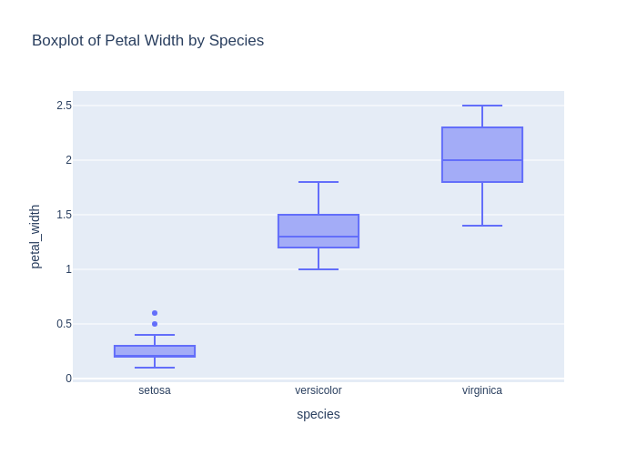
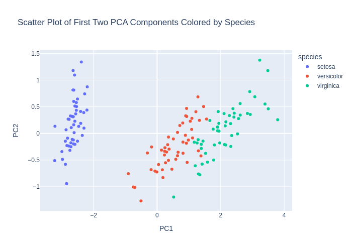
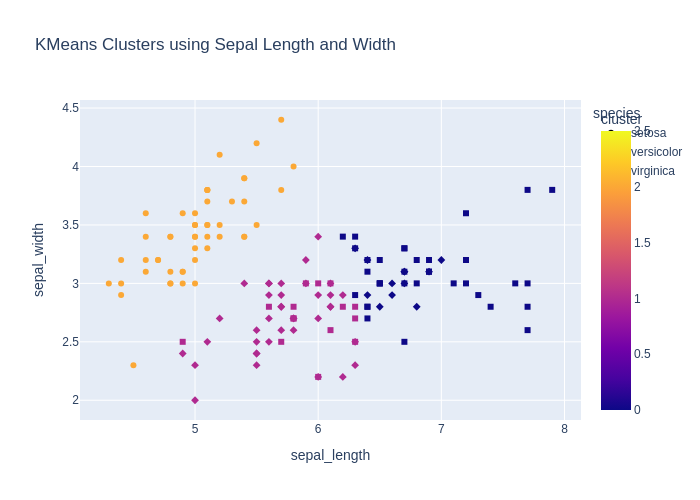
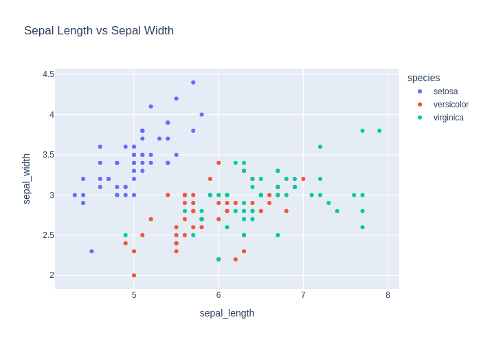
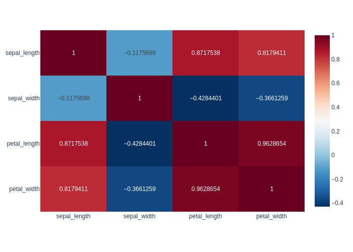
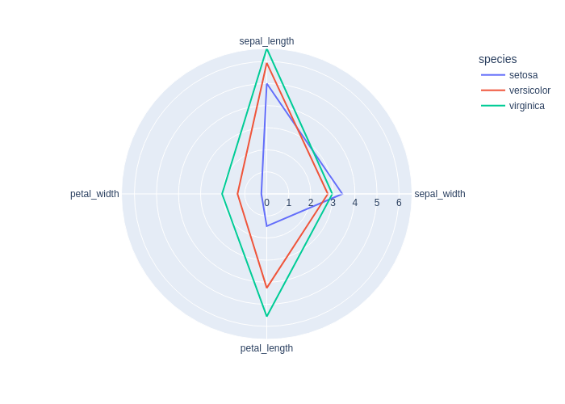

# Детальный отчёт по кейсам (en)

## Evaluation Results

- **Code generation accuracy: 88.9%** (16 / 18)

- **Chat response accuracy: 96.1%** (25 / 26)

- 1 из 2 ошибок обусловлена ошибками классификации `decision`, а не качеством ответа: "Which features best separate the iris species?" определена как `code_generation` кейс

- **Overall decision accuracy: 0.964**

## Кейсы
### code_001_describe_en (code_generation, language: en, difficulty: easy)

**User input:** Write code that outputs statistics for the dataset.


**Ground truth:**
- expected_code:
```python
df.describe()
```
- expected_result:

```python
       sepal_length  sepal_width  petal_length  petal_width
count    150.000000   150.000000    150.000000   150.000000
mean       5.843333     3.057333      3.758000     1.199333
std        0.828066     0.435866      1.765298     0.762238
min        4.300000     2.000000      1.000000     0.100000
25%        5.100000     2.800000      1.600000     0.300000
50%        5.800000     3.000000      4.350000     1.300000
75%        6.400000     3.300000      5.100000     1.800000
max        7.900000     4.400000      6.900000     2.500000
```
- expected_error:

```python
None
```


**Model output:**
> Here's the generated code:
```python
df.describe(include='all')
```
- model_result:

```python
        sepal_length  sepal_width  petal_length  petal_width species
count     150.000000   150.000000    150.000000   150.000000     150
unique           NaN          NaN           NaN          NaN       3
top              NaN          NaN           NaN          NaN  setosa
freq             NaN          NaN           NaN          NaN      50
mean        5.843333     3.057333      3.758000     1.199333     NaN
std         0.828066     0.435866      1.765298     0.762238     NaN
min         4.300000     2.000000      1.000000     0.100000     NaN
25%         5.100000     2.800000      1.600000     0.300000     NaN
50%         5.800000     3.000000      4.350000     1.300000     NaN
75%         6.400000     3.300000      5.100000     1.800000     NaN
max         7.900000     4.400000      6.900000     2.500000     NaN
```
- model_error:

```python
None
```
- decision_score: True

### code_002_pairplot_en (code_generation, language: en, difficulty: medium)

**User input:** Create a pairplot for all features.


**Ground truth:**
- expected_code:
```python
import plotly.express as px
fig = px.scatter_matrix(df, dimensions=df.columns, color="species")
fig.show()
```
- expected_result:

```python
None
```
- expected_output: Интерактивный график (Plotly)
- expected_error:

```python
execution_timeout: sandbox_timeout
```
- expected_plot:

 


**Model output:**
> Here's the generated code:
```python
import plotly.express as px
fig = px.scatter_matrix(df, dimensions=['sepal_length', 'sepal_width', 'petal_length', 'petal_width'], color='species')
fig.show()
```
- model_result:

```python
None
```
- model_error:

```python
execution_timeout: sandbox_timeout
```
- model_plot:

 
- decision_score: True

### code_003_train_model_en (code_generation, language: en, difficulty: medium)

**User input:** Write code that trains a simple classifier on this data.


**Ground truth:**
- expected_code:
```python
from sklearn.linear_model import LogisticRegression

X = df.drop(columns=["species"])
y = df["species"]

model = LogisticRegression(max_iter=200)
model.fit(X, y)
```
- possible_code_objects: RandomForestClassifier, DecisionTreeClassifier, SVC, KNeighborsClassifier, GaussianNB
- expected_result:

```python
LogisticRegression(max_iter=200)
```
- expected_error:

```python
None
```


**Model output:**
> Here's the generated code:
```python
from sklearn.model_selection import train_test_split
from sklearn.linear_model import LogisticRegression
from sklearn.metrics import accuracy_score

X = df[['sepal_length', 'sepal_width', 'petal_length', 'petal_width']]
y = df['species']

X_train, X_test, y_train, y_test = train_test_split(X, y, test_size=0.2, random_state=42)

model = LogisticRegression(max_iter=200)
model.fit(X_train, y_train)

y_pred = model.predict(X_test)
accuracy_score(y_test, y_pred)
```
- model_result:

```python
1.0
```
- model_error:

```python
None
```
- decision_score: True

### code_004_missing_check_en (code_generation, language: en, difficulty: easy)

**User input:** Check if there are missing values in the dataset.


**Ground truth:**
- expected_code:
```python
df.isnull().sum()
```
- expected_result:

```python
sepal_length    0
sepal_width     0
petal_length    0
petal_width     0
species         0
dtype: int64
```
- expected_error:

```python
None
```


**Model output:**
> Here's the generated code:
```python
df.isnull().sum()
```
- model_result:

```python
sepal_length    0
sepal_width     0
petal_length    0
petal_width     0
species         0
dtype: int64
```
- model_error:

```python
None
```
- decision_score: True

### code_005_fill_missing_en (code_generation, language: en, difficulty: easy)

**User input:** Fill missing values with the mean value of column.


**Ground truth:**
- expected_code:
```python
df.fillna(df.mean(numeric_only=True), inplace=True)
```
- expected_result:

```python
None
```
- expected_output: Графический вывод
- expected_error:

```python
None
```


**Model output:**
> Here's the generated code:
```python
df.fillna(df.mean(numeric_only=True), inplace=True)
```
- model_result:

```python
None
```
- model_error:

```python
None
```
- decision_score: True

### code_006_boxplot_en (code_generation, language: en, difficulty: medium)

**User input:** Create boxplots for all numeric features.


**Ground truth:**
- expected_code:
```python
import plotly.express as px

fig = px.box(df, y=df.select_dtypes(include="number").columns)
fig.show()
```
- expected_result:

```python
None
```
- expected_output: Интерактивный график (Plotly)
- expected_error:

```python
execution_timeout: sandbox_timeout
```
- expected_plot:

 


**Model output:**
> Here's the generated code:
```python
import plotly.express as px

fig = px.box(df, x='species', y='sepal_length', title='Boxplot of Sepal Length by Species')
fig.show()

fig = px.box(df, x='species', y='sepal_width', title='Boxplot of Sepal Width by Species')
fig.show()

fig = px.box(df, x='species', y='petal_length', title='Boxplot of Petal Length by Species')
fig.show()

fig = px.box(df, x='species', y='petal_width', title='Boxplot of Petal Width by Species')
fig.show()
```
- model_result:

```python
None
```
- model_error:

```python
execution_timeout: sandbox_timeout
```
- model_plot:

 
- decision_score: True

### code_007_standardize_en (code_generation, language: en, difficulty: medium)

**User input:** Standardize all feature columns.


**Ground truth:**
- expected_code:
```python
from sklearn.preprocessing import StandardScaler

scaler = StandardScaler()
X_scaled = scaler.fit_transform(df.drop(columns=["species"]))
```
- expected_result:

```python
None
```
- expected_output: Графический вывод
- expected_error:

```python
None
```


**Model output:**
> Here's the generated code:
```python
from sklearn.preprocessing import StandardScaler
scaler = StandardScaler()
df[['sepal_length', 'sepal_width', 'petal_length', 'petal_width']] = scaler.fit_transform(df[['sepal_length', 'sepal_width', 'petal_length', 'petal_width']])
```
- model_result:

```python
None
```
- model_error:

```python
None
```
- decision_score: True

### code_008_normalize_en (code_generation, language: en, difficulty: medium)

**User input:** Normalize the features in range 0 to 1.


**Ground truth:**
- expected_code:
```python
from sklearn.preprocessing import MinMaxScaler

scaler = MinMaxScaler()
X_normalized = scaler.fit_transform(df.drop(columns=["species"]))
```
- expected_result:

```python
None
```
- expected_output: Графический вывод
- expected_error:

```python
None
```


**Model output:**
> Here's the generated code:
```python
from sklearn.preprocessing import MinMaxScaler

scaler = MinMaxScaler()
df[['sepal_length', 'sepal_width', 'petal_length', 'petal_width']] = scaler.fit_transform(df[['sepal_length', 'sepal_width', 'petal_length', 'petal_width']])
```
- model_result:

```python
None
```
- model_error:

```python
None
```
- decision_score: True

### code_009_pca_en (code_generation, language: en, difficulty: medium)

**User input:** Reduce dimensionality to two components using PCA.


**Ground truth:**
- expected_code:
```python
from sklearn.decomposition import PCA

pca = PCA(n_components=2)
X_pca = pca.fit_transform(df.drop(columns=["species"]))
```
- expected_result:

```python
None
```
- expected_output: Графический вывод
- expected_error:

```python
None
```


**Model output:**
> Here's the generated code:
```python
from sklearn.decomposition import PCA
from sklearn.preprocessing import StandardScaler

# Standardize the features
scaler = StandardScaler()
df_scaled = scaler.fit_transform(df[['sepal_length', 'sepal_width', 'petal_length', 'petal_width']])

# Apply PCA to reduce to 2 components
pca = PCA(n_components=2)
df_pca = pca.fit_transform(df_scaled)

# Create a DataFrame with the two principal components
df_pca = pd.DataFrame(df_pca, columns=['PC1', 'PC2'])

# Add the species column back
df_pca['species'] = df['species']

df_pca
```
- model_result:

```python
          PC1       PC2    species
0   -2.264703  0.480027     setosa
1   -2.080961 -0.674134     setosa
2   -2.364229 -0.341908     setosa
3   -2.299384 -0.597395     setosa
4   -2.389842  0.646835     setosa
..        ...       ...        ...
145  1.870503  0.386966  virginica
146  1.564580 -0.896687  virginica
147  1.521170  0.269069  virginica
148  1.372788  1.011254  virginica
149  0.960656 -0.024332  virginica

[150 rows x 3 columns]
```
- model_error:

```python
None
```
- decision_score: True

### code_010_pca_plot_en (code_generation, language: en, difficulty: hard)

**User input:** Make scatter plot of first two PCA components colored by species.


**Ground truth:**
- expected_code:
```python
import plotly.express as px
from sklearn.decomposition import PCA

pca = PCA(n_components=2)
X_pca = pca.fit_transform(df.drop(columns=["species"]))

df_pca = pd.DataFrame(X_pca, columns=["PC1", "PC2"])
df_pca["species"] = df["species"]

fig = px.scatter(df_pca, x="PC1", y="PC2", color="species")
fig.show()
```
- expected_result:

```python
None
```
- expected_output: Интерактивный график (Plotly)
- expected_error:

```python
execution_timeout: sandbox_timeout
```
- expected_plot:

 


**Model output:**
> Here's the generated code:
```python
import pandas as pd
from sklearn.decomposition import PCA
import plotly.express as px

pca = PCA(n_components=2)
principal_components = pca.fit_transform(df[['sepal_length', 'sepal_width', 'petal_length', 'petal_width']])

df_pca = pd.DataFrame(data=principal_components, columns=['PC1', 'PC2'])
df_pca['species'] = df['species']

px.scatter(df_pca, x='PC1', y='PC2', color='species', title='Scatter Plot of First Two PCA Components Colored by Species')
```
- model_result:

```python
Figure({
    'data': [{'hovertemplate': 'species=setosa<br>PC1=%{x}<br>PC2=%{y}<extra></extra>',
              'legendgroup': 'setosa',
              'marker': {'color': '#636efa', 'symbol': 'circle'},
              'mode': 'markers',
              'name': 'setosa',
              'orientation': 'v',
              'showlegend': True,
              'type': 'scatter',
              'x': {'bdata': ('TCgv2xZ5BcBwHb3qj7YFwCt/ZBanHA' ... 'A3twbAs49zVz1YBMACnPMXe6AFwA=='),
                    'dtype': 'f8'},
              'xaxis': 'x',
              'y': {'bdata': ('EP0gJgFx1D9gqoDk+afGvwBETuqzjc' ... 'dSLc2/4OGs4oaK4j+ATOo1oJK7Pw=='),
                    'dtype': 'f8'},
              'yaxis': 'y'},
             {'hovertemplate': 'species=versicolor<br>PC1=%{x}<br>PC2=%{y}<extra></extra>',
              'legendgroup': 'versicolor',
              'marker': {'color': '#EF553B', 'symbol': 'circle'},
              'mode': 'markers',
              'name': 'versicolor',
              'orientation': 'v',
              'showlegend': True,
              'type': 'scatter',
              'x': {'bdata': ('EFGrYaWO9D94pcUw8tbtP/SOhkXIbf' ... '/7j+Q/CHkYF80B7b9w9VVt1CLTPw=='),
                    'dtype': 'f8'},
              'xaxis': 'x',
              'y': {'bdata': ('sGilptXs5T8ggGMNlF/UP9DwisXrIu' ... 'n1KZI/cH1It+ox6L/AaxZ3V1TWvw=='),
                    'dtype': 'f8'},
              'yaxis': 'y'},
             {'hovertemplate': 'species=virginica<br>PC1=%{x}<br>PC2=%{y}<extra></extra>',
              'legendgroup': 'virginica',
              'marker': {'color': '#00cc96', 'symbol': 'circle'},
              'mode': 'markers',
              'name': 'virginica',
              'orientation': 'v',
              'showlegend': True,
              'type': 'scatter',
              'x': {'bdata': ('JFEO+eE/BEBEG+lfzqT2P7hux9Xz7g' ... 'PCOvw//MYKwUFq/j+wRhWtNj72Pw=='),
                    'dtype': 'f8'},
              'xaxis': 'x',
              'y': {'bdata': ('ACyJGcUrhL+Qu9T3tmXivwBDAF2CAt' ... 'kYMLQ/AMWbc1TbvT+wqiHnHRfSvw=='),
                    'dtype': 'f8'},
              'yaxis': 'y'}],
    'layout': {'legend': {'title': {'text': 'species'}, 'tracegroupgap': 0},
               'template': '...',
               'title': {'text': 'Scatter Plot of First Two PCA Components Colored by Species'},
               'xaxis': {'anchor': 'y', 'domain': [0.0, 1.0], 'title': {'text': 'PC1'}},
               'yaxis': {'anchor': 'x', 'domain': [0.0, 1.0], 'title': {'text': 'PC2'}}}
})
```
- model_error:

```python
None
```
- model_plot:

 
- decision_score: True

### code_011_kmeans_en (code_generation, language: en, difficulty: medium)

**User input:** Make three clusters using KMeans.


**Ground truth:**
- expected_code:
```python
from sklearn.cluster import KMeans

kmeans = KMeans(n_clusters=3, random_state=42)
clusters = kmeans.fit_predict(df.drop(columns=["species"]))
```
- expected_result:

```python
None
```
- expected_output: Графический вывод
- expected_error:

```python
None
```


**Model output:**
> Here's the generated code:
```python
from sklearn.cluster import KMeans
import plotly.express as px
import pandas as pd

kmeans = KMeans(n_clusters=3, random_state=42)
df['cluster'] = kmeans.fit_predict(df[['sepal_length', 'sepal_width', 'petal_length', 'petal_width']])
```
- model_result:

```python
None
```
- model_error:

```python
None
```
- model_plot_error: no Plotly figure was created
- decision_score: True

### code_012_cluster_plot_en (code_generation, language: en, difficulty: medium)

**User input:** Make scatter plot of KMeans clusters using the first two features.


**Ground truth:**
- expected_code:
```python
import plotly.express as px
from sklearn.cluster import KMeans

X = df.drop(columns=["species"])
kmeans = KMeans(n_clusters=3, random_state=42)
clusters = kmeans.fit_predict(X)

fig = px.scatter(
    df,
    x="sepal_length",
    y="sepal_width",
    color=clusters.astype(str)
)
fig
```
- expected_result:

```python
Figure({
    'data': [{'hovertemplate': 'color=1<br>sepal_length=%{x}<br>sepal_width=%{y}<extra></extra>',
              'legendgroup': '1',
              'marker': {'color': '#636efa', 'symbol': 'circle'},
              'mode': 'markers',
              'name': '1',
              'orientation': 'v',
              'showlegend': True,
              'type': 'scatter',
              'x': {'bdata': ('ZmZmZmZmFECamZmZmZkTQM3MzMzMzB' ... 'ZmZhJAMzMzMzMzFUAAAAAAAAAUQA=='),
                    'dtype': 'f8'},
              'xaxis': 'x',
              'y': {'bdata': ('AAAAAAAADEAAAAAAAAAIQJqZmZmZmQ' ... 'mZmQlAmpmZmZmZDUBmZmZmZmYKQA=='),
                    'dtype': 'f8'},
              'yaxis': 'y'},
             {'hovertemplate': 'color=0<br>sepal_length=%{x}<br>sepal_width=%{y}<extra></extra>',
              'legendgroup': '0',
              'marker': {'color': '#EF553B', 'symbol': 'circle'},
              'mode': 'markers',
              'name': '0',
              'orientation': 'v',
              'showlegend': True,
              'type': 'scatter',
              'x': {'bdata': ('AAAAAAAAHECamZmZmZkbQM3MzMzMzB' ... 'zMzMzMGkAAAAAAAAAaQM3MzMzMzBhA'),
                    'dtype': 'f8'},
              'xaxis': 'x',
              'y': {'bdata': ('mpmZmZmZCUDNzMzMzMwIQAAAAAAAAA' ... 'AAAAAACEAAAAAAAAAIQDMzMzMzMwtA'),
                    'dtype': 'f8'},
              'yaxis': 'y'},
             {'hovertemplate': 'color=2<br>sepal_length=%{x}<br>sepal_width=%{y}<extra></extra>',
              'legendgroup': '2',
              'marker': {'color': '#00cc96', 'symbol': 'circle'},
              'mode': 'markers',
              'name': '2',
              'orientation': 'v',
              'showlegend': True,
              'type': 'scatter',
              'x': {'bdata': ('mpmZmZmZGUAAAAAAAAAWQAAAAAAAAB' ... 'MzMzMXQDMzMzMzMxlAmpmZmZmZF0A='),
                    'dtype': 'f8'},
              'xaxis': 'x',
              'y': {'bdata': ('mpmZmZmZCUBmZmZmZmYCQGZmZmZmZg' ... 'mZmZkFQAAAAAAAAARAAAAAAAAACEA='),
                    'dtype': 'f8'},
              'yaxis': 'y'}],
    'layout': {'legend': {'title': {'text': 'color'}, 'tracegroupgap': 0},
               'margin': {'t': 60},
               'template': '...',
               'xaxis': {'anchor': 'y', 'domain': [0.0, 1.0], 'title': {'text': 'sepal_length'}},
               'yaxis': {'anchor': 'x', 'domain': [0.0, 1.0], 'title': {'text': 'sepal_width'}}}
})
```
- expected_error:

```python
None
```
- expected_plot:

 


**Model output:**
> Here's the generated code:
```python
import plotly.express as px
from sklearn.cluster import KMeans
import pandas as pd

kmeans = KMeans(n_clusters=3, random_state=42)
df['cluster'] = kmeans.fit_predict(df[['sepal_length', 'sepal_width']])

fig = px.scatter(df, x='sepal_length', y='sepal_width', color='cluster', symbol='species', title='KMeans Clusters using Sepal Length and Width')
fig.show()
```
- model_result:

```python
None
```
- model_error:

```python
execution_timeout: sandbox_timeout
```
- model_plot:

 
- decision_score: True

### code_013_train_test_split_en (code_generation, language: en, difficulty: easy)

**User input:** Split the dataset into train and test sets.


**Ground truth:**
- expected_code:
```python
from sklearn.model_selection import train_test_split

X = df.drop(columns=["species"])
y = df["species"]

X_train, X_test, y_train, y_test = train_test_split(X, y, test_size=0.2, random_state=42)
```
- expected_result:

```python
None
```
- expected_output: Графический вывод
- expected_error:

```python
None
```


**Model output:**
> Here's the generated code:
```python
from sklearn.model_selection import train_test_split

X = df.drop('species', axis=1)
y = df['species']
X_train, X_test, y_train, y_test = train_test_split(X, y, test_size=0.2, random_state=42, stratify=y)
```
- model_result:

```python
None
```
- model_error:

```python
None
```
- decision_score: True

### code_014_show_all_plots_en (code_generation, language: en, difficulty: hard)

**User input:** Show all plots.


**Ground truth:**
- expected_code:
```python
import plotly.express as px
import plotly.graph_objects as go

# df already exists and represents the iris dataset

# Select numeric columns
num_cols = df.select_dtypes(include=["number"]).columns.tolist()

# Try to infer target column
candidate_targets = ["species", "target", "label", "class"]
target_col = next((c for c in candidate_targets if c in df.columns), None)

if not num_cols:
    raise ValueError("No numeric columns found in df to build plots.")

# 1) Histograms for all numeric features
fig_hist = px.histogram(
    df,
    x=num_cols,
    color=target_col if target_col else None,
    barmode="overlay",
    title="Distributions (Histograms)"
)
fig_hist.show()

# 2) Box plots by class (if target exists)
if target_col:
    for col in num_cols:
        fig_box = px.box(
            df,
            x=target_col,
            y=col,
            title=f"Boxplot: {col} by {target_col}"
        )
        fig_box.show()

# 3) Scatter plots for common Iris feature pairs
scatter_pairs = [
    ("sepal_length", "sepal_width"),
    ("petal_length", "petal_width")
]

for x, y in scatter_pairs:
    if x in df.columns and y in df.columns:
        fig_scatter = px.scatter(
            df,
            x=x,
            y=y,
            color=target_col if target_col else None,
            title=f"Scatter: {x} vs {y}"
        )
        fig_scatter.show()

# 4) Scatter matrix (pairwise relationships)
fig_matrix = px.scatter_matrix(
    df,
    dimensions=num_cols,
    color=target_col if target_col else None,
    title="Scatter Matrix"
)
fig_matrix.show()

# 5) Correlation heatmap
corr = df[num_cols].corr(numeric_only=True)

fig_heatmap = px.imshow(
    corr,
    text_auto=True,
    title="Correlation Heatmap"
)
fig_heatmap.show()

```
- possible_code_objects: df, pd, np, px
- expected_result:

```python
None
```
- expected_output: Интерактивный график (Plotly)
- expected_error:

```python
execution_timeout: sandbox_timeout
```
- expected_plot:

 


**Model output:**
> Here's the generated code:
```python
import plotly.express as px

fig1 = px.scatter(df, x='sepal_length', y='sepal_width', color='species', title='Sepal Length vs Sepal Width')
fig2 = px.scatter(df, x='petal_length', y='petal_width', color='species', title='Petal Length vs Petal Width')
fig3 = px.box(df, x='species', y='sepal_length', title='Sepal Length by Species')
fig4 = px.box(df, x='species', y='sepal_width', title='Sepal Width by Species')
fig5 = px.box(df, x='species', y='petal_length', title='Petal Length by Species')
fig6 = px.box(df, x='species', y='petal_width', title='Petal Width by Species')

fig1.show()
fig2.show()
fig3.show()
fig4.show()
fig5.show()
fig6.show()
```
- model_result:

```python
None
```
- model_error:

```python
execution_timeout: sandbox_timeout
```
- model_plot:

 
- decision_score: True

### code_015_histogram_en (code_generation, language: en, difficulty: hard)

**User input:** Show a histogram.


**Ground truth:**
- expected_code:
```python
import plotly.express as px

# df already exists and represents the iris dataset

num_cols = df.select_dtypes(include=["number"]).columns.tolist()

if not num_cols:
    raise ValueError("В df не найдено числовых колонок для построения histogram.")

# Строим histogram по всем числовым признакам
fig = px.histogram(
    df,
    x=num_cols,
    barmode="overlay",
    title="Histogram"
)

fig.show()

```
- possible_code_objects: df, px
- expected_result:

```python
None
```
- expected_output: Интерактивный график (Plotly)
- expected_error:

```python
execution_timeout: sandbox_timeout
```
- expected_plot:

 


**Model output:**
> Here's the generated code:
```python
import plotly.express as px
px.histogram(df, x='sepal_length', nbins=20)
```
- model_result:

```python
Figure({
    'data': [{'bingroup': 'x',
              'hovertemplate': 'sepal_length=%{x}<br>count=%{y}<extra></extra>',
              'legendgroup': '',
              'marker': {'color': '#636efa', 'pattern': {'shape': ''}},
              'name': '',
              'nbinsx': 20,
              'orientation': 'v',
              'showlegend': False,
              'type': 'histogram',
              'x': {'bdata': ('ZmZmZmZmFECamZmZmZkTQM3MzMzMzB' ... 'AAAAAAGkDNzMzMzMwYQJqZmZmZmRdA'),
                    'dtype': 'f8'},
              'xaxis': 'x',
              'yaxis': 'y'}],
    'layout': {'barmode': 'relative',
               'legend': {'tracegroupgap': 0},
               'margin': {'t': 60},
               'template': '...',
               'xaxis': {'anchor': 'y', 'domain': [0.0, 1.0], 'title': {'text': 'sepal_length'}},
               'yaxis': {'anchor': 'x', 'domain': [0.0, 1.0], 'title': {'text': 'count'}}}
})
```
- model_error:

```python
None
```
- model_plot:

 
- decision_score: True

### code_016_index_to_value_en (code_generation, language: en, difficulty: hard)

**User input:** Display the Index to Values plot


**Ground truth:**
- expected_code:
```python
import plotly.express as px

df_reset = df.reset_index().rename(columns={"index": "index"})
fig = px.scatter(
    df_reset,
    x="index",
    y=["sepal_length", "sepal_width", "petal_length", "petal_width"],
)
fig
```
- possible_code_objects: df, px
- expected_result:

```python
Figure({
    'data': [{'hovertemplate': 'variable=sepal_length<br>index=%{x}<br>value=%{y}<extra></extra>',
              'legendgroup': 'sepal_length',
              'marker': {'color': '#636efa', 'symbol': 'circle'},
              'mode': 'markers',
              'name': 'sepal_length',
              'orientation': 'v',
              'showlegend': True,
              'type': 'scatter',
              'x': {'bdata': ('AAABAAIAAwAEAAUABgAHAAgACQAKAA' ... 'CLAIwAjQCOAI8AkACRAJIAkwCUAJUA'),
                    'dtype': 'i2'},
              'xaxis': 'x',
              'y': {'bdata': ('ZmZmZmZmFECamZmZmZkTQM3MzMzMzB' ... 'AAAAAAGkDNzMzMzMwYQJqZmZmZmRdA'),
                    'dtype': 'f8'},
              'yaxis': 'y'},
             {'hovertemplate': 'variable=sepal_width<br>index=%{x}<br>value=%{y}<extra></extra>',
              'legendgroup': 'sepal_width',
              'marker': {'color': '#EF553B', 'symbol': 'circle'},
              'mode': 'markers',
              'name': 'sepal_width',
              'orientation': 'v',
              'showlegend': True,
              'type': 'scatter',
              'x': {'bdata': ('AAABAAIAAwAEAAUABgAHAAgACQAKAA' ... 'CLAIwAjQCOAI8AkACRAJIAkwCUAJUA'),
                    'dtype': 'i2'},
              'xaxis': 'x',
              'y': {'bdata': ('AAAAAAAADEAAAAAAAAAIQJqZmZmZmQ' ... 'AAAAAACEAzMzMzMzMLQAAAAAAAAAhA'),
                    'dtype': 'f8'},
              'yaxis': 'y'},
             {'hovertemplate': 'variable=petal_length<br>index=%{x}<br>value=%{y}<extra></extra>',
              'legendgroup': 'petal_length',
              'marker': {'color': '#00cc96', 'symbol': 'circle'},
              'mode': 'markers',
              'name': 'petal_length',
              'orientation': 'v',
              'showlegend': True,
              'type': 'scatter',
              'x': {'bdata': ('AAABAAIAAwAEAAUABgAHAAgACQAKAA' ... 'CLAIwAjQCOAI8AkACRAJIAkwCUAJUA'),
                    'dtype': 'i2'},
              'xaxis': 'x',
              'y': {'bdata': ('ZmZmZmZm9j9mZmZmZmb2P83MzMzMzP' ... 'zMzMzMFECamZmZmZkVQGZmZmZmZhRA'),
                    'dtype': 'f8'},
              'yaxis': 'y'},
             {'hovertemplate': 'variable=petal_width<br>index=%{x}<br>value=%{y}<extra></extra>',
              'legendgroup': 'petal_width',
              'marker': {'color': '#ab63fa', 'symbol': 'circle'},
              'mode': 'markers',
              'name': 'petal_width',
              'orientation': 'v',
              'showlegend': True,
              'type': 'scatter',
              'x': {'bdata': ('AAABAAIAAwAEAAUABgAHAAgACQAKAA' ... 'CLAIwAjQCOAI8AkACRAJIAkwCUAJUA'),
                    'dtype': 'i2'},
              'xaxis': 'x',
              'y': {'bdata': ('mpmZmZmZyT+amZmZmZnJP5qZmZmZmc' ... 'AAAAAAAEBmZmZmZmYCQM3MzMzMzPw/'),
                    'dtype': 'f8'},
              'yaxis': 'y'}],
    'layout': {'legend': {'title': {'text': 'variable'}, 'tracegroupgap': 0},
               'margin': {'t': 60},
               'template': '...',
               'xaxis': {'anchor': 'y', 'domain': [0.0, 1.0], 'title': {'text': 'index'}},
               'yaxis': {'anchor': 'x', 'domain': [0.0, 1.0], 'title': {'text': 'value'}}}
})
```
- expected_error:

```python
None
```
- expected_plot:

 


**Model output:**
> Here's the generated code:
```python
df.index.to_series().plot(kind='line')
```
- model_result:

```python
Axes(0.125,0.11;0.775x0.77)
```
- model_error:

```python
None
```
- decision_score: True

### code_017_corr_matrix_en (code_generation, language: en, difficulty: hard)

**User input:** Display the correlation matrix plot


**Ground truth:**
- expected_code:
```python
import plotly.express as px

corr = df[["sepal_length", "sepal_width", "petal_length", "petal_width"]].corr()
fig = px.imshow(corr, text_auto=True)
fig
```
- possible_code_objects: df, px
- expected_result:

```python
Figure({
    'data': [{'coloraxis': 'coloraxis',
              'hovertemplate': 'x: %{x}<br>y: %{y}<br>color: %{z}<extra></extra>',
              'name': '0',
              'texttemplate': '%{z}',
              'type': 'heatmap',
              'x': array(['sepal_length', 'sepal_width', 'petal_length', 'petal_width'],
                         dtype=object),
              'xaxis': 'x',
              'y': array(['sepal_length', 'sepal_width', 'petal_length', 'petal_width'],
                         dtype=object),
              'yaxis': 'y',
              'z': {'bdata': ('AAAAAAAA8D9HWdmpDRm+v9Mdsyxo5e' ... '12m27Xv7hdSirLz+4/AAAAAAAA8D8='),
                    'dtype': 'f8',
                    'shape': '4, 4'}}],
    'layout': {'coloraxis': {'colorscale': [[0.0, '#0d0887'], [0.1111111111111111,
                                            '#46039f'], [0.2222222222222222,
                                            '#7201a8'], [0.3333333333333333,
                                            '#9c179e'], [0.4444444444444444,
                                            '#bd3786'], [0.5555555555555556,
                                            '#d8576b'], [0.6666666666666666,
                                            '#ed7953'], [0.7777777777777778,
                                            '#fb9f3a'], [0.8888888888888888,
                                            '#fdca26'], [1.0, '#f0f921']]},
               'margin': {'t': 60},
               'template': '...',
               'xaxis': {'anchor': 'y', 'constrain': 'domain', 'domain': [0.0, 1.0], 'scaleanchor': 'y'},
               'yaxis': {'anchor': 'x', 'autorange': 'reversed', 'constrain': 'domain', 'domain': [0.0, 1.0]}}
})
```
- expected_error:

```python
None
```
- expected_plot:

 


**Model output:**
> Here's the generated code:
```python
import plotly.express as px
import numpy as np

corr_matrix = df.select_dtypes(include=[np.number]).corr()
fig = px.imshow(corr_matrix, text_auto=True, aspect="auto", color_continuous_scale="RdBu_r")
fig.show()
```
- model_result:

```python
None
```
- model_error:

```python
execution_timeout: sandbox_timeout
```
- model_plot:

 
- decision_score: True

### code_018_radar_en (code_generation, language: en, difficulty: hard)

**User input:** Display the Radar chart


**Ground truth:**
- expected_code:
```python
import plotly.express as px

cols = ["sepal_length", "sepal_width", "petal_length", "petal_width"]
df_mean = df.groupby("species", observed=True)[cols].mean().reset_index()
df_long = df_mean.melt(id_vars="species", var_name="variable", value_name="value")
fig = px.line_polar(df_long, r="value", theta="variable", color="species", line_close=True)
fig
```
- possible_code_objects: df, px
- expected_result:

```python
Figure({
    'data': [{'hovertemplate': 'species=setosa<br>value=%{r}<br>variable=%{theta}<extra></extra>',
              'legendgroup': 'setosa',
              'line': {'color': '#636efa', 'dash': 'solid'},
              'marker': {'symbol': 'circle'},
              'mode': 'lines',
              'name': 'setosa',
              'r': {'bdata': 'oBov3SQGFEAGgZVDi2wLQDEIrBxaZPc/sXJoke18zz+gGi/dJAYUQA==', 'dtype': 'f8'},
              'showlegend': True,
              'subplot': 'polar',
              'theta': array(['sepal_length', 'sepal_width', 'petal_length', 'petal_width',
                              'sepal_length'], dtype=object),
              'type': 'scatterpolar'},
             {'hovertemplate': 'species=versicolor<br>value=%{r}<br>variable=%{theta}<extra></extra>',
              'legendgroup': 'versicolor',
              'line': {'color': '#EF553B', 'dash': 'solid'},
              'marker': {'symbol': 'circle'},
              'mode': 'lines',
              'name': 'versicolor',
              'r': {'bdata': 'WDm0yHa+F0ApXI/C9SgGQArXo3A9ChFAne+nxks39T9YObTIdr4XQA==', 'dtype': 'f8'},
              'showlegend': True,
              'subplot': 'polar',
              'theta': array(['sepal_length', 'sepal_width', 'petal_length', 'petal_width',
                              'sepal_length'], dtype=object),
              'type': 'scatterpolar'},
             {'hovertemplate': 'species=virginica<br>value=%{r}<br>variable=%{theta}<extra></extra>',
              'legendgroup': 'virginica',
              'line': {'color': '#00cc96', 'dash': 'solid'},
              'marker': {'symbol': 'circle'},
              'mode': 'lines',
              'name': 'virginica',
              'r': {'bdata': 'JjEIrBxaGkCXbhKDwMoHQGmR7Xw/NRZAaJHtfD81AEAmMQisHFoaQA==', 'dtype': 'f8'},
              'showlegend': True,
              'subplot': 'polar',
              'theta': array(['sepal_length', 'sepal_width', 'petal_length', 'petal_width',
                              'sepal_length'], dtype=object),
              'type': 'scatterpolar'}],
    'layout': {'legend': {'title': {'text': 'species'}, 'tracegroupgap': 0},
               'margin': {'t': 60},
               'polar': {'angularaxis': {'direction': 'clockwise', 'rotation': 90},
                         'domain': {'x': [0.0, 1.0], 'y': [0.0, 1.0]}},
               'template': '...'}
})
```
- expected_error:

```python
None
```
- expected_plot:

 


**Model output:**
> Here's the generated code:
```python
import plotly.express as px

fig = px.line_polar(df, r=['sepal_length', 'sepal_width', 'petal_length', 'petal_width'], theta=['sepal_length', 'sepal_width', 'petal_length', 'petal_width'], color='species', line_close=True)
fig.show()
```
- model_result:

```python
None
```
- model_error:

```python
execution_error: All arguments should have the same length. The length of column argument `df[color]` is 150, whereas the length of previously-processed arguments ['r', 'theta'] is 4
```
- model_plot_error: All arguments should have the same length. The length of column argument `df[color]` is 150, whereas the length of previously-processed arguments ['r', 'theta'] is 4
- decision_score: True

### chat_001_what_is_iris_en (chat_response, language: en, difficulty: easy)

**User input:** Explain what this dataset represents.


**Ground truth:**
- expected_facts: dataset contains measurements of petals and sepals; three iris species


**Model output:**
> This dataset contains measurements of flowers from three different species of iris plants.  Each row represents one flower, and the columns provide specific details:  - **sepal_length**: The length of the sepal in centimeters. - **sepal_width**: The width of the sepal in centimeters. - **petal_length**: The length of the petal in centimeters. - **petal_width**: The width of the petal in centimeters. - **species**: The type of iris flower, such as setosa, versicolor, or virginica.  These measurements help scientists and learners identify which species a flower belongs to based on its physical features.
- decision_score: True

### chat_002_how_many_classes_en (chat_response, language: en, difficulty: easy)

**User input:** How many classes are in this dataset?


**Ground truth:**
- expected_facts: three classes; setosa; versicolor; virginica


**Model output:**
> The dataset has **three classes**.  These classes are the different species of flowers in the dataset.   They are:   - **setosa**   - **versicolor**   - **virginica**
- decision_score: True

### chat_003_best_features_en (chat_response, language: en, difficulty: medium)

**User input:** Which features best separate the iris species?


**Ground truth:**
- expected_facts: petal length; petal width


**Model output:**
> The features that best separate the iris species are **petal length** and **petal width**.  These two measurements show the clearest differences between the species. For example:  - **Setosa** has much smaller petals. - **Versicolor** is in the middle. - **Virginica** has the largest petals.  This makes petal length and petal width the most useful features for telling the species apart.
- decision_score: True

### chat_004_easiest_class_en (chat_response, language: en, difficulty: medium)

**User input:** Which iris species is the easiest to separate from the others?


**Ground truth:**
- expected_facts: setosa; shorter petals; wider petals


**Model output:**
> The **setosa** species is the easiest to separate from the others.  It has distinct features: - **Smaller petals** compared to the other species. - **Shorter sepal and petal lengths**. - Clear separation in measurements makes it stand out.  Because of these differences, setosa can be identified with high accuracy using simple rules based on size.
- decision_score: True

### theory_001_overfitting_en (chat_response, language: en, difficulty: easy)

**User input:** What is overfitting in machine learning?


**Ground truth:**
- expected_facts: model fits training data too well; poor generalization to new data
- forbidden_facts: overfitting improves performance on unseen data


**Model output:**
> **Overfitting** happens when a machine learning model learns the training data too well — including its noise and outliers — instead of just the underlying pattern.  This means the model performs very well on the training data, but poorly on new, unseen data.  Think of it like memorizing answers instead of understanding the subject.  **Key signs of overfitting:** - Very high accuracy on training data - Much lower accuracy on test or real-world data  To prevent overfitting, you can: - Use more training data - Simplify the model - Use techniques like cross-validation or regularization  In short, a good model generalizes well — it works not just on known data, but on new data too.
- decision_score: True

### theory_002_train_test_split_en (chat_response, language: en, difficulty: easy)

**User input:** Why is a train-test split used?


**Ground truth:**
- expected_facts: evaluate model on unseen data; prevent data leakage
- forbidden_facts: to increase training accuracy


**Model output:**
> A **train-test split** is used to check how well a model will perform on new, unseen data.  Here’s why it’s important:  - We train the model on part of the data, called the **training set**. - Then, we test the model on a separate part, called the **test set**. - This helps us see if the model learns patterns from the data, not just memorizes it.  Without a train-test split, we might think the model is doing well, but it could just be remembering the training data. The test set gives a fairer idea of real-world performance.  Example: ``` Train: 80% of the data Test:  20% of the data ```  This split helps build more reliable and useful models.
- decision_score: True

### theory_003_regularization_en (chat_response, language: en, difficulty: medium)

**User input:** What is regularization and why is it used?


**Ground truth:**
- expected_facts: adds penalty to model complexity; reduces overfitting
- forbidden_facts: regularization increases model variance


**Model output:**
> **Regularization** is a technique used in machine learning to prevent a model from becoming too complex.  When a model is too complex, it may learn the training data too well — including noise and outliers. This is called **overfitting**.  Regularization helps by adding a penalty to the size of the coefficients in the model. This keeps the model simpler and improves its ability to generalize to new, unseen data.  There are two common types: - **L1 Regularization** (Lasso): Adds the absolute value of coefficients as a penalty. - **L2 Regularization** (Ridge): Adds the squared value of coefficients as a penalty.  In short, regularization helps build models that perform better on new data by avoiding overfitting.
- decision_score: True

### theory_004_bias_variance_en (chat_response, language: en, difficulty: medium)

**User input:** Explain the bias-variance tradeoff.


**Ground truth:**
- expected_facts: bias refers to error from simplifying assumptions; variance refers to sensitivity to training data; tradeoff between bias and variance
- forbidden_facts: bias and variance can both be minimized independently


**Model output:**
> The **bias-variance tradeoff** is a key concept in machine learning that helps us understand how well a model will perform on new data.  - **Bias** is the error from incorrect assumptions in the model. High bias means the model is too simple and doesn’t capture the true pattern in the data. This leads to underfitting.  - **Variance** is the error from too much sensitivity to small changes in the training data. High variance means the model is too complex and learns noise instead of the real pattern. This leads to overfitting.  A good model balances both: - Low bias means the model fits the training data well. - Low variance means the model generalizes well to new data.  If you make the model simpler, bias goes up but variance goes down. If you make the model more complex, bias goes down but variance goes up.  The goal is to find the sweet spot where both bias and variance are low, so the model performs well on unseen data.  Think of it like aiming at a target: - High bias: all shots are far from the center, but close to each other. - High variance: shots are scattered all over, even if some are close to the center. - Low bias and low variance: shots are close to the center and tightly grouped.  This tradeoff is essential when choosing model complexity.
- decision_score: True

### chat_005_feature_count_en (chat_response, language: en, difficulty: easy)

**User input:** How many features does this dataset have?


**Ground truth:**
- expected_facts: four features; sepal length; sepal width; petal length; petal width
- forbidden_facts: five features; only petal features


**Model output:**
> This dataset has **five** features.  They are: - **sepal_length** - **sepal_width** - **petal_length** - **petal_width** - **species**  Each feature represents a different measurement or category in the dataset.
- decision_score: True

### chat_006_samples_count_en (chat_response, language: en, difficulty: easy)

**User input:** How many samples are in this dataset?


**Ground truth:**
- expected_facts: 150 samples; 50 samples per class
- forbidden_facts: 100 samples; imbalanced classes


**Model output:**
> The dataset contains **150 samples**.
- decision_score: True

### chat_007_numeric_only_en (chat_response, language: en, difficulty: easy)

**User input:** Are all features in this dataset numeric?


**Ground truth:**
- expected_facts: all features are numeric; continuous measurements
- forbidden_facts: categorical features; text features


**Model output:**
> No, not all features are numeric.  The features **sepal_length**, **sepal_width**, **petal_length**, and **petal_width** are all numeric (float values).  But the **species** feature is a **category**, which means it contains text labels, like "setosa", "versicolor", or "virginica".  So, only four features are numeric. The species is categorical.
- decision_score: True

### chat_008_need_scaling_en (chat_response, language: en, difficulty: medium)

**User input:** Is feature scaling important for this dataset?


**Ground truth:**
- expected_facts: important for distance-based models; helps algorithms like kNN or SVM
- forbidden_facts: scaling is never useful; scaling changes class labels


**Model output:**
> **Feature scaling** can be important for this dataset, especially if you're using machine learning models that are sensitive to the scale of input features.  For example: - **Distance-based models** like *k-nearest neighbors* or *support vector machines* work better when all features are on a similar scale. - **Gradient descent-based models** like *logistic regression* or *neural networks* can converge faster when features are scaled.  In this dataset, the features are: - **sepal_length** (in centimeters) - **sepal_width** (in centimeters) - **petal_length** (in centimeters) - **petal_width** (in centimeters)  These measurements are all in the same unit, but their ranges differ. For instance, petal length and width tend to be smaller than sepal length and width. This difference in scale can affect model performance.  So, **yes**, feature scaling is often recommended for this dataset to improve model accuracy and training speed.  If you're using a model like *random forest* or *decision tree*, scaling is less important because they are not sensitive to feature scales.  Let me know what model you're planning to use, and I can give more specific advice.
- decision_score: True

### chat_009_linear_separable_en (chat_response, language: en, difficulty: medium)

**User input:** Is this dataset linearly separable?


**Ground truth:**
- expected_facts: setosa is linearly separable; other classes overlap
- forbidden_facts: all classes are perfectly separable; no class is separable


**Model output:**
> This dataset contains measurements of flower parts—sepal length, sepal width, petal length, and petal width—and the species of the flower.  The species is a categorical variable, meaning it has distinct groups, like setosa, versicolor, and virginica.  Whether the data is linearly separable depends on how well we can draw straight lines (or planes in higher dimensions) to separate the species groups.  In this case, **setosa** can be separated easily from the other two species using linear boundaries.  However, **versicolor** and **virginica** overlap more, and a single straight line or plane cannot perfectly separate them.  So, the dataset is **not fully linearly separable**.  To check this visually or mathematically, we would need to plot the data or use a model like a linear classifier.  If you'd like, I can suggest how to explore this with Python code.
- decision_score: True

### chat_011_unsupervised_possible_en (chat_response, language: en, difficulty: medium)

**User input:** Can this dataset be used for unsupervised learning?


**Ground truth:**
- expected_facts: can be used for clustering; labels can be ignored
- forbidden_facts: unsupervised learning requires labels


**Model output:**
> Yes, this dataset can be used for **unsupervised learning**.  Unsupervised learning works with data that has no labels, and this dataset includes features like: - **sepal_length** - **sepal_width** - **petal_length** - **petal_width**  These are all numerical measurements that can be used to find patterns or groupings in the data.  For example, you could use unsupervised learning to: - Group similar flowers together based on their measurements. - Reduce the number of features using techniques like PCA. - Detect unusual or outlier flowers.  Even though the dataset has a **species** column, you can ignore it during unsupervised learning to focus only on the measurements.  So, yes — this dataset is well-suited for unsupervised learning tasks.
- decision_score: True

### chat_012_pca_purpose_en (chat_response, language: en, difficulty: medium)

**User input:** Is PCA applicable to this dataset?


**Ground truth:**
- expected_facts: reduce dimensionality; enable visualization; capture most variance
- forbidden_facts: PCA improves class labels


**Model output:**
> Yes, **PCA** (Principal Component Analysis) is applicable to this dataset.  The dataset contains numerical features: **sepal_length**, **sepal_width**, **petal_length**, and **petal_width**. These are all continuous measurements, which are suitable for PCA.  PCA works best when variables are on similar scales and there are correlations between them. In this case, the flower measurements are likely correlated, making PCA a good choice for reducing dimensionality or finding patterns.  Note: The **species** column is categorical and should be excluded or encoded before applying PCA.  So, yes — PCA can be used on the numerical parts of this dataset.
- decision_score: True

### chat_013_outliers_en (chat_response, language: en, difficulty: medium)

**User input:** Are outliers a major concern in this dataset?


**Ground truth:**
- expected_facts: dataset is relatively clean; few or no strong outliers
- forbidden_facts: dataset is heavily corrupted by outliers


**Model output:**
> Outliers can be a concern in any dataset, especially when using methods sensitive to extreme values.  In this dataset, we have four numerical features:   - **sepal_length**   - **sepal_width**   - **petal_length**   - **petal_width**  These are continuous measurements, so outliers could affect analyses like clustering or linear models.  However, this dataset is the well-known **Iris dataset**, which is generally clean and well-behaved. Outliers are rare here.  That said, it's still good practice to check for outliers using visual tools like boxplots or statistical methods like the IQR rule.  If you'd like, I can suggest how to detect outliers using Python code.
- decision_score: True

### chat_014_real_world_limitations_en (chat_response, language: en, difficulty: hard)

**User input:** What are the limitations of this dataset?


**Ground truth:**
- expected_facts: small size; not representative of complex real-world data
- forbidden_facts: suitable for deep learning at scale


**Model output:**
> This dataset has a few important limitations to keep in mind:  - It contains only **four numerical features**: sepal length, sepal width, petal length, and petal width. These are measurements of iris flowers. - The **species** column is categorical, meaning it only includes a few fixed types of iris flowers, like setosa, versicolor, and virginica. - The dataset is **small and well-balanced**, with only 150 total entries. This makes it great for learning, but not representative of real-world complexity. - It does not include any missing values or outliers, which can make it too clean for real-world use. - The data is **not time-based** or from a real-world sensor or survey, so it may not reflect actual data collection challenges.  Because of these traits, the dataset is best used for **learning basic data analysis and machine learning concepts**, not for real-world predictions.
- decision_score: True

### theory_006_classification_vs_regression_en (chat_response, language: en, difficulty: easy)

**User input:** What is the difference between classification and regression?


**Ground truth:**
- expected_facts: classification predicts discrete labels; regression predicts continuous values
- forbidden_facts: classification predicts numbers only; regression predicts categories


**Model output:**
> **Classification** and **regression** are two types of machine learning tasks.  In **classification**, the goal is to predict a **category** or **label**.   For example, deciding if a flower is *setosa*, *versicolor*, or *virginica*.  In **regression**, the goal is to predict a **number** or **continuous value**.   For example, predicting the exact length of a petal in centimeters.  So, the main difference is: - **Classification** → predicts **categories**. - **Regression** → predicts **numbers**.
- decision_score: True

### theory_007_cross_validation_en (chat_response, language: en, difficulty: medium)

**User input:** What is cross-validation?


**Ground truth:**
- expected_facts: splits data into multiple folds; provides more reliable performance estimates; reduces dependence on a single train-test split
- forbidden_facts: cross-validation guarantees perfect performance


**Model output:**
> **Cross-validation** is a technique used to check how well a model will work on new, unseen data.  It helps us make sure the model isn't just memorizing the training data, but actually learning patterns that apply to other data.  Here’s how it works in simple steps:  - The data is split into parts, often called *folds*. - The model is trained on some of the folds and tested on the remaining one. - This process is repeated so that each fold gets a turn being the test set. - The results from all rounds are combined to give a more reliable estimate of the model’s performance.  For example, in **5-fold cross-validation**, the data is split into 5 parts. The model trains on 4 parts and tests on the 1 part, and this happens 5 times.  This method helps reduce the risk of getting misleading results from a single train-test split.  It’s especially useful when you have limited data.
- decision_score: True

### theory_008_feature_engineering_en (chat_response, language: en, difficulty: medium)

**User input:** What is feature engineering?


**Ground truth:**
- expected_facts: process of creating or transforming features; can improve model performance; requires domain knowledge
- forbidden_facts: feature engineering is only data cleaning


**Model output:**
> **Feature engineering** is the process of using your data to create new features or improve existing ones to help machine learning models make better predictions.  For example, in a dataset with flower measurements like sepal length and petal length, you might create a new feature like the ratio of petal length to sepal length.  This can help the model spot patterns more easily.  It’s about thinking creatively about the data to make it more useful for analysis or prediction.
- decision_score: True

### theory_009_data_leakage_en (chat_response, language: en, difficulty: medium)

**User input:** What is data leakage?


**Ground truth:**
- expected_facts: information from test data leaks into training; leads to overly optimistic evaluation; harms generalization
- forbidden_facts: data leakage improves real-world performance


**Model output:**
> **Data leakage** happens when information from outside the training data is used to create a model.  This can make the model seem more accurate than it really is.  For example, if you use future data or data that wouldn’t be available when making real predictions, that’s leakage.  It leads to misleading results.  Always keep your training and test data separate.  Make sure no information from the future or test set leaks into the training process.
- decision_score: True

### theory_010_precision_recall_en (chat_response, language: en, difficulty: medium)

**User input:** Explain precision and recall.


**Ground truth:**
- expected_facts: precision measures correctness of positive predictions; recall measures coverage of actual positives; tradeoff between precision and recall
- forbidden_facts: precision and recall are always equal


**Model output:**
> **Precision** and **recall** are two important measures used to evaluate how well a model works, especially in classification tasks.  **Precision** tells us how many of the items the model predicted as positive are actually positive.   In simple terms:   - *High precision* means the model makes few wrong positive predictions.   - It answers: "Out of all the positive predictions, how many were correct?"  **Recall** tells us how many of the actual positive items the model correctly identified.   In simple terms:   - *High recall* means the model caught most of the real positives.   - It answers: "Out of all the actual positives, how many did the model find?"  Let’s say you're building a model to detect sick plants.  - If the model says 10 plants are sick, but only 7 are actually sick, precision is low.   - If there are 20 sick plants in total, but the model only found 8, recall is low.  You want both precision and recall to be high for a good model.  A common way to combine them is the **F1 score**, which balances both.
- decision_score: True

### theory_011_accuracy_limitations_en (chat_response, language: en, difficulty: medium)

**User input:** Is accuracy a universal metric?


**Ground truth:**
- expected_facts: problematic with imbalanced datasets; does not reflect class-wise performance
- forbidden_facts: accuracy is always the best metric


**Model output:**
> **Accuracy** is not a universal metric.  It works well when all classes have similar numbers of samples.  But it can be misleading when classes are imbalanced.  For example, if 95% of the data is one class, a model that always predicts that class would have 95% accuracy — even if it fails on the minority class.  In such cases, other metrics like **precision**, **recall**, or **F1-score** are often more informative.  So, **accuracy** is useful in some situations, but not always the best choice.
- decision_score: True

### chat_015_what_is_in_data_en (chat_response, language: en, difficulty: easy)

**User input:** What is in the data?


**Ground truth:**
- expected_facts: The data represents the Iris dataset; The dataset contains numeric features describing sepal and petal measurements; There is a categorical feature indicating the iris species; Each row corresponds to a single flower
- forbidden_facts: Mentioning specific statistics or numeric values; Claims about model performance or training results; Assumptions about downstream data processing


**Model output:**
> The data contains measurements of flower parts and the species of the flowers.  - **sepal_length**: The length of the sepal in centimeters. - **sepal_width**: The width of the sepal in centimeters. - **petal_length**: The length of the petal in centimeters. - **petal_width**: The width of the petal in centimeters. - **species**: The type of flower, such as setosa, versicolor, or virginica.  Each row represents one flower with these five pieces of information.
- decision_score: True
