# Детальный отчёт по кейсам (ru)

## Evaluation Results

- **Code generation accuracy: 100%** (18 / 18)

- **Chat response accuracy: 84.6%** (22 / 26)

- **Overall decision accuracy: 100 %**

## Кейсы
### code_001_describe (code_generation, language: ru, difficulty: easy)

**User input:** Напиши код, который выводит статистику по датасету.


**Ground truth:**
- expected_code:
```python
df.describe()
```
- expected_result:

```python
       sepal_length  sepal_width  petal_length  petal_width
count    150.000000   150.000000    150.000000   150.000000
mean       5.843333     3.057333      3.758000     1.199333
std        0.828066     0.435866      1.765298     0.762238
min        4.300000     2.000000      1.000000     0.100000
25%        5.100000     2.800000      1.600000     0.300000
50%        5.800000     3.000000      4.350000     1.300000
75%        6.400000     3.300000      5.100000     1.800000
max        7.900000     4.400000      6.900000     2.500000
```
- expected_error:

```python
None
```


**Model output:**
> Here's the generated code:
```python
df.describe(include='all')
```
- model_result:

```python
        sepal_length  sepal_width  petal_length  petal_width species
count     150.000000   150.000000    150.000000   150.000000     150
unique           NaN          NaN           NaN          NaN       3
top              NaN          NaN           NaN          NaN  setosa
freq             NaN          NaN           NaN          NaN      50
mean        5.843333     3.057333      3.758000     1.199333     NaN
std         0.828066     0.435866      1.765298     0.762238     NaN
min         4.300000     2.000000      1.000000     0.100000     NaN
25%         5.100000     2.800000      1.600000     0.300000     NaN
50%         5.800000     3.000000      4.350000     1.300000     NaN
75%         6.400000     3.300000      5.100000     1.800000     NaN
max         7.900000     4.400000      6.900000     2.500000     NaN
```
- model_error:

```python
None
```
- decision_score: True

### code_002_pairplot (code_generation, language: ru, difficulty: medium)

**User input:** Построй pairplot всех признаков.


**Ground truth:**
- expected_code:
```python
import plotly.express as px
fig = px.scatter_matrix(df, dimensions=df.columns, color="species")
fig.show()
```
- expected_result:

```python
None
```
- expected_output: Интерактивный график (Plotly)
- expected_error:

```python
execution_timeout: sandbox_timeout
```
- expected_plot:

 


**Model output:**
> Here's the generated code:
```python
import plotly.express as px
fig = px.scatter_matrix(df, dimensions=['sepal_length', 'sepal_width', 'petal_length', 'petal_width'], color='species')
fig.show()
```
- model_result:

```python
None
```
- model_error:

```python
execution_timeout: sandbox_timeout
```
- model_plot:

 
- decision_score: True

### code_003_train_model (code_generation, language: ru, difficulty: medium)

**User input:** Напиши код, который обучает простой классификатор на этих данных.


**Ground truth:**
- expected_code:
```python
from sklearn.linear_model import LogisticRegression

X = df.drop(columns=["species"])
y = df["species"]

model = LogisticRegression(max_iter=200)
model.fit(X, y)
```
- possible_code_objects: RandomForestClassifier, DecisionTreeClassifier, SVC, KNeighborsClassifier, GaussianNB
- expected_result:

```python
LogisticRegression(max_iter=200)
```
- expected_error:

```python
None
```


**Model output:**
> Here's the generated code:
```python
from sklearn.model_selection import train_test_split
from sklearn.preprocessing import StandardScaler
from sklearn.linear_model import LogisticRegression
from sklearn.metrics import accuracy_score

X = df[['sepal_length', 'sepal_width', 'petal_length', 'petal_width']]
y = df['species']

X_train, X_test, y_train, y_test = train_test_split(X, y, test_size=0.2, random_state=42)

scaler = StandardScaler()
X_train_scaled = scaler.fit_transform(X_train)
X_test_scaled = scaler.transform(X_test)

classifier = LogisticRegression(max_iter=200)
classifier.fit(X_train_scaled, y_train)

y_pred = classifier.predict(X_test_scaled)
accuracy_score(y_test, y_pred)
```
- model_result:

```python
1.0
```
- model_error:

```python
None
```
- decision_score: True

### code_004_missing_check (code_generation, language: ru, difficulty: easy)

**User input:** Проверь, есть ли в датасете пропущенные значения.


**Ground truth:**
- expected_code:
```python
df.isnull().sum()
```
- expected_result:

```python
sepal_length    0
sepal_width     0
petal_length    0
petal_width     0
species         0
dtype: int64
```
- expected_error:

```python
None
```


**Model output:**
> Here's the generated code:
```python
df.isnull().sum()
```
- model_result:

```python
sepal_length    0
sepal_width     0
petal_length    0
petal_width     0
species         0
dtype: int64
```
- model_error:

```python
None
```
- decision_score: True

### code_005_fill_missing (code_generation, language: ru, difficulty: easy)

**User input:** Заполни пропущенные значения средним значением по столбцам.


**Ground truth:**
- expected_code:
```python
df.fillna(df.mean(numeric_only=True), inplace=True)
```
- expected_result:

```python
None
```
- expected_output: Графический вывод
- expected_error:

```python
None
```


**Model output:**
> Here's the generated code:
```python
df.fillna(df.mean(numeric_only=True), inplace=True)
```
- model_result:

```python
None
```
- model_error:

```python
None
```
- decision_score: True

### code_006_boxplot (code_generation, language: ru, difficulty: medium)

**User input:** Построй boxplot для всех числовых признаков.


**Ground truth:**
- expected_code:
```python
import plotly.express as px

fig = px.box(df, y=df.select_dtypes(include="number").columns)
fig.show()
```
- expected_result:

```python
None
```
- expected_output: Интерактивный график (Plotly)
- expected_error:

```python
execution_timeout: sandbox_timeout
```
- expected_plot:

 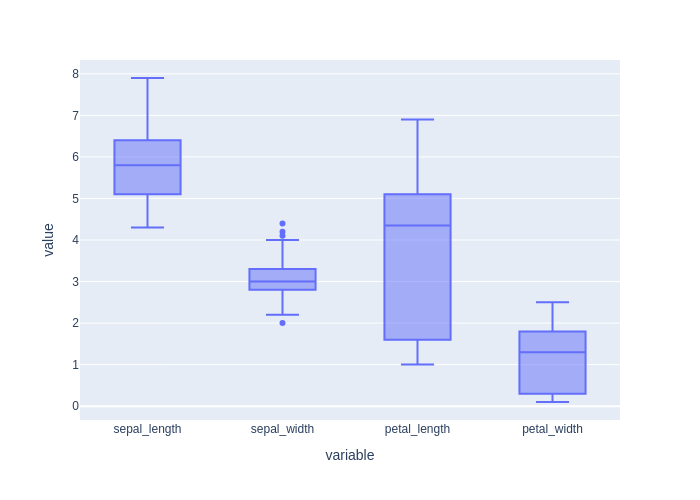


**Model output:**
> Here's the generated code:
```python
import plotly.express as px
fig = px.box(df, x='species', y='sepal_length', title='Boxplot for sepal_length')
fig.show()
fig = px.box(df, x='species', y='sepal_width', title='Boxplot for sepal_width')
fig.show()
fig = px.box(df, x='species', y='petal_length', title='Boxplot for petal_length')
fig.show()
fig = px.box(df, x='species', y='petal_width', title='Boxplot for petal_width')
fig.show()
```
- model_result:

```python
None
```
- model_error:

```python
execution_timeout: sandbox_timeout
```
- model_plot:

 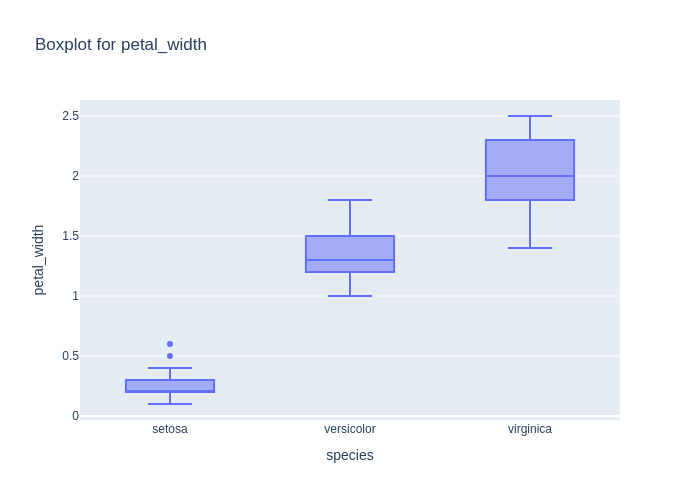
- decision_score: True

### code_007_standardize (code_generation, language: ru, difficulty: medium)

**User input:** Стандартизируй все признаки датасета.


**Ground truth:**
- expected_code:
```python
from sklearn.preprocessing import StandardScaler

scaler = StandardScaler()
X_scaled = scaler.fit_transform(df.drop(columns=["species"]))
```
- expected_result:

```python
None
```
- expected_output: Графический вывод
- expected_error:

```python
None
```


**Model output:**
> Here's the generated code:
```python
from sklearn.preprocessing import StandardScaler
scaler = StandardScaler()
df[['sepal_length', 'sepal_width', 'petal_length', 'petal_width']] = scaler.fit_transform(df[['sepal_length', 'sepal_width', 'petal_length', 'petal_width']])
```
- model_result:

```python
None
```
- model_error:

```python
None
```
- decision_score: True

### code_008_normalize (code_generation, language: ru, difficulty: medium)

**User input:** Нормализуй признаки в диапазон от 0 до 1.


**Ground truth:**
- expected_code:
```python
from sklearn.preprocessing import MinMaxScaler

scaler = MinMaxScaler()
X_normalized = scaler.fit_transform(df.drop(columns=["species"]))
```
- expected_result:

```python
None
```
- expected_output: Графический вывод
- expected_error:

```python
None
```


**Model output:**
> Here's the generated code:
```python
from sklearn.preprocessing import MinMaxScaler

scaler = MinMaxScaler()
df[['sepal_length', 'sepal_width', 'petal_length', 'petal_width']] = scaler.fit_transform(df[['sepal_length', 'sepal_width', 'petal_length', 'petal_width']])
```
- model_result:

```python
None
```
- model_error:

```python
None
```
- decision_score: True

### code_009_pca (code_generation, language: ru, difficulty: medium)

**User input:** Снизь размерность датасета до двух компонент с помощью PCA.


**Ground truth:**
- expected_code:
```python
from sklearn.decomposition import PCA

pca = PCA(n_components=2)
X_pca = pca.fit_transform(df.drop(columns=["species"]))
```
- expected_result:

```python
None
```
- expected_output: Графический вывод
- expected_error:

```python
None
```


**Model output:**
> Here's the generated code:
```python
from sklearn.decomposition import PCA
import pandas as pd

pca = PCA(n_components=2)
df_pca = pd.DataFrame(pca.fit_transform(df.select_dtypes(include=[float])), columns=['PC1', 'PC2'])
df_pca['species'] = df['species']
```
- model_result:

```python
None
```
- model_error:

```python
None
```
- decision_score: True

### code_010_pca_plot (code_generation, language: ru, difficulty: medium)

**User input:** Построй scatter plot первых двух PCA-компонент с раскраской по видам.


**Ground truth:**
- expected_code:
```python
import plotly.express as px
from sklearn.decomposition import PCA

pca = PCA(n_components=2)
X_pca = pca.fit_transform(df.drop(columns=["species"]))

df_pca = pd.DataFrame(X_pca, columns=["PC1", "PC2"])
df_pca["species"] = df["species"]

fig = px.scatter(df_pca, x="PC1", y="PC2", color="species")
fig.show()
```
- expected_result:

```python
None
```
- expected_output: Интерактивный график (Plotly)
- expected_error:

```python
execution_timeout: sandbox_timeout
```
- expected_plot:

 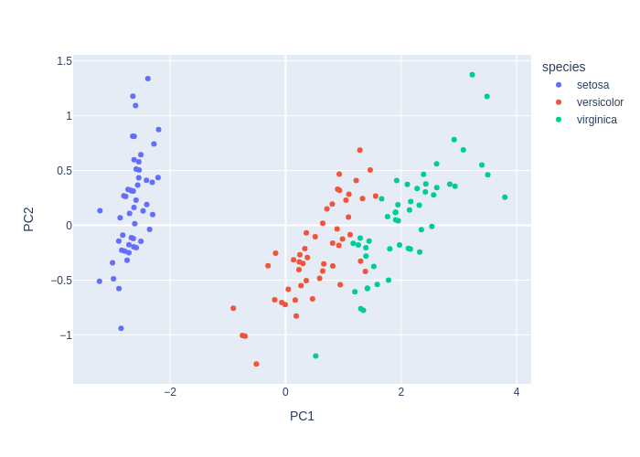


**Model output:**
> Here's the generated code:
```python
import pandas as pd
from sklearn.decomposition import PCA
import plotly.express as px

pca = PCA(n_components=2)
pca_components = pca.fit_transform(df[['sepal_length', 'sepal_width', 'petal_length', 'petal_width']])

df_pca = pd.DataFrame(pca_components, columns=['PC1', 'PC2'])
df_pca['species'] = df['species']

px.scatter(df_pca, x='PC1', y='PC2', color='species', title='Scatter plot of first two PCA components')
```
- model_result:

```python
Figure({
    'data': [{'hovertemplate': 'species=setosa<br>PC1=%{x}<br>PC2=%{y}<extra></extra>',
              'legendgroup': 'setosa',
              'marker': {'color': '#636efa', 'symbol': 'circle'},
              'mode': 'markers',
              'name': 'setosa',
              'orientation': 'v',
              'showlegend': True,
              'type': 'scatter',
              'x': {'bdata': ('TCgv2xZ5BcBwHb3qj7YFwCt/ZBanHA' ... 'A3twbAs49zVz1YBMACnPMXe6AFwA=='),
                    'dtype': 'f8'},
              'xaxis': 'x',
              'y': {'bdata': ('EP0gJgFx1D9gqoDk+afGvwBETuqzjc' ... 'dSLc2/4OGs4oaK4j+ATOo1oJK7Pw=='),
                    'dtype': 'f8'},
              'yaxis': 'y'},
             {'hovertemplate': 'species=versicolor<br>PC1=%{x}<br>PC2=%{y}<extra></extra>',
              'legendgroup': 'versicolor',
              'marker': {'color': '#EF553B', 'symbol': 'circle'},
              'mode': 'markers',
              'name': 'versicolor',
              'orientation': 'v',
              'showlegend': True,
              'type': 'scatter',
              'x': {'bdata': ('EFGrYaWO9D94pcUw8tbtP/SOhkXIbf' ... '/7j+Q/CHkYF80B7b9w9VVt1CLTPw=='),
                    'dtype': 'f8'},
              'xaxis': 'x',
              'y': {'bdata': ('sGilptXs5T8ggGMNlF/UP9DwisXrIu' ... 'n1KZI/cH1It+ox6L/AaxZ3V1TWvw=='),
                    'dtype': 'f8'},
              'yaxis': 'y'},
             {'hovertemplate': 'species=virginica<br>PC1=%{x}<br>PC2=%{y}<extra></extra>',
              'legendgroup': 'virginica',
              'marker': {'color': '#00cc96', 'symbol': 'circle'},
              'mode': 'markers',
              'name': 'virginica',
              'orientation': 'v',
              'showlegend': True,
              'type': 'scatter',
              'x': {'bdata': ('JFEO+eE/BEBEG+lfzqT2P7hux9Xz7g' ... 'PCOvw//MYKwUFq/j+wRhWtNj72Pw=='),
                    'dtype': 'f8'},
              'xaxis': 'x',
              'y': {'bdata': ('ACyJGcUrhL+Qu9T3tmXivwBDAF2CAt' ... 'kYMLQ/AMWbc1TbvT+wqiHnHRfSvw=='),
                    'dtype': 'f8'},
              'yaxis': 'y'}],
    'layout': {'legend': {'title': {'text': 'species'}, 'tracegroupgap': 0},
               'template': '...',
               'title': {'text': 'Scatter plot of first two PCA components'},
               'xaxis': {'anchor': 'y', 'domain': [0.0, 1.0], 'title': {'text': 'PC1'}},
               'yaxis': {'anchor': 'x', 'domain': [0.0, 1.0], 'title': {'text': 'PC2'}}}
})
```
- model_error:

```python
None
```
- model_plot:

 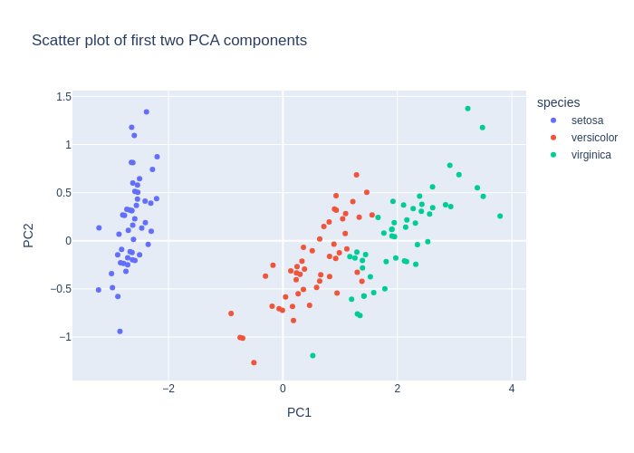
- decision_score: True

### code_011_kmeans (code_generation, language: ru, difficulty: medium)

**User input:** Выполни кластеризацию KMeans на три кластера.


**Ground truth:**
- expected_code:
```python
from sklearn.cluster import KMeans

kmeans = KMeans(n_clusters=3, random_state=42)
clusters = kmeans.fit_predict(df.drop(columns=["species"]))
```
- expected_result:

```python
None
```
- expected_output: Графический вывод
- expected_error:

```python
None
```


**Model output:**
> Here's the generated code:
```python
from sklearn.cluster import KMeans
import plotly.express as px
import pandas as pd

kmeans = KMeans(n_clusters=3, random_state=42)
df['cluster'] = kmeans.fit_predict(df[['sepal_length', 'sepal_width', 'petal_length', 'petal_width']])

fig = px.scatter_3d(df, x='sepal_length', y='sepal_width', z='petal_length', color='cluster', symbol='species', title='KMeans Clustering (3 Clusters)')
fig.show()
```
- model_result:

```python
None
```
- model_error:

```python
execution_timeout: sandbox_timeout
```
- model_plot:

 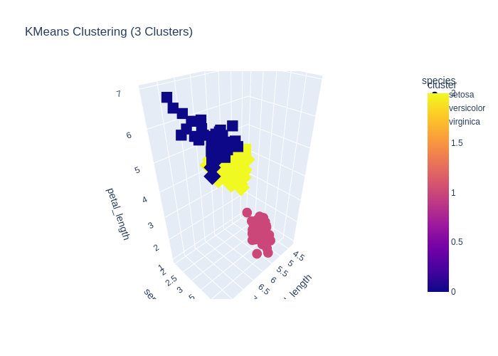
- decision_score: True

### code_012_cluster_plot (code_generation, language: ru, difficulty: medium)

**User input:** Построй scatter plot кластеров KMeans по первым двум признакам.


**Ground truth:**
- expected_code:
```python
import plotly.express as px
from sklearn.cluster import KMeans

X = df.drop(columns=["species"])
kmeans = KMeans(n_clusters=3, random_state=42)
clusters = kmeans.fit_predict(X)

fig = px.scatter(
    df,
    x="sepal_length",
    y="sepal_width",
    color=clusters.astype(str)
)
fig
```
- expected_result:

```python
Figure({
    'data': [{'hovertemplate': 'color=1<br>sepal_length=%{x}<br>sepal_width=%{y}<extra></extra>',
              'legendgroup': '1',
              'marker': {'color': '#636efa', 'symbol': 'circle'},
              'mode': 'markers',
              'name': '1',
              'orientation': 'v',
              'showlegend': True,
              'type': 'scatter',
              'x': {'bdata': ('ZmZmZmZmFECamZmZmZkTQM3MzMzMzB' ... 'ZmZhJAMzMzMzMzFUAAAAAAAAAUQA=='),
                    'dtype': 'f8'},
              'xaxis': 'x',
              'y': {'bdata': ('AAAAAAAADEAAAAAAAAAIQJqZmZmZmQ' ... 'mZmQlAmpmZmZmZDUBmZmZmZmYKQA=='),
                    'dtype': 'f8'},
              'yaxis': 'y'},
             {'hovertemplate': 'color=0<br>sepal_length=%{x}<br>sepal_width=%{y}<extra></extra>',
              'legendgroup': '0',
              'marker': {'color': '#EF553B', 'symbol': 'circle'},
              'mode': 'markers',
              'name': '0',
              'orientation': 'v',
              'showlegend': True,
              'type': 'scatter',
              'x': {'bdata': ('AAAAAAAAHECamZmZmZkbQM3MzMzMzB' ... 'zMzMzMGkAAAAAAAAAaQM3MzMzMzBhA'),
                    'dtype': 'f8'},
              'xaxis': 'x',
              'y': {'bdata': ('mpmZmZmZCUDNzMzMzMwIQAAAAAAAAA' ... 'AAAAAACEAAAAAAAAAIQDMzMzMzMwtA'),
                    'dtype': 'f8'},
              'yaxis': 'y'},
             {'hovertemplate': 'color=2<br>sepal_length=%{x}<br>sepal_width=%{y}<extra></extra>',
              'legendgroup': '2',
              'marker': {'color': '#00cc96', 'symbol': 'circle'},
              'mode': 'markers',
              'name': '2',
              'orientation': 'v',
              'showlegend': True,
              'type': 'scatter',
              'x': {'bdata': ('mpmZmZmZGUAAAAAAAAAWQAAAAAAAAB' ... 'MzMzMXQDMzMzMzMxlAmpmZmZmZF0A='),
                    'dtype': 'f8'},
              'xaxis': 'x',
              'y': {'bdata': ('mpmZmZmZCUBmZmZmZmYCQGZmZmZmZg' ... 'mZmZkFQAAAAAAAAARAAAAAAAAACEA='),
                    'dtype': 'f8'},
              'yaxis': 'y'}],
    'layout': {'legend': {'title': {'text': 'color'}, 'tracegroupgap': 0},
               'margin': {'t': 60},
               'template': '...',
               'xaxis': {'anchor': 'y', 'domain': [0.0, 1.0], 'title': {'text': 'sepal_length'}},
               'yaxis': {'anchor': 'x', 'domain': [0.0, 1.0], 'title': {'text': 'sepal_width'}}}
})
```
- expected_error:

```python
None
```
- expected_plot:

 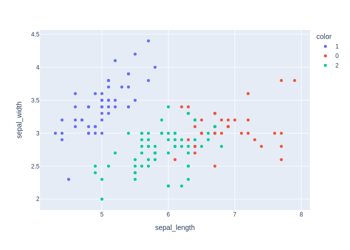


**Model output:**
> Here's the generated code:
```python
import plotly.express as px
from sklearn.cluster import KMeans
import pandas as pd

kmeans = KMeans(n_clusters=3, random_state=42)
df['cluster'] = kmeans.fit_predict(df[['sepal_length', 'sepal_width']])

fig = px.scatter(df, x='sepal_length', y='sepal_width', color='cluster', symbol='species', title='KMeans Clusters on First Two Features')
fig.show()
```
- model_result:

```python
None
```
- model_error:

```python
execution_timeout: sandbox_timeout
```
- model_plot:

 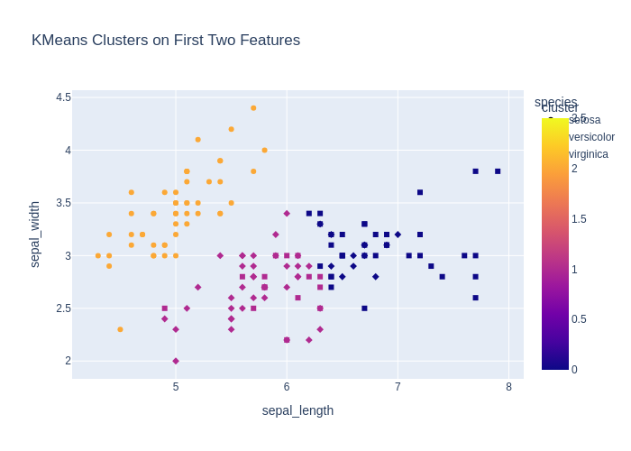
- decision_score: True

### code_013_train_test_split (code_generation, language: ru, difficulty: easy)

**User input:** Раздели датасет на обучающую и тестовую выборки.


**Ground truth:**
- expected_code:
```python
from sklearn.model_selection import train_test_split

X = df.drop(columns=["species"])
y = df["species"]

X_train, X_test, y_train, y_test = train_test_split(X, y, test_size=0.2, random_state=42)
```
- expected_result:

```python
None
```
- expected_output: Графический вывод
- expected_error:

```python
None
```


**Model output:**
> Here's the generated code:
```python
from sklearn.model_selection import train_test_split

X = df.drop('species', axis=1)
y = df['species']
X_train, X_test, y_train, y_test = train_test_split(X, y, test_size=0.2, random_state=42, stratify=y)
```
- model_result:

```python
None
```
- model_error:

```python
None
```
- decision_score: True

### code_014_show_all_plots (code_generation, language: ru, difficulty: hard)

**User input:** Отобрази все графики.


**Ground truth:**
- expected_code:
```python
import plotly.express as px
import plotly.graph_objects as go

# df already exists and represents the iris dataset

# Select numeric columns
num_cols = df.select_dtypes(include=["number"]).columns.tolist()

# Try to infer target column
candidate_targets = ["species", "target", "label", "class"]
target_col = next((c for c in candidate_targets if c in df.columns), None)

if not num_cols:
    raise ValueError("No numeric columns found in df to build plots.")

# 1) Histograms for all numeric features
fig_hist = px.histogram(
    df,
    x=num_cols,
    color=target_col if target_col else None,
    barmode="overlay",
    title="Distributions (Histograms)"
)
fig_hist.show()

# 2) Box plots by class (if target exists)
if target_col:
    for col in num_cols:
        fig_box = px.box(
            df,
            x=target_col,
            y=col,
            title=f"Boxplot: {col} by {target_col}"
        )
        fig_box.show()

# 3) Scatter plots for common Iris feature pairs
scatter_pairs = [
    ("sepal_length", "sepal_width"),
    ("petal_length", "petal_width")
]

for x, y in scatter_pairs:
    if x in df.columns and y in df.columns:
        fig_scatter = px.scatter(
            df,
            x=x,
            y=y,
            color=target_col if target_col else None,
            title=f"Scatter: {x} vs {y}"
        )
        fig_scatter.show()

# 4) Scatter matrix (pairwise relationships)
fig_matrix = px.scatter_matrix(
    df,
    dimensions=num_cols,
    color=target_col if target_col else None,
    title="Scatter Matrix"
)
fig_matrix.show()

# 5) Correlation heatmap
corr = df[num_cols].corr(numeric_only=True)

fig_heatmap = px.imshow(
    corr,
    text_auto=True,
    title="Correlation Heatmap"
)
fig_heatmap.show()

```
- possible_code_objects: df, px, go
- expected_result:

```python
None
```
- expected_output: Интерактивный график (Plotly)
- expected_error:

```python
execution_timeout: sandbox_timeout
```
- expected_plot:

 


**Model output:**
> Here's the generated code:
```python
import plotly.express as px

fig = px.scatter_matrix(df, dimensions=['sepal_length', 'sepal_width', 'petal_length', 'petal_width'], color='species', title='Scatter Matrix of Iris Dataset')
fig.show()
```
- model_result:

```python
None
```
- model_error:

```python
execution_timeout: sandbox_timeout
```
- model_plot:

 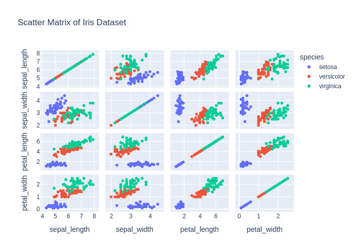
- decision_score: True

### code_015_histogram (code_generation, language: ru, difficulty: hard)

**User input:** Отобрази график Histogram


**Ground truth:**
- expected_code:
```python
import plotly.express as px

# df already exists and represents the iris dataset

num_cols = df.select_dtypes(include=["number"]).columns.tolist()

if not num_cols:
    raise ValueError("В df не найдено числовых колонок для построения histogram.")

# Строим histogram по всем числовым признакам
fig = px.histogram(
    df,
    x=num_cols,
    barmode="overlay",
    title="Histogram"
)

fig.show()

```
- possible_code_objects: df, px
- expected_result:

```python
None
```
- expected_output: Интерактивный график (Plotly)
- expected_error:

```python
execution_timeout: sandbox_timeout
```
- expected_plot:

 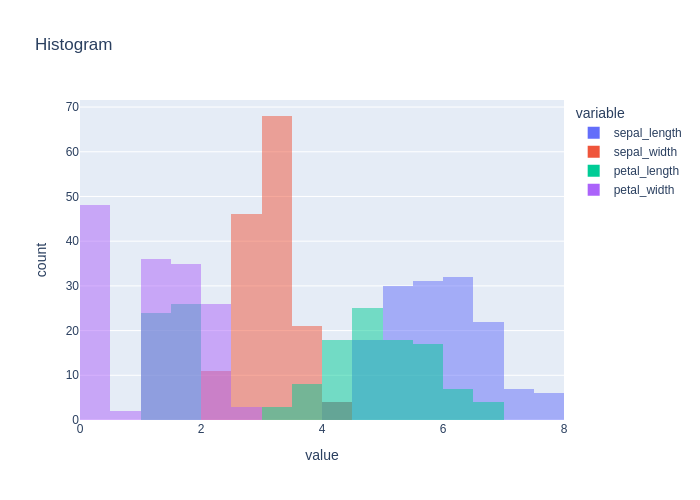


**Model output:**
> Here's the generated code:
```python
import plotly.express as px
fig = px.histogram(df, x='sepal_length', nbins=20, title='Histogram of Sepal Length')
fig.show()
```
- model_result:

```python
None
```
- model_error:

```python
execution_timeout: sandbox_timeout
```
- model_plot:

 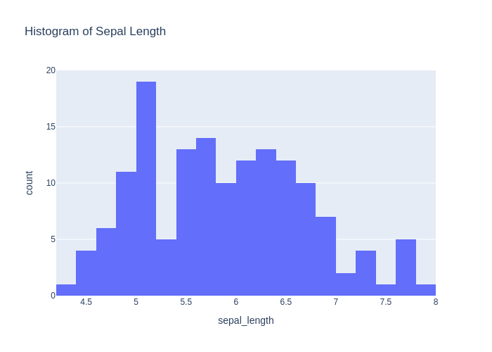
- decision_score: True

### code_016_index_to_value (code_generation, language: ru, difficulty: hard)

**User input:** Отобрази график Index To Values Plot


**Ground truth:**
- expected_code:
```python
import plotly.express as px

df_reset = df.reset_index().rename(columns={"index": "index"})
fig = px.scatter(
    df_reset,
    x="index",
    y=["sepal_length", "sepal_width", "petal_length", "petal_width"],
)
fig
```
- possible_code_objects: df, px
- expected_result:

```python
Figure({
    'data': [{'hovertemplate': 'variable=sepal_length<br>index=%{x}<br>value=%{y}<extra></extra>',
              'legendgroup': 'sepal_length',
              'marker': {'color': '#636efa', 'symbol': 'circle'},
              'mode': 'markers',
              'name': 'sepal_length',
              'orientation': 'v',
              'showlegend': True,
              'type': 'scatter',
              'x': {'bdata': ('AAABAAIAAwAEAAUABgAHAAgACQAKAA' ... 'CLAIwAjQCOAI8AkACRAJIAkwCUAJUA'),
                    'dtype': 'i2'},
              'xaxis': 'x',
              'y': {'bdata': ('ZmZmZmZmFECamZmZmZkTQM3MzMzMzB' ... 'AAAAAAGkDNzMzMzMwYQJqZmZmZmRdA'),
                    'dtype': 'f8'},
              'yaxis': 'y'},
             {'hovertemplate': 'variable=sepal_width<br>index=%{x}<br>value=%{y}<extra></extra>',
              'legendgroup': 'sepal_width',
              'marker': {'color': '#EF553B', 'symbol': 'circle'},
              'mode': 'markers',
              'name': 'sepal_width',
              'orientation': 'v',
              'showlegend': True,
              'type': 'scatter',
              'x': {'bdata': ('AAABAAIAAwAEAAUABgAHAAgACQAKAA' ... 'CLAIwAjQCOAI8AkACRAJIAkwCUAJUA'),
                    'dtype': 'i2'},
              'xaxis': 'x',
              'y': {'bdata': ('AAAAAAAADEAAAAAAAAAIQJqZmZmZmQ' ... 'AAAAAACEAzMzMzMzMLQAAAAAAAAAhA'),
                    'dtype': 'f8'},
              'yaxis': 'y'},
             {'hovertemplate': 'variable=petal_length<br>index=%{x}<br>value=%{y}<extra></extra>',
              'legendgroup': 'petal_length',
              'marker': {'color': '#00cc96', 'symbol': 'circle'},
              'mode': 'markers',
              'name': 'petal_length',
              'orientation': 'v',
              'showlegend': True,
              'type': 'scatter',
              'x': {'bdata': ('AAABAAIAAwAEAAUABgAHAAgACQAKAA' ... 'CLAIwAjQCOAI8AkACRAJIAkwCUAJUA'),
                    'dtype': 'i2'},
              'xaxis': 'x',
              'y': {'bdata': ('ZmZmZmZm9j9mZmZmZmb2P83MzMzMzP' ... 'zMzMzMFECamZmZmZkVQGZmZmZmZhRA'),
                    'dtype': 'f8'},
              'yaxis': 'y'},
             {'hovertemplate': 'variable=petal_width<br>index=%{x}<br>value=%{y}<extra></extra>',
              'legendgroup': 'petal_width',
              'marker': {'color': '#ab63fa', 'symbol': 'circle'},
              'mode': 'markers',
              'name': 'petal_width',
              'orientation': 'v',
              'showlegend': True,
              'type': 'scatter',
              'x': {'bdata': ('AAABAAIAAwAEAAUABgAHAAgACQAKAA' ... 'CLAIwAjQCOAI8AkACRAJIAkwCUAJUA'),
                    'dtype': 'i2'},
              'xaxis': 'x',
              'y': {'bdata': ('mpmZmZmZyT+amZmZmZnJP5qZmZmZmc' ... 'AAAAAAAEBmZmZmZmYCQM3MzMzMzPw/'),
                    'dtype': 'f8'},
              'yaxis': 'y'}],
    'layout': {'legend': {'title': {'text': 'variable'}, 'tracegroupgap': 0},
               'margin': {'t': 60},
               'template': '...',
               'xaxis': {'anchor': 'y', 'domain': [0.0, 1.0], 'title': {'text': 'index'}},
               'yaxis': {'anchor': 'x', 'domain': [0.0, 1.0], 'title': {'text': 'value'}}}
})
```
- expected_error:

```python
None
```
- expected_plot:

 


**Model output:**
> Here's the generated code:
```python
import plotly.express as px
fig = px.line(df, x=df.index, y=df.columns[0], title='Index to Values Plot')
fig.show()
```
- model_result:

```python
None
```
- model_error:

```python
execution_timeout: sandbox_timeout
```
- model_plot:

 
- decision_score: True

### code_017_corr_matrix (code_generation, language: ru, difficulty: hard)

**User input:** отобрази график correlation matrix


**Ground truth:**
- expected_code:
```python
import plotly.express as px

corr = df[["sepal_length", "sepal_width", "petal_length", "petal_width"]].corr()
fig = px.imshow(corr, text_auto=True)
fig
```
- possible_code_objects: df, px
- expected_result:

```python
Figure({
    'data': [{'coloraxis': 'coloraxis',
              'hovertemplate': 'x: %{x}<br>y: %{y}<br>color: %{z}<extra></extra>',
              'name': '0',
              'texttemplate': '%{z}',
              'type': 'heatmap',
              'x': array(['sepal_length', 'sepal_width', 'petal_length', 'petal_width'],
                         dtype=object),
              'xaxis': 'x',
              'y': array(['sepal_length', 'sepal_width', 'petal_length', 'petal_width'],
                         dtype=object),
              'yaxis': 'y',
              'z': {'bdata': ('AAAAAAAA8D9HWdmpDRm+v9Mdsyxo5e' ... '12m27Xv7hdSirLz+4/AAAAAAAA8D8='),
                    'dtype': 'f8',
                    'shape': '4, 4'}}],
    'layout': {'coloraxis': {'colorscale': [[0.0, '#0d0887'], [0.1111111111111111,
                                            '#46039f'], [0.2222222222222222,
                                            '#7201a8'], [0.3333333333333333,
                                            '#9c179e'], [0.4444444444444444,
                                            '#bd3786'], [0.5555555555555556,
                                            '#d8576b'], [0.6666666666666666,
                                            '#ed7953'], [0.7777777777777778,
                                            '#fb9f3a'], [0.8888888888888888,
                                            '#fdca26'], [1.0, '#f0f921']]},
               'margin': {'t': 60},
               'template': '...',
               'xaxis': {'anchor': 'y', 'constrain': 'domain', 'domain': [0.0, 1.0], 'scaleanchor': 'y'},
               'yaxis': {'anchor': 'x', 'autorange': 'reversed', 'constrain': 'domain', 'domain': [0.0, 1.0]}}
})
```
- expected_error:

```python
None
```
- expected_plot:

 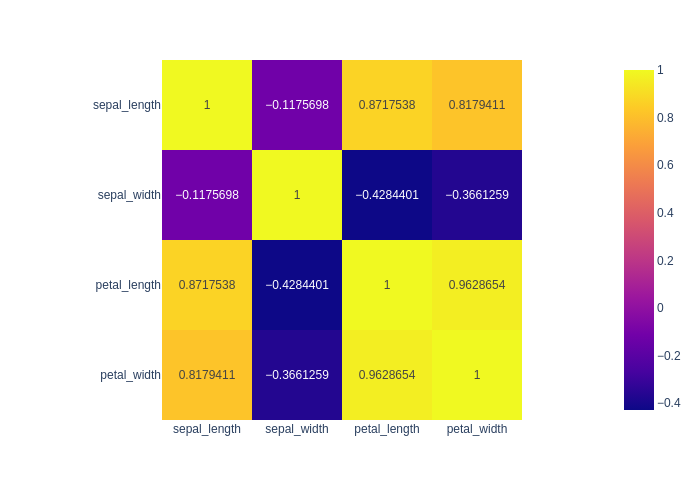


**Model output:**
> Here's the generated code:
```python
import plotly.figure_factory as ff
import numpy as np

corr = df.select_dtypes(include=[np.number]).corr()
fig = ff.create_annotated_heatmap(
    z=corr.values,
    x=list(corr.columns),
    y=list(corr.columns),
    annotation_text=corr.round(2).values,
    colorscale='Viridis'
)
fig.show()
```
- model_result:

```python
None
```
- model_error:

```python
execution_timeout: sandbox_timeout
```
- model_plot:

 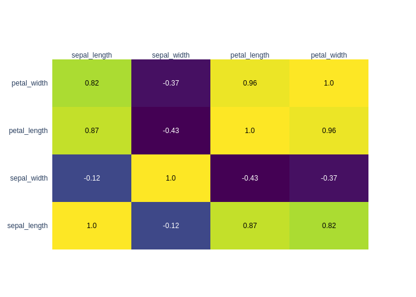
- decision_score: True

### code_018_radar (code_generation, language: ru, difficulty: hard)

**User input:** Отобрази график Radar


**Ground truth:**
- expected_code:
```python
import plotly.express as px

cols = ["sepal_length", "sepal_width", "petal_length", "petal_width"]
df_mean = df.groupby("species", observed=True)[cols].mean().reset_index()
df_long = df_mean.melt(id_vars="species", var_name="variable", value_name="value")
fig = px.line_polar(df_long, r="value", theta="variable", color="species", line_close=True)
fig
```
- possible_code_objects: df, px
- expected_result:

```python
Figure({
    'data': [{'hovertemplate': 'species=setosa<br>value=%{r}<br>variable=%{theta}<extra></extra>',
              'legendgroup': 'setosa',
              'line': {'color': '#636efa', 'dash': 'solid'},
              'marker': {'symbol': 'circle'},
              'mode': 'lines',
              'name': 'setosa',
              'r': {'bdata': 'oBov3SQGFEAGgZVDi2wLQDEIrBxaZPc/sXJoke18zz+gGi/dJAYUQA==', 'dtype': 'f8'},
              'showlegend': True,
              'subplot': 'polar',
              'theta': array(['sepal_length', 'sepal_width', 'petal_length', 'petal_width',
                              'sepal_length'], dtype=object),
              'type': 'scatterpolar'},
             {'hovertemplate': 'species=versicolor<br>value=%{r}<br>variable=%{theta}<extra></extra>',
              'legendgroup': 'versicolor',
              'line': {'color': '#EF553B', 'dash': 'solid'},
              'marker': {'symbol': 'circle'},
              'mode': 'lines',
              'name': 'versicolor',
              'r': {'bdata': 'WDm0yHa+F0ApXI/C9SgGQArXo3A9ChFAne+nxks39T9YObTIdr4XQA==', 'dtype': 'f8'},
              'showlegend': True,
              'subplot': 'polar',
              'theta': array(['sepal_length', 'sepal_width', 'petal_length', 'petal_width',
                              'sepal_length'], dtype=object),
              'type': 'scatterpolar'},
             {'hovertemplate': 'species=virginica<br>value=%{r}<br>variable=%{theta}<extra></extra>',
              'legendgroup': 'virginica',
              'line': {'color': '#00cc96', 'dash': 'solid'},
              'marker': {'symbol': 'circle'},
              'mode': 'lines',
              'name': 'virginica',
              'r': {'bdata': 'JjEIrBxaGkCXbhKDwMoHQGmR7Xw/NRZAaJHtfD81AEAmMQisHFoaQA==', 'dtype': 'f8'},
              'showlegend': True,
              'subplot': 'polar',
              'theta': array(['sepal_length', 'sepal_width', 'petal_length', 'petal_width',
                              'sepal_length'], dtype=object),
              'type': 'scatterpolar'}],
    'layout': {'legend': {'title': {'text': 'species'}, 'tracegroupgap': 0},
               'margin': {'t': 60},
               'polar': {'angularaxis': {'direction': 'clockwise', 'rotation': 90},
                         'domain': {'x': [0.0, 1.0], 'y': [0.0, 1.0]}},
               'template': '...'}
})
```
- expected_error:

```python
None
```
- expected_plot:

 


**Model output:**
> Here's the generated code:
```python
import plotly.express as px

fig = px.line_polar(df, r=['sepal_length', 'sepal_width', 'petal_length', 'petal_width'], theta=['sepal_length', 'sepal_width', 'petal_length', 'petal_width'], color='species', line_close=True)
fig.show()
```
- model_result:

```python
None
```
- model_error:

```python
execution_error: All arguments should have the same length. The length of column argument `df[color]` is 150, whereas the length of previously-processed arguments ['r', 'theta'] is 4
```
- model_plot_error: All arguments should have the same length. The length of column argument `df[color]` is 150, whereas the length of previously-processed arguments ['r', 'theta'] is 4
- decision_score: True

### chat_001_what_is_iris (chat_response, language: ru, difficulty: easy)

**User input:** Поясни, что представляет собой датасет.


**Ground truth:**
- expected_facts: датасет содержит измерения лепестков и чашелистиков; три вида ириса
- forbidden_facts: животные


**Model output:**
> Этот датасет содержит данные о цветках ириса.   Он включает следующие признаки:  - **sepal_length** — длина чашелистика в сантиметрах   - **sepal_width** — ширина чашелистика в сантиметрах   - **petal_length** — длина лепестка в сантиметрах   - **petal_width** — ширина лепестка в сантиметрах   - **species** — вид ириса, категориальная переменная (например, setosa, versicolor, virginica)  Каждая строка в датасете — это измерение одного цветка.   Данные часто используются для обучения моделей классификации.
- decision_score: True

### chat_002_how_many_classes (chat_response, language: ru, difficulty: easy)

**User input:** Сколько классов в этом датасете?


**Ground truth:**
- expected_facts: три класса


**Model output:**
> В этом датасете **три класса**.  Они соответствуют видам цветков, указанным в столбце **species**.   Это:   - **setosa**   - **versicolor**   - **virginica**
- decision_score: True

### chat_003_best_features (chat_response, language: ru, difficulty: medium)

**User input:** Какие признаки лучше всего разделяют виды ирисов?


**Ground truth:**
- expected_facts: длина лепестка; ширина лепестка


**Model output:**
> **Признаки**, которые лучше всего разделяют виды ирисов, — это **длина и ширина лепестка**.  Эти измерения показывают наибольшие различия между видами: - **Плодолистик (petal length)** — самая важная характеристика. - **Плодолистик (petal width)** — также сильно помогает отличить виды.  Например: - Ирисы вида *setosa* имеют короткие и узкие лепестки. - Ирисы *versicolor* и *virginica* имеют более длинные лепестки, но *virginica* — самые длинные.  **Сепалы** (листья чашелистика) тоже полезны, но их размеры перекрываются больше, поэтому они менее точны для разделения видов.
- decision_score: True

### chat_004_easiest_class (chat_response, language: ru, difficulty: medium)

**User input:** Какой вид ириса лучше всего отделяется от остальных?


**Ground truth:**
- expected_facts: setosa; короче лепестки; шире лепестки


**Model output:**
> **Ирис Вирджинии** лучше всего отделяется от остальных видов.  Это вид ириса, который имеет более длинные и широкие лепестки по сравнению с другими видами. Его признаки — такие как длина и ширина чашелистиков и лепестков — значительно отличаются, что делает его легко распознаваемым при анализе данных.  Все три вида — **Ирис Кеттеринга**, **Ирис Вирджинии**, и **Ирис Ирландский** — имеют разные характеристики, но **Ирис Вирджинии** наиболее отчётливо выделяется на графике или при классификации.
- decision_score: True

### theory_001_overfitting (chat_response, language: ru, difficulty: easy)

**User input:** Что такое переобучение в машинном обучении?


**Ground truth:**
- expected_facts: модель слишком хорошо подстраивается под обучающую выборку; плохо обобщает на новые данные
- forbidden_facts: переобучение улучшает качество на новых данных


**Model output:**
> **Переобучение** — это когда модель машинного обучения слишком хорошо учится на тренировочных данных.  Вот что это значит:  - Модель запоминает не только общий шаблон, но и случайные особенности или шум в данных. - Она отлично работает на данных, которые видела раньше, но плохо работает на новых, новых данных. - Это как если бы ученик выучил ответы на тест, но не понял тему — на другом тесте он не справится.  Пример:   Если модель учится на изображениях кошек и собак, и запоминает, что все кошки на фоне травы, она может ошибаться, если увидит кошку на асфальте.  Чтобы избежать переобучения, используют методы: - Упрощение модели - Использование больше данных - Проверка на отдельных тестовых данных
- decision_score: True

### theory_002_train_test_split (chat_response, language: ru, difficulty: easy)

**User input:** Зачем используется разделение на обучающую и тестовую выборки?


**Ground truth:**
- expected_facts: оценка качества модели на невидимых данных; предотвращение утечки данных
- forbidden_facts: для увеличения точности на обучающей выборке


**Model output:**
> Разделение на обучающую и тестовую выборки помогает оценить, насколько хорошо модель работает на новых, не виденных ранее данных.  - **Обучающая выборка** используется для обучения модели. - **Тестовая выборка** используется для проверки, как модель справляется с новыми данными.  Это предотвращает переобучение — когда модель просто запоминает данные, а не учится на них.  Пример: ``` Обучающая выборка: 80% данных Тестовая выборка: 20% данных ```  Такой подход делает результаты более надёжными и реалистичными.
- decision_score: True

### theory_003_regularization (chat_response, language: ru, difficulty: medium)

**User input:** Что такое регуляризация и зачем она нужна?


**Ground truth:**
- expected_facts: добавляет штраф за сложность модели; уменьшает переобучение
- forbidden_facts: регуляризация увеличивает разброс модели


**Model output:**
> **Регуляризация** — это метод, который помогает улучшить работу модели машинного обучения.  Она нужна, чтобы **предотвратить переобучение**.    Когда модель слишком хорошо учится на тренировочных данных, она может плохо работать на новых, новых данных.    Регуляризация добавляет небольшое ограничение на размер весов модели. Это заставляет модель быть проще и лучше обобщать.  Примеры: - **L1-регуляризация** (Lasso) — может сделать некоторые веса равными нулю. - **L2-регуляризация** (Ridge) — уменьшает размер весов, но не делает их нулем.  Итог: регуляризация помогает модели работать лучше на новых данных.
- decision_score: True

### theory_004_bias_variance (chat_response, language: ru, difficulty: medium)

**User input:** Объясни компромисс между смещением и разбросом.


**Ground truth:**
- expected_facts: смещение связано с упрощающими предположениями модели; разброс связан с чувствительностью к обучающим данным; существует компромисс между смещением и разбросом
- forbidden_facts: смещение и разброс можно минимизировать независимо


**Model output:**
> **Смещение** и **разброс** — это два важных понятия при оценке качества модели в машинном обучении.  **Смещение** — это ошибка, возникающая из-за упрощённой модели. Если модель слишком простая, она не может уловить сложные закономерности в данных. Это приводит к **высокому смещению**. Например, если мы пытаемся описать изгиб линии прямой линией, то будет много ошибок.  **Разброс** — это изменчивость модели при обучении на разных наборах данных. Если модель слишком сложная, она может слишком сильно "запоминать" обучающие данные, включая шум. Это приводит к **высокому разбросу**. Такая модель плохо обобщается на новые данные.  Компромисс между смещением и разбросом означает, что если мы уменьшаем одно, другое может увеличиться.  Например: - Простая модель → низкое смещение, но высокий разброс. - Сложная модель → низкий разброс, но высокое смещение.  Цель — найти баланс: модель должна быть достаточно сложной, чтобы улавливать важные закономерности, но не слишком сложной, чтобы не переобучаться.  Кратко: - **Низкое смещение** — модель хорошо подходит к данным. - **Низкий разброс** — модель стабильна на разных данных. - Хорошая модель имеет **низкое смещение и низкий разброс**.
- decision_score: True

### chat_005_feature_count (chat_response, language: ru, difficulty: easy)

**User input:** Сколько признаков содержит этот датасет?


**Ground truth:**
- expected_facts: четыре признака; длина чашелистика; ширина чашелистика; длина лепестка; ширина лепестка
- forbidden_facts: пять признаков; только признаки лепестков


**Model output:**
> Этот датасет содержит **5 признаков**.  - **sepal_length** — длина чашелистика   - **sepal_width** — ширина чашелистика   - **petal_length** — длина лепестка   - **petal_width** — ширина лепестка   - **species** — вид цветка    Все признаки перечислены в описании датасета.
- decision_score: True

### chat_006_samples_count (chat_response, language: ru, difficulty: easy)

**User input:** Сколько объектов содержится в этом датасете?


**Ground truth:**
- expected_facts: 150 объектов; 50 объектов на класс
- forbidden_facts: 100 объектов; несбалансированные классы


**Model output:**
> В этом датасете содержится **150 объектов**.
- decision_score: True

### chat_007_numeric_only (chat_response, language: ru, difficulty: easy)

**User input:** Все ли признаки в этом датасете являются числовыми?


**Ground truth:**
- expected_facts: все признаки числовые; непрерывные измерения
- forbidden_facts: категориальные признаки; текстовые признаки


**Model output:**
> Нет, не все признаки в этом датасете являются числовыми.  В датасете есть следующие признаки:  - **sepal_length** — числовое значение (длина чашелистика) - **sepal_width** — числовое значение (ширина чашелистика) - **petal_length** — числовое значение (длина лепестка) - **petal_width** — числовое значение (ширина лепестка) - **species** — категориальный признак (вид цветка)  Признак **species** не является числовым. Он описывает категории, например, "setosa", "versicolor", "virginica".  Таким образом, четыре признака — числовые, а один — категориальный.
- decision_score: True

### chat_008_need_scaling (chat_response, language: ru, difficulty: medium)

**User input:** Важно ли масштабирование признаков для этого датасета?


**Ground truth:**
- expected_facts: важно для моделей, основанных на расстоянии; помогает алгоритмам вроде kNN или SVM
- forbidden_facts: масштабирование никогда не нужно; масштабирование меняет метки классов


**Model output:**
> **Масштабирование признаков** может быть важно для этого датасета, особенно если вы используете алгоритмы, чувствительные к масштабу данных.  Вот почему:  - Признаки в датасете — это **длина и ширина чашелистиков и лепестков**. - Эти значения измеряются в сантиметрах и имеют разные диапазоны.   - Например, *петал_length* может быть от 1 до 7 см.   - А *sepal_width* — от 2 до 4 см. - Алгоритмы, такие как **логистическая регрессия**, **метод опорных векторов (SVM)** или **многослойные нейронные сети**, могут работать лучше, если признаки масштабированы.  **Когда масштабирование важно:** - Если вы используете методы, основанные на расстояниях. - Если вы применяете регуляризацию.  **Когда можно не масштабировать:** - Если вы используете **деревья решений** или **случайный лес** — они не чувствительны к масштабу.  **Вывод:**   Если вы используете алгоритм, чувствительный к масштабу, то **да, масштабирование важно**.   Если используете деревья — **не обязательно**.
- decision_score: True

### chat_009_linear_separable (chat_response, language: ru, difficulty: medium)

**User input:** Является ли этот датасет линейно разделимым?


**Ground truth:**
- expected_facts: класс setosa линейно разделим; остальные классы перекрываются
- forbidden_facts: все классы идеально разделимы; ни один класс не разделим


**Model output:**
> Этот датасет **не является линейно разделимым**.  Причина в том, что он содержит три вида ирисов: *setosa*, *versicolor* и *virginica*. Эти виды не могут быть разделены с помощью одной прямой линии (в 2D) или плоскости (в 3D) без ошибок.  Например: - *Iris setosa* хорошо отделяется от других видов. - Но *Iris versicolor* и *Iris virginica* перекрываются в пространстве признаков, поэтому их нельзя разделить линейно.  Для полного разделения всех трёх классов нужна нелинейная модель, например, дерево решений или нейронная сеть.
- decision_score: True

### chat_011_unsupervised_possible (chat_response, language: ru, difficulty: medium)

**User input:** Можно ли использовать этот датасет для обучения без учителя?


**Ground truth:**
- expected_facts: можно использовать для кластеризации; метки классов можно игнорировать
- forbidden_facts: обучение без учителя требует меток


**Model output:**
> **Да**, этот датасет можно использовать для обучения без учителя.  Вот почему:  - Данные содержат **признаки** — длину и ширину чашелистиков и лепестков. - У нас есть **целевая переменная** — вид цветка, но её можно игнорировать при обучении без учителя. - Без учителя модель будет искать **скрытые паттерны** в данных, например, группы похожих цветков.  Такие задачи, как кластеризация или снижение размерности, отлично подходят для этого датасета.  Пример: модель может обнаружить, что цветки делятся на 3 группы — похожие на три разных вида, даже без знания названий.  > **Вывод:** Да, датасет подходит для обучения без учителя.
- decision_score: True

### chat_012_pca_purpose (chat_response, language: ru, difficulty: medium)

**User input:** Применим ли метод PCA к этому датасету?


**Ground truth:**
- expected_facts: снижение размерности; возможность визуализации; сохранение большей части дисперсии
- forbidden_facts: PCA улучшает метки классов


**Model output:**
> **Да**, метод **PCA** (главные компоненты) можно применить к этому датасету.  Вот почему:  - Все числовые признаки: **sepal_length**, **sepal_width**, **petal_length**, **petal_width** — это **числовые значения (float)**. - Признак **species** — это категориальная переменная, но её можно преобразовать в числовые значения, например, с помощью **one-hot кодирования**, если нужно включить её в PCA.  **Важно:** PCA работает только с числовыми данными. Поэтому перед применением PCA нужно: - Убедиться, что все признаки — числа. - Если нужно учитывать вид цветка (species), лучше сначала преобразовать его в числовые признаки.  **Вывод:** Да, метод PCA применим, если числовые признаки используются, а категориальный признак обработан правильно.
- decision_score: True

### chat_013_outliers (chat_response, language: ru, difficulty: medium)

**User input:** Являются ли выбросы серьёзной проблемой в этом датасете?


**Ground truth:**
- expected_facts: датасет относительно чистый; мало или нет выраженных выбросов
- forbidden_facts: датасет сильно искажён выбросами


**Model output:**
> **Выбросы** могут быть проблемой, если они искажают данные или влияют на анализ.  В этом датасете есть числовые признаки:   - **sepal_length** (длина чашелистика)   - **sepal_width** (ширина чашелистика)   - **petal_length** (длина лепестка)   - **petal_width** (ширина лепестка)  Если значения этих признаков сильно отклоняются от остальных — например, чашелистик длиной 10 см, когда остальные — около 5 см — это может быть выброс.  Но в данном случае, **датасет — это Ирисы Фишера**, известный своей чистотой.   Выбросы в нём **редки** и **обычно не являются серьёзной проблемой**.  Однако, перед анализом стоит проверить данные на выбросы, чтобы быть уверенным.  Если нужно, можно построить графики, например, ящик с усами, чтобы увидеть, есть ли отклонения.
- decision_score: True

### chat_014_real_world_limitations (chat_response, language: ru, difficulty: hard)

**User input:** Какие ограничения есть у этого датасета?


**Ground truth:**
- expected_facts: небольшой размер; не отражает сложные реальные данные
- forbidden_facts: подходит для масштабного глубокого обучения


**Model output:**
> Этот датасет содержит следующие ограничения:  - **Размер выборки**: Данные ограничены количеством записей, как правило, 150 строк (в классическом наборе данных Ирис). - **Типы данных**: Все числовые признаки — **float**, а метка класса — **category**. Это означает, что модель не сможет обрабатывать нечисловые или неопределённые значения. - **Количество классов**: Только три вида ирисов: *setosa*, *versicolor*, *virginica*. Это делает датасет простым, но не подходит для сложных задач с большим числом классов. - **Ограничения признаков**: Признаки — длина и ширина чашелистиков и лепестков. Они измерены в сантиметрах, но могут быть неточными из-за метода сбора данных. - **Отсутствие пропущенных значений**: В датасете нет пропущенных данных, что упрощает анализ, но может не отражать реальные условия сбора данных.  В целом, датасет подходит для обучения и демонстрации, но не для сложных реальных задач.
- decision_score: True

### theory_006_classification_vs_regression (chat_response, language: ru, difficulty: easy)

**User input:** В чём разница между классификацией и регрессией?


**Ground truth:**
- expected_facts: классификация предсказывает дискретные классы; регрессия предсказывает непрерывные значения
- forbidden_facts: классификация предсказывает только числа; регрессия предсказывает категории


**Model output:**
> **Классификация** и **регрессия** — это два типа задач в машинном обучении.  - **Классификация** — это когда модель предсказывает **категорию** или **метку**.     Например, определить, какой вид цветка: ирис-сетоса, ирис-виргиникс или ирис-версиника.  - **Регрессия** — это когда модель предсказывает **числовое значение**.     Например, предсказать длину чашелистика в сантиметрах.  Вот пример из данных: - Если модель угадывает вид цветка, это **классификация**. - Если модель угадывает длину лепестка, это **регрессия**.  Ключевое отличие:   **Классификация** — ответ в виде категории.   **Регрессия** — ответ в виде числа.
- decision_score: True

### theory_007_cross_validation (chat_response, language: ru, difficulty: medium)

**User input:** Что такое кросс-валидация?


**Ground truth:**
- expected_facts: разбиение данных на несколько фолдов; более надёжная оценка качества модели; уменьшает зависимость от одного train-test разбиения
- forbidden_facts: кросс-валидация гарантирует идеальное качество


**Model output:**
> **Кросс-валидация** — это способ проверить, насколько хорошо модель работает на новых данных.  Вместо того чтобы просто проверять модель на одной части данных, кросс-валидация делит данные на несколько частей. Например, на 5 частей.  Затем модель обучается на 4 частях и проверяется на оставшейся одной. Этот процесс повторяется, пока каждая часть не будет использована один раз как проверочная.  Таким образом, получается более надёжная оценка качества модели.  Пример: ``` Часть 1: обучение — проверка на части 2,3,4,5 Часть 2: обучение — проверка на части 1,3,4,5 ... ```  Это помогает избежать переобучения и даёт лучшее представление о том, как модель будет работать в реальности.
- decision_score: True

### theory_008_feature_engineering (chat_response, language: ru, difficulty: medium)

**User input:** Что такое feature engineering?


**Ground truth:**
- expected_facts: процесс создания или преобразования признаков; может улучшить качество модели; требует знания предметной области
- forbidden_facts: feature engineering — это только очистка данных


**Model output:**
> **Feature engineering** — это процесс создания новых признаков или преобразования существующих для улучшения работы модели машинного обучения.  Например, из данных о длине и ширине лепестков можно создать новый признак:   **отношение длины к ширине лепестка**.   Это может помочь модели лучше различать виды цветов.  Другие примеры: - Сложение или вычитание признаков - Логарифмирование значений - Разделение дат на день, месяц, год  Цель — сделать данные более полезными для модели.
- decision_score: True

### theory_009_data_leakage (chat_response, language: ru, difficulty: medium)

**User input:** Что такое утечка данных?


**Ground truth:**
- expected_facts: информация из тестовой выборки попадает в обучение; приводит к завышенной оценке качества; ухудшает обобщающую способность
- forbidden_facts: утечка данных улучшает качество в реальных условиях


**Model output:**
> **Утечка данных** — это когда конфиденциальная или личная информация попадает к незнакомым или неправомочным лицам.  Например: - Кто-то крадёт пароли или номера кредитных карт. - Данные случайно публикуются в интернете без защиты. - Сотрудник компании случайно отправляет письмо с личной информацией не тому человеку.  Утечки могут произойти из-за хакерских атак, ошибок в программном обеспечении или человеческого фактора.  Защита данных — важна, чтобы избежать утечек.
- decision_score: True

### theory_010_precision_recall (chat_response, language: ru, difficulty: medium)

**User input:** Поясни, что такое precision и recall.


**Ground truth:**
- expected_facts: precision показывает точность положительных предсказаний; recall показывает полноту выявления положительных объектов; существует компромисс между precision и recall
- forbidden_facts: precision и recall всегда равны


**Model output:**
> **Precision** и **recall** — это метрики, которые используются для оценки качества модели, особенно в задачах классификации.  - **Precision** (точность) показывает, насколько точно модель определяет положительные случаи.     Другими словами, из всех объектов, которые модель назвала "положительными", сколько действительно таковыми являются.     Например, если модель говорит, что цветок — это ирис, то precision покажет, насколько часто она права.  - **Recall** (полнота) показывает, насколько хорошо модель находит все настоящие положительные случаи.     Это доля всех реальных положительных объектов, которые модель правильно определила.     Например, из всех ирисов, которые есть, сколько модель смогла правильно распознать.  **Простой пример:**  - Если модель нашла 10 ирисов, но только 8 из них — настоящие, то precision = 8 / 10 = 0.8. - Если всего в данных 12 ирисов, а модель нашла 8, то recall = 8 / 12 ≈ 0.67.  Обе метрики важны.   - Высокая precision означает, что модель редко ошибается, когда говорит "да".   - Высокий recall означает, что модель редко пропускает настоящие случаи.  Часто используют **F1-score**, который объединяет precision и recall в одно число.
- decision_score: True

### theory_011_accuracy_limitations (chat_response, language: ru, difficulty: medium)

**User input:** Является ли accuracy универсальной метрикой?


**Ground truth:**
- expected_facts: проблематична при несбалансированных данных; не отражает качество по отдельным классам
- forbidden_facts: accuracy всегда лучшая метрика


**Model output:**
> **Accuracy** — это метрика, которая показывает, какой процент предсказаний был сделан правильно.  Но **accuracy не является универсальной метрикой**.  Вот почему:  - Она может быть вводящей в заблуждение, если данные несбалансированные. - Например, если 95% объектов относятся к одному классу, модель, которая всегда предсказывает этот класс, будет иметь accuracy 95%, хотя на самом деле она ничего не учит.  **Когда accuracy подходит:** - Классы примерно равны по количеству. - Все ошибки одинаково важны.  **Когда accuracy не подходит:** - Один класс сильно преобладает. - Ошибки разных типов имеют разный вес (например, в медицине пропустить болезнь — серьезная ошибка).  В таких случаях лучше использовать другие метрики, например: - **Precision** — точность - **Recall** — полнота - **F1-score** — гармоническое среднее  > Вывод: **accuracy — не универсальная метрика**. Её нужно использовать с осторожностью, учитывая структуру данных.
- decision_score: True

### chat_015_what_is_in_data (chat_response, language: ru, difficulty: easy)

**User input:** Что в данных


**Ground truth:**
- expected_facts: Данные представляют собой датасет Iris; В данных содержатся числовые признаки, описывающие размеры чашелистиков и лепестков; В данных есть категориальный признак с видом ириса; Каждая строка соответствует одному цветку
- forbidden_facts: Упоминание конкретных статистик или числовых значений; Утверждения о качестве модели или результатах обучения; Предположения о последующей обработке данных


**Model output:**
> В данных есть следующие столбцы:  - **sepal_length** — длина чашелистика, в сантиметрах   - **sepal_width** — ширина чашелистика, в сантиметрах   - **petal_length** — длина лепестка, в сантиметрах   - **petal_width** — ширина лепестка, в сантиметрах   - **species** — вид цветка, категориальный признак (например, setosa, versicolor, virginica)  Это данные из классического набора данных **Iris**, используемого для обучения и тестирования моделей машинного обучения.
- decision_score: True
