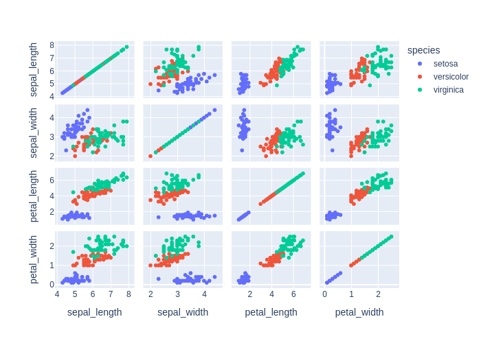

# Детальный отчёт по кейсам (ru)

## Методика расчёта метрик
### Semantic similarity (только для chat_response)
Формула:
```text
semantic_similarity = 0.6 * similarity + 0.4 * expected_coverage - 0.5 * forbidden_penalty
```
Где доли:
 - expected_coverage — доля ожидаемых фактов, упомянутых в ответе;
 - forbidden_penalty — доля запрещённых фактов,
попавших в ответ (штраф).
 - similarity — embedding-cosine между эталонным ответом (конкатенация expected_facts или базовый
референс) и ответом модели.


Факт считается покрытым, если косинусная близость fact↔ответ ≥ 0.55
(или высокая токеновая схожесть), что позволяет засчитывать перефраз. Весами (0.6/0.4/0.5) балансируем близость текста и полноту фактов,
давая штраф за запрещённые факты, чтобы сохранить интерпретируемость (веса суммарно ограничивают метрику в [0, 1]).

### Code score (только для code_generation)
- heuristic_score = 0.3 (валидный синтаксис) + до 0.2 (совпадение импортов) + до 0.4 (совпадение ключевых вызовов).
- result_match: бинарный флаг (1.0/0.0), что итоговый результат выполнения совпал с эталоном без ошибок исполнения.

## Кейсы
### code_001_describe (code_generation, language: ru, difficulty: easy)

**User input:** Напиши код, который выводит статистику по датасету.


**Ground truth:**
- expected_code:
```python
df.describe()
```
- expected_result:
 
```python
       sepal_length  sepal_width  petal_length  petal_width
count    150.000000   150.000000    150.000000   150.000000
mean       5.843333     3.057333      3.758000     1.199333
std        0.828066     0.435866      1.765298     0.762238
min        4.300000     2.000000      1.000000     0.100000
25%        5.100000     2.800000      1.600000     0.300000
50%        5.800000     3.000000      4.350000     1.300000
75%        6.400000     3.300000      5.100000     1.800000
max        7.900000     4.400000      6.900000     2.500000
```
- expected_error:
 
```python
None
```


**Model output:**
> Here's the generated code:
```python
df.describe(include='all')
```
- model_result:
 
```python
        sepal_length  sepal_width  petal_length  petal_width species
count     150.000000   150.000000    150.000000   150.000000     150
unique           NaN          NaN           NaN          NaN       3
top              NaN          NaN           NaN          NaN  setosa
freq             NaN          NaN           NaN          NaN      50
mean        5.843333     3.057333      3.758000     1.199333     NaN
std         0.828066     0.435866      1.765298     0.762238     NaN
min         4.300000     2.000000      1.000000     0.100000     NaN
25%         5.100000     2.800000      1.600000     0.300000     NaN
50%         5.800000     3.000000      4.350000     1.300000     NaN
75%         6.400000     3.300000      5.100000     1.800000     NaN
max         7.900000     4.400000      6.900000     2.500000     NaN
```
- model_error:
 
```python
None
```


**Метрики:**
- decision_score: True
  - heuristic_score: 1.0
    - syntax_check: 0.333 (ok=True)
    - imports_score: 0.222 | expected:  | model:  | matched: 
    - calls_score: 0.444 | expected: describe | model: describe | matched: describe

### code_002_pairplot (code_generation, language: ru, difficulty: medium)

**User input:** Построй pairplot всех признаков.


**Ground truth:**
- expected_code:
```python
import plotly.express as px
fig = px.scatter_matrix(df, dimensions=df.columns, color="species")
fig.show()
```
- expected_result:
 
```python
None
```
- expected_output: Интерактивный график (Plotly)
- expected_error:
 
```python
execution_timeout: sandbox_timeout
```
- expected_plot:

 


**Model output:**
> Here's the generated code:
```python
import plotly.express as px
fig = px.scatter_matrix(df, dimensions=['sepal_length', 'sepal_width', 'petal_length', 'petal_width'], color='species')
fig.show()
```
- model_result:
 
```python
None
```
- model_error:
 
```python
execution_timeout: sandbox_timeout
```
- model_plot:

 


**Метрики:**
- decision_score: True
  - heuristic_score: 1.0
    - syntax_check: 0.333 (ok=True)
    - imports_score: 0.222 | expected: plotly.express | model: plotly.express | matched: plotly.express
    - calls_score: 0.444 | expected: scatter_matrix, show | model: scatter_matrix, show | matched: scatter_matrix, show

### code_003_train_model (code_generation, language: ru, difficulty: medium)

**User input:** Напиши код, который обучает простой классификатор на этих данных.


**Ground truth:**
- expected_code:
```python
from sklearn.linear_model import LogisticRegression

X = df.drop(columns=["species"])
y = df["species"]

model = LogisticRegression(max_iter=200)
model.fit(X, y)
```
- possible_code_objects: RandomForestClassifier, DecisionTreeClassifier, SVC, KNeighborsClassifier, GaussianNB
- expected_result:
 
```python
LogisticRegression(max_iter=200)
```
- expected_error:
 
```python
None
```


**Model output:**
> Here's the generated code:
```python
from sklearn.model_selection import train_test_split
from sklearn.preprocessing import LabelEncoder
from sklearn.linear_model import LogisticRegression
from sklearn.metrics import accuracy_score

# Encode the target variable
le = LabelEncoder()
y = le.fit_transform(df['species'])
X = df[['sepal_length', 'sepal_width', 'petal_length', 'petal_width']]

# Split the data
X_train, X_test, y_train, y_test = train_test_split(X, y, test_size=0.2, random_state=42)

# Train the classifier
clf = LogisticRegression(max_iter=200)
clf.fit(X_train, y_train)

# Predict and evaluate
y_pred = clf.predict(X_test)
accuracy = accuracy_score(y_test, y_pred)
```
- model_result:
 
```python
None
```
- model_error:
 
```python
None
```


**Метрики:**
- decision_score: True
  - heuristic_score: 0.852
    - syntax_check: 0.333 (ok=True)
    - imports_score: 0.222 | expected: sklearn.linear_model | model: sklearn.linear_model, sklearn.metrics, sklearn.model_selection, sklearn.preprocessing | matched: sklearn.linear_model
    - calls_score: 0.296 | expected: LogisticRegression, drop, fit | model: LabelEncoder, LogisticRegression, accuracy_score, fit, fit_transform, predict, train_test_split | matched: LogisticRegression, fit

### chat_001_what_is_iris (chat_response, language: ru, difficulty: easy)

**User input:** Поясни, что представляет собой датасет.


**Ground truth:**
- expected_facts: датасет содержит измерения лепестков и чашелистиков; три вида ириса
- forbidden_facts: животные


**Model output:**
> Этот датасет содержит данные о цветках ириса.   Он включает следующие столбцы:  - **sepal_length** — длина чашелистика в сантиметрах   - **sepal_width** — ширина чашелистика в сантиметрах   - **petal_length** — длина лепестка в сантиметрах   - **petal_width** — ширина лепестка в сантиметрах   - **species** — вид ириса, например, setosa, versicolor или virginica    Каждая строка описывает один цветок.   Данные используются для обучения моделей машинного обучения, чтобы научиться определять вид ириса по его размерам.


**Метрики:**
- decision_score: True
- semantic_similarity: 0.159
  - expected_coverage: 0.0 | forbidden_penalty: 0.0

### chat_002_how_many_classes (chat_response, language: ru, difficulty: easy)

**User input:** Сколько классов в этом датасете?


**Ground truth:**
- expected_facts: три класса


**Model output:**
> В этом датасете **три класса**.  Они соответствуют видам цветков, указанным в столбце **species**.   Это:   - **setosa**   - **versicolor**   - **virginica**


**Метрики:**
- decision_score: True
- semantic_similarity: 0.304
  - expected_coverage: 0.0 | forbidden_penalty: 0.0

### chat_003_best_features (chat_response, language: ru, difficulty: medium)

**User input:** Какие признаки лучше всего разделяют виды ирисов?


**Ground truth:**
- expected_facts: длина лепестка; ширина лепестка


**Model output:**
> **Пetal length** и **petal width** лучше всего разделяют виды ирисов.  Эти признаки показывают наибольшие различия между видами.   Например: - **Setosa** имеет маленькие лепестки. - **Versicolor** средние. - **Virginica** самые большие.  **Sepal length** и **sepal width** также полезны, но менее точны для разделения видов.


**Метрики:**
- decision_score: True
- semantic_similarity: 0.197
  - expected_coverage: 0.0 | forbidden_penalty: 0.0

### chat_004_easiest_class (chat_response, language: ru, difficulty: medium)

**User input:** Какой вид ириса лучше всего отделяется от остальных?


**Ground truth:**
- expected_facts: setosa; короче лепестки; шире лепестки


**Model output:**
> **Ирис Вирджиния** лучше всего отделяется от остальных видов.  Этот вид имеет более длинные и широкие лепестки по сравнению с другими. В данных наборе он показывает наименьшее перекрытие с другими видами, что делает его легко распознаваемым.


**Метрики:**
- decision_score: True
- semantic_similarity: 0.289
  - expected_coverage: 0.0 | forbidden_penalty: 0.0

### theory_001_overfitting (chat_response, language: ru, difficulty: easy)

**User input:** Что такое переобучение в машинном обучении?


**Ground truth:**
- expected_facts: модель слишком хорошо подстраивается под обучающую выборку; плохо обобщает на новые данные
- forbidden_facts: переобучение улучшает качество на новых данных


**Model output:**
> **Переобучение** — это когда модель машинного обучения слишком хорошо учится на тренировочных данных.  Вот что это значит:  - Модель запоминает тренировочные данные, а не учится на общих паттернах. - Она работает отлично на известных данных, но плохо на новых, не виденных ранее данных. - Это как ученик, который выучил ответы на тест, но не понял тему.  Пример: ``` Тренировочные данные: цветок с длиной чашелистника 5.1 см — это ирис. Модель запоминает: "5.1 см = ирис". Но при новом цветке с 5.1 см она может ошибиться, если другие признаки разные. ```  Чтобы избежать переобучения, используют: - Больше данных - Упрощение модели - Проверку на отдельных тестовых данных  Коротко: **переобучение — это когда модель "запоминает", а не "понимает"**.


**Метрики:**
- decision_score: True
- semantic_similarity: 0.197
  - expected_coverage: 0.0 | forbidden_penalty: 0.0

### theory_002_train_test_split (chat_response, language: ru, difficulty: easy)

**User input:** Зачем используется разделение на обучающую и тестовую выборки?


**Ground truth:**
- expected_facts: оценка качества модели на невидимых данных; предотвращение утечки данных
- forbidden_facts: для увеличения точности на обучающей выборке


**Model output:**
> Разделение на обучающую и тестовую выборки нужно, чтобы проверить, насколько хорошо модель учится на данных.  - **Обучающая выборка** — это данные, на которых модель учится.   - **Тестовая выборка** — это данные, которые модель ещё не видела.    Когда модель работает на тестовых данных, мы узнаём, как она справится с новыми, незнакомыми примерами.    Это помогает избежать переобучения.   **Переобучение** — это когда модель запоминает данные, но не умеет обобщать.    Таким образом, тестовая выборка показывает, насколько модель полезна в реальной жизни.


**Метрики:**
- decision_score: True
- semantic_similarity: 0.185
  - expected_coverage: 0.0 | forbidden_penalty: 0.0

### theory_003_regularization (chat_response, language: ru, difficulty: medium)

**User input:** Что такое регуляризация и зачем она нужна?


**Ground truth:**
- expected_facts: добавляет штраф за сложность модели; уменьшает переобучение
- forbidden_facts: регуляризация увеличивает разброс модели


**Model output:**
> **Регуляризация** — это способ улучшить работу модели машинного обучения, чтобы она лучше обобщала данные, а не просто запоминала их.  Когда модель слишком сложная, она может "переобучиться" — то есть хорошо работать на тренировочных данных, но плохо на новых. Это как если бы ученик выучил ответы на тест, но не понял тему.  **Регуляризация помогает**: - Уменьшить сложность модели. - Снизить риск переобучения. - Сделать модель более надёжной на новых данных.  Она работает, добавляя штраф за слишком большие значения весов в модели. Это заставляет модель быть проще и стабильнее.  Примеры: **L1-регуляризация** (Lasso) и **L2-регуляризация** (Ridge).


**Метрики:**
- decision_score: True
- semantic_similarity: 0.121
  - expected_coverage: 0.0 | forbidden_penalty: 0.0

### theory_004_bias_variance (chat_response, language: ru, difficulty: medium)

**User input:** Объясни компромисс между смещением и разбросом.


**Ground truth:**
- expected_facts: смещение связано с упрощающими предположениями модели; разброс связан с чувствительностью к обучающим данным; существует компромисс между смещением и разбросом
- forbidden_facts: смещение и разброс можно минимизировать независимо


**Model output:**
> Компромисс между **смещением** и **разбросом** — это важное понятие в статистике и машинном обучении.  **Смещение** — это ошибка, возникающая, когда модель слишком простая, чтобы правильно отразить сложность данных. Она не учитывает важные закономерности. Это значит, что модель систематически ошибается. Высокое смещение часто связано с переобучением или недообучением.  **Разброс** — это изменчивость предсказаний модели при разных наборах данных. Если модель сильно зависит от конкретного набора данных, она может хорошо работать на нём, но плохо — на новых данных. Высокий разброс означает, что модель слишком сложная и "переучивается" на шум.  Компромисс означает:   - Если вы уменьшаете смещение (делаете модель сложнее), разброс может увеличиться.   - Если вы уменьшаете разброс (упрощаете модель), смещение может вырасти.  Идеальный баланс — это модель, которая и не слишком простая, и не слишком сложная. Она хорошо работает на новых данных.


**Метрики:**
- decision_score: True
- semantic_similarity: 0.279
  - expected_coverage: 0.0 | forbidden_penalty: 0.0
